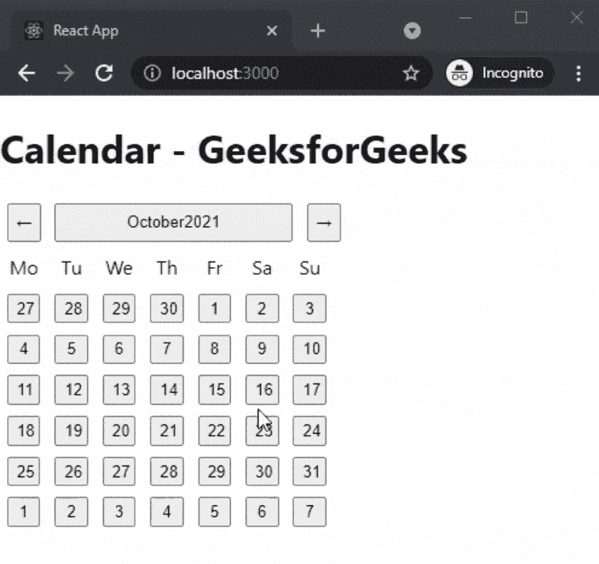
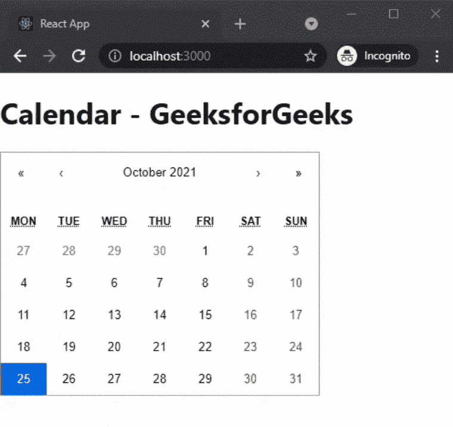

# 如何在 ReactJS 中创建日历？

> 原文:[https://www . geeksforgeeks . org/如何在 reactjs 中创建日历/](https://www.geeksforgeeks.org/how-to-create-calendar-in-reactjs/)

在本文中，我们将学习如何在 ReactJS 中创建日历。您可以在待办事项列表、电子商务网站、机票预订网站和更多应用程序中使用此日历。

React 是一个免费的开源前端 JavaScript 库，用于构建用户界面或 UI 组件。它由脸书和一个由个人开发者和公司组成的社区维护。

**方法:**为了创建我们的日历，我们将看到 2 种不同的方法。在第一种方法中，我们将看到如何在没有任何样式的情况下创建一个简单的日历，在第二种方法中，我们还将在日历中添加一些样式，使其更具吸引力。

**创建 reatjs 应用程序:**您可以使用以下命令创建一个新的 reatjs 项目:

```
npx create-react-app gfg  
```

**项目结构:**会是这样的。


**示例 1:** 在本例中，我们将创建一个非常简单的日历，没有任何样式。为此，我们将安装一个新的 npm 包。在您的终端中运行以下代码来安装软件包。

```
npm i @natscale/react-calendar
```

现在我们要把日历添加到我们的主页上。为此，在您的 **App.js** 文件中添加以下代码。

## App.js

```
import React, { useState, useCallback } from 'react';
import { Calendar } from '@natscale/react-calendar';

export default function CalendarGfg() {
  const [value, setValue] = useState();

  const onChange = useCallback(
    (value) => {
      setValue(value);
    },
    [setValue],
  );

  return (
    <div>
      <h1>Calendar - GeeksforGeeks</h1>
      <Calendar value={value} onChange={onChange} />
    </div>
  );
}
```

**说明:**在上面的文件中，我们首先从我们安装的包中导入我们的日历。之后，我们使用 useState()钩子在 onChange 函数上创建和设置值。然后我们将返回我们的日历。

**运行应用的步骤:**在终端运行下面的命令运行应用。

```
npm start
```

### 输出:



**示例 2:** 在本例中，我们将创建一个带有一些样式的非常日历。为此，我们将安装一个新的 npm 包。在您的终端中运行以下代码来安装软件包。

```
npm i react-calendar
```

现在我们要把日历添加到我们的主页上。为此，在您的 App.js 文件中添加以下代码。

## App.js

```
import React, { useState } from 'react';
import Calendar from 'react-calendar';
import 'react-calendar/dist/Calendar.css';

export default function CalendarGfg() {
  const [value, onChange] = useState(new Date());

  return (
    <div>
      <h1>Calendar - GeeksforGeeks</h1>
      <Calendar
        onChange={onChange}
        value={value}
      />
    </div>
  );
}
```

**运行应用的步骤:**在终端运行下面的命令运行应用。

```
npm start
```

### 输出:

