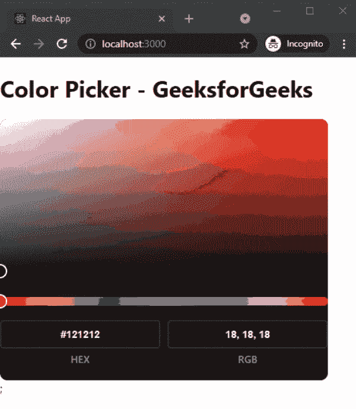

# 如何在 ReactJS 中创建拾色器？

> 原文:[https://www . geesforgeks . org/how-create-picker-in-reactjs/](https://www.geeksforgeeks.org/how-to-create-color-picker-in-reactjs/)

在本文中，我们将学习如何在 ReactJs 中创建颜色选择器。颜色选择器是一种图形用户界面小部件，通常在图形软件或在线上找到，用于选择颜色，有时也用于创建配色方案。

React 是一个免费的开源前端 JavaScript 库，用于构建用户界面或 UI 组件。它由脸书和一个由个人开发者和公司组成的社区维护。

**方法:**为了创建我们的颜色选择器，我们将使用 react-color-palette 包，因为它功能强大、重量轻且完全可定制。之后，我们将使用安装的软件包在主页上添加我们的颜色选择器。

**创建反应堆应用程序:**

**步骤 1:** 您可以使用以下命令创建一个新的 ReactJs 项目:

```jsx
npx create-react-app gfg
```

**步骤 2:** 现在我们将使用以下命令安装反应调色板包:

```jsx
npm install react-color-palette
```

**项目结构:**会是这样的。


**添加拾色器:**在本例中，我们将使用我们安装的软件包在应用程序的主页上添加拾色器。为此，在 **App.js** 文件中添加以下内容。

## App.js

```jsx
import { ColorPicker, useColor } from "react-color-palette";
import "react-color-palette/lib/css/styles.css";

export default function ColorPickerGfg(){
  const [color, setColor] = useColor("hex", "#121212");

  return (
    <div>
        <h1>Color Picker - GeeksforGeeks</h1>
        <ColorPicker width={456} height={228} 
                   color={color} 
                   onChange={setColor} hideHSV dark />;
    </div>
  )
};
```

**说明:**首先在上面的例子中，我们使用 react-color-palette 包导入了 ColorPicker 和用于我们的 color picker 的 CSS 文件。之后，我们使用我们的 useColor()钩子来设置初始颜色。然后，我们将使用已安装软件包的颜色选择器组件添加我们的颜色选择器。

**运行应用的步骤:**在终端运行下面的命令运行应用。

```jsx
npm start
```

### 输出:

