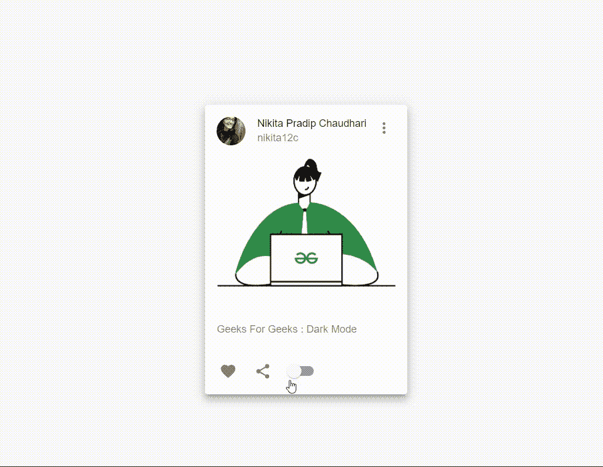

# 如何使用材质 UI 在 ReactJS 中创建黑暗模式？

> 原文:[https://www . geeksforgeeks . org/how-create-dark-mode-in-reactjs-use-material-ui/](https://www.geeksforgeeks.org/how-to-create-dark-mode-in-reactjs-using-material-ui/)

如今，在你的网站或应用程序中使用黑暗模式已经变得非常流行。在本文中，您将学习如何在您的 React web 应用程序中添加暗模式开关，以在亮模式和暗模式之间切换。

**创建反应应用程序和安装模块的步骤:**

*   **步骤 1:** 使用以下命令创建一个反应应用程序:

    ```
    npx create-react-app foldername
    ```

*   **步骤 2:** 创建项目文件夹(即文件夹名称)后，使用以下命令移动到该文件夹:

    ```
    cd foldername
    ```

*   **步骤 3:** 创建 React.js 应用程序后，使用以下命令安装 material-UI 模块。

    ```
    npm install @material-ui/core
    npm install @material-ui/icons
    ```

**示例:**创建一个基本的反应 app 后，我们将在 App 中进行更改。js 如下:

**步骤 1:** 导入主题提供者并创建多个主题

```
import { createMuiTheme, ThemeProvider } from '@material-ui/core/styles';
```

**步骤 2:** 在 App.js 中设置切换逻辑

```
const [toggleDark, settoggleDark] = useState(false);
const myTheme=createMuiTheme({

    // Theme settings
    palette:{
      type: toggleDark ? 'dark' : 'light',
    }
});
```

**第 3 步:**这里我正在创建一个新的 SmallComponent，这将是我们在 App 中导入的新组件。(您可以根据自己的组件对其进行自定义。在这里，我专注于在已经存在的代码中实现黑暗模式)。传递暗模式的状态(切换暗模式和设置暗模式)，这将用于在亮模式和暗模式之间切换。将您的组件包装在主题提供程序中，并传递您定制的主题。

```
<ThemeProvider theme={myTheme}>
    <SmallComponent toggleDark={toggleDark} settoggleDark={settoggleDark}/>
</ThemeProvider>
```

**第 4 步:**使用 SmallComponent.js 中的 onChange 开关触发切换

```
const handleModeChange = () => {
    settoggleDark(!toggleDark)
};
```

```
<Switch
    checked={toggleDark}
    onChange={handleModeChange}
    name="toggleDark"
    color="default"
/>
```

**示例:**

## App.js

```
import React, { useState } from "react";
import SmallComponent from "./SmallComponent";
import { createMuiTheme, ThemeProvider } from "@material-ui/core/styles";

function App() {
  const [toggleDark, settoggleDark] = useState(false);
  const myTheme = createMuiTheme({

    // Theme settings
    palette: {
      type: toggleDark ? "dark" : "light",
    },
  });

  return (

    // Wrapping code in ThemeProvider
    <ThemeProvider theme={myTheme}>
      <SmallComponent toggleDark={toggleDark}
      settoggleDark={settoggleDark} />
    </ThemeProvider>
  );
}

export default App;
```

## 狭窄组件. js

```
import React from "react";
import { makeStyles } from "@material-ui/core/styles";
import Card from "@material-ui/core/Card";
import CardHeader from "@material-ui/core/CardHeader";
import CardMedia from "@material-ui/core/CardMedia";
import CardContent from "@material-ui/core/CardContent";
import CardActions from "@material-ui/core/CardActions";
import Avatar from "@material-ui/core/Avatar";
import IconButton from "@material-ui/core/IconButton";
import Typography from "@material-ui/core/Typography";
import { red } from "@material-ui/core/colors";
import FavoriteIcon from "@material-ui/icons/Favorite";
import ShareIcon from "@material-ui/icons/Share";
import Grid from "@material-ui/core/Grid";
import MoreVertIcon from "@material-ui/icons/MoreVert";

// Import your profile image in images folder
import myImg from "./images/nikita-img.jpeg";

// Import your background image in images folder
import backImg2 from "./images/nik2.jpg"; 
import Switch from "@material-ui/core/Switch";

const useStyles = makeStyles((theme) => ({

  // Styling material components
  root: {
    width: "100%",
    height: "100vh",
    backgroundColor: theme.palette.background.default,
    [theme.breakpoints.down("xs")]: {
      paddingTop: theme.spacing(2),
    },
  },
  media: {
    height: 56,
    paddingTop: "56.25%", // 16:9
  },
  avatar: {
    backgroundColor: red[500],
  },
}));

export default function SmallComponent({ 
        toggleDark, settoggleDark }) {
  const classes = useStyles();

  // Trigger toggle using onChange Switch
  const handleModeChange = () => {
    settoggleDark(!toggleDark);
  };
  return (
    <Grid
      className={classes.root}
      container
      justify="center"
      alignItems="center"
    >
      <Card elevation={8}>
        {/* you can modify the image avatar,
         background and title name to yours*/}
        <CardHeader
          avatar={<Avatar alt="Nikita Chaudhari" src={myImg} />}
          action={
            <IconButton aria-label="settings">
              <MoreVertIcon />
            </IconButton>
          }
          title="Nikita Pradip Chaudhari"
          subheader="nikita12c"
        />
        <CardMedia
          className={classes.media}
          image={backImg2}
          title="Paella dish"
        />
        <CardContent>
          <Typography variant="body2" color="textSecondary" component="p">
            Geeks For Geeks : Dark Mode
          </Typography>
        </CardContent>
        <CardActions disableSpacing>
          <IconButton aria-label="add to favorites">
            <FavoriteIcon />
          </IconButton>
          <IconButton aria-label="share">
            <ShareIcon />
          </IconButton>
          {/* switching between dark and light mode */}
          <Switch
            checked={toggleDark}
            onChange={handleModeChange}
            name="toggleDark"
            color="default"
          />
        </CardActions>
      </Card>
    </Grid>
  );
}
```

**见下方演示视频:**



**说明:**材质-UI 自带两种调色板类型；**亮**(默认)和**暗**。您可以通过设置类型“暗”来使主题变暗。如果你想对配色方案有更多的控制，你可以自己定义它们，或者你可以访问 Material-UI 网站上的 https://material-ui.com/customization/color/#playground 来选择你想要的配色方案。

**参考:**T2**https://material-ui.com/customization/palette/**T5】