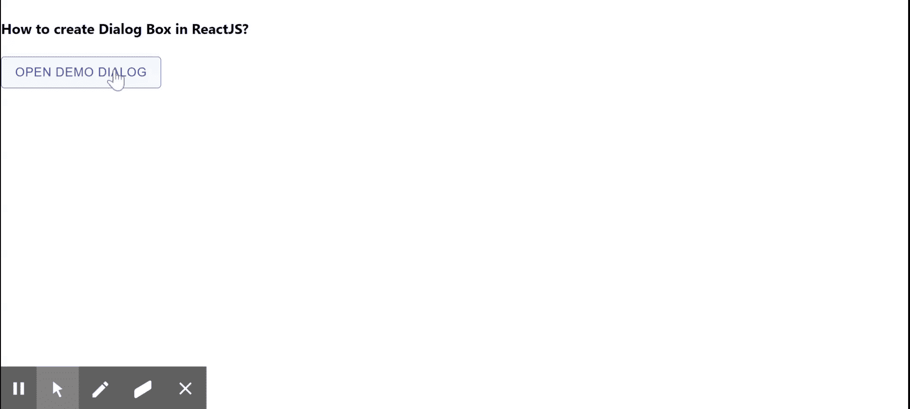

# 如何在 ReactJS 中创建对话框？

> 原文:[https://www . geesforgeks . org/how-to-create-box-in-reactjs-2/](https://www.geeksforgeeks.org/how-to-create-dialog-box-in-reactjs-2/)

对话框是一种出现在应用内容前的模态窗口，用于提供关键信息或请求决策。React 的 Material UI 有这个组件可供我们使用，非常容易集成。我们可以使用以下方法在 ReactJS 中创建对话框。

**创建反应应用程序并安装模块:**

**步骤 1:** 使用以下命令创建一个 React 应用程序。

```jsx
npx create-react-app foldername
```

**步骤 2:** 在创建项目文件夹(即文件夹名**)后，使用以下命令移动到该文件夹。**

```jsx
cd foldername
```

**步骤 3:** 创建 ReactJS 应用程序后，使用以下命令安装 **material-ui** 模块。

```jsx
npm install @material-ui/core
```

**项目结构:**如下图。


项目结构

**示例:**现在在 **App.js** 文件中写下以下代码。在这里，App 是我们编写代码的默认组件。

## App.js

```jsx
import React from "react";
import Dialog from "@material-ui/core/Dialog";
import DialogContentText from "@material-ui/core/DialogContentText";
import DialogTitle from "@material-ui/core/DialogTitle";
import DialogActions from "@material-ui/core/DialogActions";
import DialogContent from "@material-ui/core/DialogContent";
import Button from "@material-ui/core/Button";

export default function App() {
  const [open, setOpen] = React.useState(false);

  const handleClickToOpen = () => {
    setOpen(true);
  };

  const handleToClose = () => {
    setOpen(false);
  };

  return (
    <div stlye={{}}>
      <h4>How to create Dialog Box in ReactJS?</h4>
      <Button variant="outlined" color="primary" 
              onClick={handleClickToOpen}>
        Open Demo Dialog
      </Button>
      <Dialog open={open} onClose={handleToClose}>
        <DialogTitle>{"How are you?"}</DialogTitle>
        <DialogContent>
          <DialogContentText>
            I am Good, Hope the same for you!
          </DialogContentText>
        </DialogContent>
        <DialogActions>
          <Button onClick={handleToClose} 
                  color="primary" autoFocus>
            Close
          </Button>
        </DialogActions>
      </Dialog>
    </div>
  );
}
```

**运行应用程序的步骤:**从项目的根目录使用以下命令运行应用程序。

```jsx
npm start
```

**输出:**现在打开浏览器，转到***http://localhost:3000/***，会看到如下输出。



**参考:**T2】https://material-ui.com/components/dialogs/