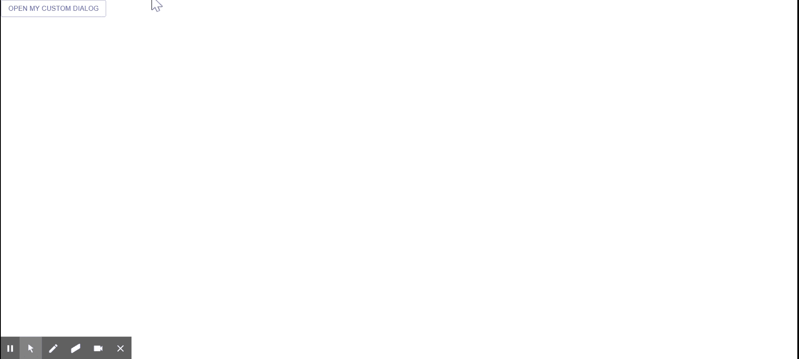

# 如何在 ReactJS 中创建对话框？

> 原文:[https://www . geesforgeks . org/how-to-create-box-in-reactjs/](https://www.geeksforgeeks.org/how-to-create-dialog-box-in-reactjs/)

**对话框**通知用户某项任务，可以包含关键信息、要求决策或涉及多个任务。React 的 Material UI 有这个组件可供我们使用，非常容易集成。我们可以使用以下方法在 ReactJS 中创建对话框:

**创建反应应用程序并安装模块:**

**步骤 1:** 使用以下命令创建一个反应应用程序:

```jsx
npx create-react-app foldername
```

**步骤 2:** 在创建项目文件夹(即文件夹名**)后，使用以下命令将**移动到该文件夹:

```jsx
cd foldername
```

**步骤 3:** 创建 ReactJS 应用程序后，使用以下命令安装 **material-ui** 模块:

```jsx
npm install @material-ui/core
```

**项目结构:**如下图。


项目结构

**App.js:** 现在在 **App.js** 文件中写下以下代码。在这里，App 是我们编写代码的默认组件。

## java 描述语言

```jsx
import React from 'react';
import DialogActions from '@material-ui/core/DialogActions';
import DialogContent from '@material-ui/core/DialogContent';
import DialogTitle from '@material-ui/core/DialogTitle';
import DialogContentText from '@material-ui/core/DialogContentText';
import Dialog from '@material-ui/core/Dialog';
import Button from '@material-ui/core/Button';

const App = () => {
  const [open, setOpen] = React.useState(false);

  const handleClickOpen = () => {
    setOpen(true);
  };

  const handleClose = () => {
    setOpen(false);
  };

  return (
    <div>
      <Button variant="outlined" 
              color="primary" onClick={handleClickOpen}>
        Open My Custom Dialog
      </Button>
      <Dialog open={open} onClose={handleClose}>
        <DialogTitle>
           Greetings from GeeksforGeeks
        </DialogTitle>
        <DialogContent>
          <DialogContentText>
            Do you do coding ?
          </DialogContentText>
        </DialogContent>
        <DialogActions>
          <Button onClick={handleClose} color="primary">
           Close
          </Button>
          <Button onClick={handleClose} color="primary" autoFocus>
           Yes
          </Button>
        </DialogActions>
      </Dialog>
    </div>
  );
}

export default App;
```

**运行应用程序的步骤:**从项目的根目录使用以下命令运行应用程序:

```jsx
npm start
```

**输出:**现在打开浏览器，转到***http://localhost:3000/***，会看到如下输出:

