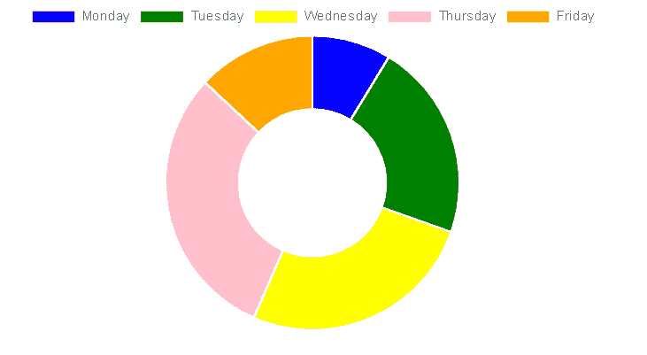

# 如何在 React Bootstrap 中创建甜甜圈图？

> 原文:[https://www . geesforgeks . org/如何创建甜甜圈-反应图-引导/](https://www.geeksforgeeks.org/how-to-create-doughnut-chart-in-react-bootstrap/)

甜甜圈图是饼图的修改版，中间区域被去掉了。甜甜圈更关注用弧的面积来以最有效的方式表示信息，而不是饼图，饼图更注重比较切片之间的比例面积。甜甜圈图在空间方面更有效率，因为甜甜圈图内部的空白空间可以用来显示一些关于甜甜圈图的附加信息。

**创建反应应用程序并安装模块:**

*   **步骤 1:** 使用以下命令创建一个反应应用程序。

    ```jsx
    npx create-react-app foldername
    ```

*   **步骤 2:** 创建项目文件夹(即文件夹名)后，使用以下命令移动到该文件夹。

    ```jsx
    cd foldername
    ```

*   **步骤 3:** 创建 ReactJS 应用程序后，使用以下命令安装所需的模块。

    ```jsx
    npm install --save mdbreact react-chartjs-2
    ```

*   **第四步:**将 Bootstrap CSS 和 fontawesome CSS 添加到 index.js.

    ```jsx
    import '@fortawesome/fontawesome-free/css/all.min.css';  
    import 'bootstrap-css-only/css/bootstrap.min.css';  
    import 'mdbreact/dist/css/mdb.css';
    ```

**项目结构:**如下图。


项目结构

**示例:**现在在 App.js 文件中写下以下代码。在这里，App 是我们编写代码的默认组件。

## App.js

```jsx
import React from "react";
import { MDBContainer } from "mdbreact";
import { Doughnut } from "react-chartjs-2";

const App = () => {

  // Sample data
  const data = {
    labels: ["Monday", "Tuesday", "Wednesday", "Thursday", "Friday"],
      datasets: [
        {
          label: "Hours Studied in Geeksforgeeks",
          data: [2, 5, 6, 7, 3],
          backgroundColor: ["blue", "green", "yellow", "pink", "orange"],
        }
      ]
  }

  return (
    <MDBContainer>
      <Doughnut data={data} />
    </MDBContainer>
  );
}

export default App;
```

**运行应用程序的步骤:**从项目的根目录使用以下命令运行应用程序:

```jsx
npm start
```

**输出:**现在打开浏览器，转到***http://localhost:3000/***，会看到如下输出:



输出