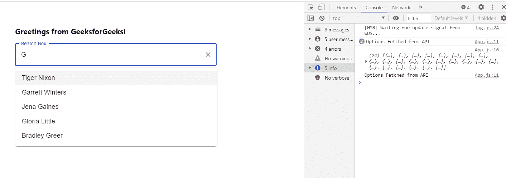

# 如何在 ReactJS 中创建动态搜索框？

> 原文:[https://www . geesforgeks . org/how-create-dynamic-search-box-in-reactjs/](https://www.geeksforgeeks.org/how-to-create-dynamic-search-box-in-reactjs/)

**动态搜索框**是一个带有文本字段的搜索栏，用于接受用户输入，然后对用户输入进行一些操作，根据他的输入向他显示动态结果。每当用户开始键入时，就会调用 API，以便向他显示动态选项。比如 Youtube 搜索框、谷歌 search box 等。【React 的 Material UI 有这个组件可以给我们用，非常容易集成。我们可以使用以下方法在 ReactJS 中创建一个简单的动态搜索框。

**创建反应应用程序并安装模块:**

**步骤 1:** 使用以下命令创建一个反应应用程序:

```
npx create-react-app foldername
```

**步骤 2:** 在创建项目文件夹(即文件夹名**)后，使用以下命令将**移动到该文件夹:

```
cd foldername
```

**步骤 3:** 创建 ReactJS 应用程序后，使用以下命令安装 **material-ui** 模块:

```
npm install @material-ui/core
npm install @material-ui/lab
```

**项目结构:**如下图。


项目结构

**App.js:** 现在在 **App.js** 文件中写下以下代码。在这里，App 是我们编写代码的默认组件。

## java 描述语言

```
import React, { useState } from 'react'
import TextField from '@material-ui/core/TextField';
import Autocomplete from '@material-ui/lab/Autocomplete';

const App = () => {

  const [myOptions, setMyOptions] = useState([])

  const getDataFromAPI = () => {
    console.log("Options Fetched from API")

    fetch('http://dummy.restapiexample.com/api/v1/employees').then((response) => {
      return response.json()
    }).then((res) => {
      console.log(res.data)
      for (var i = 0; i < res.data.length; i++) {
        myOptions.push(res.data[i].employee_name)
      }
      setMyOptions(myOptions)
    })
  }

  return (
    <div style={{ marginLeft: '40%', marginTop: '60px' }}>
      <h3>Greetings from GeeksforGeeks!</h3>
      <Autocomplete
        style={{ width: 500 }}
        freeSolo
        autoComplete
        autoHighlight
        options={myOptions}
        renderInput={(params) => (
          <TextField {...params}
            onChange={getDataFromAPI}
            variant="outlined"
            label="Search Box"
          />
        )}
      />
    </div>
  );
}

export default App
```

**运行应用程序的步骤:**从项目的根目录使用以下命令运行应用程序:

```
npm start
```

**输出:**现在打开浏览器，转到***http://localhost:3000/***，会看到如下输出:



在上面的例子中，您可以看到，每当用户键入任何内容时，都会调用一个名为的应用编程接口来获取选项，这就是我们如何在搜索框中显示动态选项，就像 YouTube、谷歌等一样。