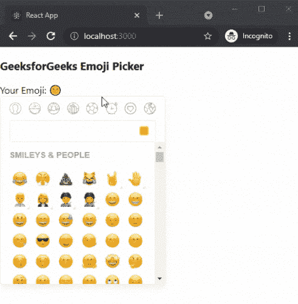

# 如何在 ReactJS 中创建表情选择器？

> 原文:[https://www . geesforgeks . org/how-create-emoji-picker-in-reactjs/](https://www.geeksforgeeks.org/how-to-create-emoji-picker-in-reactjs/)

在本文中，我们将学习如何在 ReactJs 中创建表情选择器。React 是一个免费的开源前端 JavaScript 库，用于构建用户界面或 UI 组件。它由脸书和一个由个人开发者和公司组成的社区维护。

**方法:**为了创建我们的电子表格，我们将使用表情选择器-反应包，因为它功能强大、重量轻且完全可定制。之后，我们将使用已安装的软件包在主页上添加表情选择器。

**创建 reatjs 应用程序:**您可以使用以下命令创建一个新的 reatjs 项目:

```
npx create-react-app gfg
```

**模块安装:**使用以下命令安装表情识别器反应包:

```
npm i emoji-picker-react
```

**项目结构:**会是这样的。


**文件名:App.js** 在这个例子中，我们将使用我们安装的软件包在我们的应用程序主页上添加表情选择器。为此，在 App.js 文件中添加以下内容。

## java 描述语言

```
import React, { useState } from 'react';
import Picker from 'emoji-picker-react';

export default function Emoji(){
  const [chosenEmoji, setChosenEmoji] = useState(null);

  const onEmojiClick = (event, emojiObject) => {
    setChosenEmoji(emojiObject);
  };

  return (
    <div>
      <h3>GeeksforGeeks Emoji Picker</h3>
      {chosenEmoji ? (
        <span>Your Emoji: {chosenEmoji.emoji}</span>
      ) : (
        <span>No Emoji</span>
      )}
      <Picker onEmojiClick={onEmojiClick} />
    </div>
  );
};
```

**说明:**首先在上面的例子中，我们是从表情符号-picker-react 包中导入 Picker 组件。之后，我们使用 useState 添加初始数据并更新表情符号。然后，我们使用 PIcker 组件添加表情选择器。

**运行应用的步骤:**在终端运行下面的命令运行应用。

```
npm start
```

**输出:**

