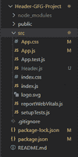
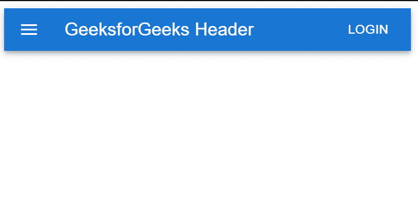

# 如何在 React.js 中创建 Header？

> 原文:[https://www . geesforgeks . org/how-create-header-in-react-js/](https://www.geeksforgeeks.org/how-to-create-header-in-react-js/)

标题是网站设计的重要元素。这是对网站的第一印象。它提供了用户可能想要访问的网站其他区域的有用链接。在本文中，我们将使用 React.js 和 Material UI 创建一个功能性的 Header。

**方法:**首先我们将使用一些安装创建一个基本的 react 应用程序。我们将使用材质用户界面制作带有一些样式的新标题组件。为了创建一个标题，我们将使用应用程序栏从材料用户界面，这将提供屏幕标题，导航和行动。此外，我们将需要一个工具栏，里面将设置子组件的属性，使它们都水平对齐。然后我们将对我们的默认主页(即 App.js 文件)进行一些更改，方法是将新创建的 Header 导入其中。现在让我们开始创建这个。

**创建反应应用程序并安装模块:**

**步骤 1:** 使用以下命令创建一个反应应用程序:

```jsx
npx create-react-app foldername
```

**步骤 2:** 创建项目文件夹(即文件夹名)后，使用以下命令移动到该文件夹:

```jsx
cd foldername
```

**步骤 3:** 创建 React.js 应用程序后，使用以下命令安装 material-ui 模块。

```jsx
npm install @material-ui/core
npm install @mui/icons-material
npm install @mui/material
```

**项目结构:**现在在名为“src”的文件夹中创建新文件 **Header.js** 。我们的头组件将驻留在这个文件中。现在，新的项目结构将如下所示:



更新项目结构

**第三步:**现在我们来制作表头组件。我们将使用应用程序栏组件是从材料用户界面。顶部的应用程序栏提供与当前屏幕相关的内容和操作。它用于品牌、屏幕标题、导航和动作。它可以转换为上下文操作栏，也可以用作导航栏。材质用户界面中的工具栏并不像其他材质用户界面组件那样独立工作，它与应用程序栏一起工作。工具栏组件将属性设置为子组件，使它们都水平对齐。

## Header.js

```jsx
import * as React from "react";

// importing material UI components
import AppBar from "@mui/material/AppBar";
import Box from "@mui/material/Box";
import Toolbar from "@mui/material/Toolbar";
import Typography from "@mui/material/Typography";
import Button from "@mui/material/Button";
import IconButton from "@mui/material/IconButton";
import MenuIcon from "@mui/icons-material/Menu";

export default function Header() {
  return (
      <AppBar position="static">
        <Toolbar>
          {/*Inside the IconButton, we 
           can render various icons*/}
          <IconButton
            size="large"
            edge="start"
            color="inherit"
            aria-label="menu"
            sx={{ mr: 2 }}
          >
            {/*This is a simple Menu 
             Icon wrapped in Icon */}
            <MenuIcon />
          </IconButton>
          {/* The Typography component applies 
           default font weights and sizes */}

          <Typography variant="h6" 
            component="div" sx={{ flexGrow: 1 }}>
            GeeksforGeeks Header
          </Typography>
          <Button color="inherit">Login</Button>
        </Toolbar>
      </AppBar>
  );
}
```

**第四步:**创建完 Header 组件后，我们将在 App.js 中导入，并在 App.js 中进行如下更改。

## App.js

```jsx
import React from "react";
import Header from "./Header";

function App() {
  return (

   // Using the newly created Header 
   // component in this main component
   <Header/>
  );
}
export default App;
```

**运行应用程序的步骤:**从项目的根目录使用以下命令运行应用程序:

```jsx
npm start
```

**输出:**现在打开浏览器，转到 http://localhost:3000/，会看到如下输出:

