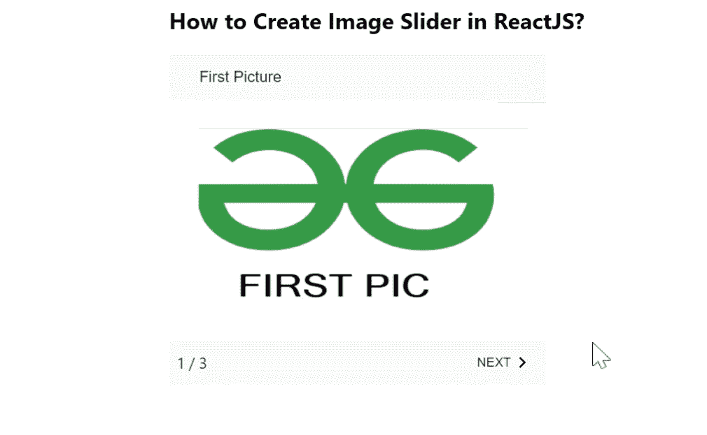

# 如何在 ReactJS 中创建图像滑块？

> 原文:[https://www . geesforgeks . org/如何创建图像-滑入式反应/](https://www.geeksforgeeks.org/how-to-create-image-slider-in-reacts/)

图像滑块表示用下一个按钮显示图像集合，这样用户可以用该按钮移动到下一张图片。在网络应用程序或移动应用程序中显示图像集合是最常见的功能。【React 的 Material UI 有这个组件可供我们使用，非常容易集成。我们可以使用以下方法在 ReactJS 中使用 MobileStepper 组件。

**创建反应应用程序并安装模块:**

**步骤 1:** 使用以下命令创建一个反应应用程序:

```jsx
npx create-react-app foldername
```

**步骤 2:** 创建项目文件夹(即文件夹名**)后，使用以下命令移动到该文件夹中:**

```jsx
cd foldername
```

**步骤 3:** 创建 ReactJS 应用程序后，使用以下命令安装 **material-ui** 模块:

```jsx
npm install @material-ui/core
npm install @material-ui/icons
```

**项目结构:**如下图。


项目结构

**App.js:** 现在在 **App.js** 文件中写下以下代码。在这里，App 是我们编写代码的默认组件。

## java 描述语言

```jsx
import React from "react";
import Button from "@material-ui/core/Button";
import MobileStepper from "@material-ui/core/MobileStepper";
import Paper from "@material-ui/core/Paper";
import KeyboardArrowRight from "@material-ui/icons/KeyboardArrowRight";
import Typography from "@material-ui/core/Typography";
import { useTheme } from "@material-ui/core/styles";
import KeyboardArrowLeft from "@material-ui/icons/KeyboardArrowLeft";

const MyCollection = [
  {
    label: "First Picture",
    imgPath:
"https://media.geeksforgeeks.org/wp-content/uploads/20210208000010/1.png",
  },
  {
    label: "Second Picture",
    imgPath:
"https://media.geeksforgeeks.org/wp-content/uploads/20210208000009/2.png",
  },
  {
    label: "Third Picture",
    imgPath:
"https://media.geeksforgeeks.org/wp-content/uploads/20210208000008/3.png",
  },
];

const App = () => {
  const CollectionSize = MyCollection.length;
  const theme = useTheme();
  const [index, setActiveStep] = React.useState(0);

  const goToNextPicture = () => {
    setActiveStep((prevActiveStep) => prevActiveStep + 1);
  };

  return (
    <div
      style={{
        marginLeft: "40%",
      }}
    >
      <h2>How to Create Image Slider in ReactJS?</h2>
      <div
        style={{
          maxWidth: 400,
          flexGrow: 1,
        }}
      >
        <Paper
          square
          elevation={0}
          style={{
            height: 50,
            display: "flex",
            paddingLeft: theme.spacing(4),
            backgroundColor: theme.palette.background.default,
            alignItems: "center",
          }}
        >
          <Typography>{MyCollection[index].label}</Typography>
        </Paper>
        
        <MobileStepper
          variant="text"
          position="static"
          index={index}
          steps={CollectionSize}
          nextButton={
            <Button
              size="small"
              onClick={goToNextPicture}
              disabled={index === CollectionSize - 1}
            >
              Next
              {theme.direction !== "rtl" ? (
                <KeyboardArrowRight />
              ) : (
                <KeyboardArrowLeft />
              )}
            </Button>
          }
        />
      </div>
    </div>
  );
};

export default App;
```

**运行应用程序的步骤:**从项目的根目录使用以下命令运行应用程序:

```jsx
npm start
```

**输出:**现在打开浏览器，转到***http://localhost:3000/***，会看到如下输出。

