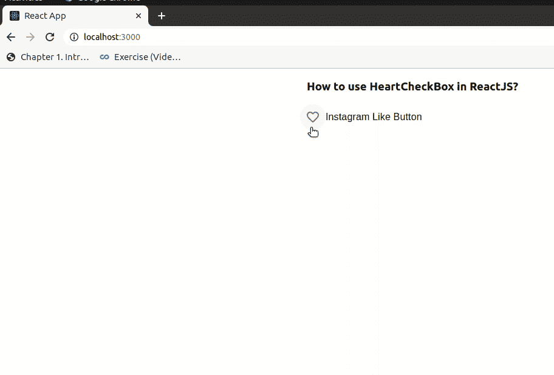

# 如何在 ReactJS 中创建 Instagram Like 按钮？

> 原文:[https://www . geesforgeks . org/how-create-insta gram-like-button-in-reactjs/](https://www.geeksforgeeks.org/how-to-create-instagram-like-button-in-reactjs/)

我们可以在 ReactJS 中使用复选框组件、FormControlLabel 组件、和图标组件创建 Instagram Like Button。React 的 Material UI 有这个组件可供我们使用，非常容易集成。它 可以用来打开或关闭一个选项。 我们可以使用通过以下方法创建 Instagram 类似 ReactJS 中的按钮:

**创建反应应用程序并安装模块:**

**步骤 1:** 使用以下命令创建一个反应应用程序:

```
npx create-react-app foldername
```

**步骤 2:** 创建项目文件夹(即文件夹名**)后，使用以下命令移动到该文件夹中:**

```
cd foldername
```

**步骤 3:** 创建 ReactJS 应用程序后，使用以下命令安装 **material-ui** 模块:

```
npm install @material-ui/core
@material-ui/icons
```

**项目结构:**如下图。


项目结构

**App.js:** 现在在 **App.js** 文件中写下以下代码。在这里，App 是我们编写代码的默认组件。

## java 描述语言

```
import React from 'react';
import FormControlLabel from '@material-ui/core/FormControlLabel';
import Checkbox from '@material-ui/core/Checkbox';
import Favorite from '@material-ui/icons/Favorite';
import FavoriteBorder from '@material-ui/icons/FavoriteBorder';

const App = () => {

  return (
    <div style={{
      margin: 'auto',
      display: 'block',
      width: 'fit-content'
    }}>
      <h3>How to use HeartCheckBox in ReactJS?</h3>
      <FormControlLabel
        control={<Checkbox icon={<FavoriteBorder />} 
                  checkedIcon={<Favorite />}
          name="checkedH" />}
        label="Instagram Like Button"
      />
    </div>
  );
}

export default App;
```

**运行应用程序的步骤:**从项目的根目录使用以下命令运行应用程序:

```
npm start
```

**输出:**现在打开浏览器，转到***http://localhost:3000/***，会看到如下输出:

