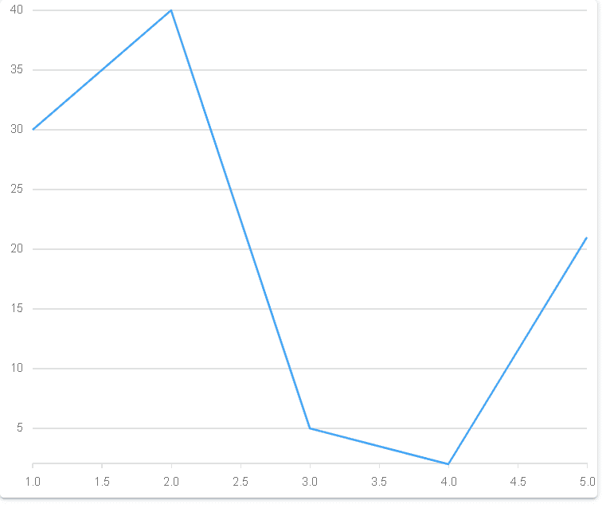

# 如何使用材质 UI 和 DevExpress 在 react 中创建折线图？

> 原文:[https://www . geeksforgeeks . org/如何创建使用材料的反应折线图-ui-and-devexpress/](https://www.geeksforgeeks.org/how-to-create-line-chart-in-react-using-material-ui-and-devexpress/)

**DevExpress:** DevExpress 是一个用于控制和构建 Window、Mobile 和其他应用程序的用户界面的包。

**折线图:**折线图用于表示不同轴上两个数据关系 X 和关系 Y 之间的关系。图中的一个轴代表被比较的特定类别，而另一个轴代表对应于这些类别的测量值。

**创建 React 应用程序和安装模块的步骤:**

*   **步骤 1:** 使用以下命令创建一个反应应用程序。

    ```
    npx create-react-app foldername
    ```

*   **步骤 2:** 创建项目文件夹(即文件夹名称)后，使用以下命令移动到该文件夹。

    ```
    cd foldername
    ```

*   **步骤 3:** 创建 ReactJS 应用程序后，使用以下命令安装所需的模块。

    ```
    npm i --save @devexpress/dx-react-core @devexpress/dx-react-chart
    npm install @material-ui/core
    npm i --save @devexpress/dx-react-chart-material-ui
    ```

**项目结构:**如下图:


项目结构

**示例:**现在在 App.js 文件中写下以下代码。在这里，应用程序是我们编写代码的默认组件。

## App.js

```
import React from "react";
import Paper from '@material-ui/core/Paper';
import {
  ArgumentAxis,
  ValueAxis,
  Chart,
  LineSeries,
} from '@devexpress/dx-react-chart-material-ui';

const App = () => {

// Sample data
const data = [
  { x: 1, y: 30 },
  { x: 2, y: 40 },
  { x: 3, y: 5 },
  { x: 4, y: 2 },
  { x: 5, y: 21 },
];
return (
    <Paper>
    <Chart
      data={data}
    >
      <ArgumentAxis />
      <ValueAxis />

      <LineSeries valueField="y" argumentField="x" />
    </Chart>
  </Paper>
);
}

export default App;
```

**运行应用程序的步骤:**从项目的根目录使用以下命令运行应用程序:

```
npm start
```

**输出:**现在打开浏览器，转到***http://localhost:3000/***，会看到如下输出:



输出