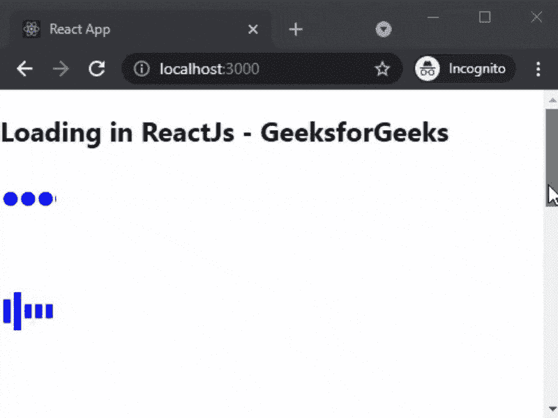

# 如何在 ReactJS 中创建加载屏幕？

> 原文:[https://www . geeksforgeeks . org/如何创建加载屏幕-in-reactjs/](https://www.geeksforgeeks.org/how-to-create-loading-screen-in-reactjs/)

在本文中，我们将学习如何在 ReactJs 中创建加载屏幕。加载屏幕是由计算机程序(通常是视频游戏)在程序加载或初始化时显示的图片。

React 是一个免费的开源前端 JavaScript 库，用于构建用户界面或 UI 组件。它由脸书和一个由个人开发者和公司组成的社区维护。

**方法:**为了创建我们的加载屏幕，我们将使用 react-loading 包，因为它功能强大、重量轻且完全可定制。之后，我们将使用已安装的软件包在主页上添加不同类型的加载屏幕。

**创建 reatjs 应用程序:**您可以使用以下命令创建一个新的 reatjs 项目:

```jsx
npx create-react-app gfg
```

**安装所需的包:**现在我们将使用以下命令安装反作用加载包:

```jsx
npm i react-loading
```

**项目结构:**会是这样的。


**添加加载屏幕:**在这个例子中，我们将使用我们安装的包在我们的应用程序主页上添加反应加载。为此，在 **App.js** 文件中添加以下内容。

## java 描述语言

```jsx
import React from "react";
import ReactLoading from "react-loading";

export default function Loading() {
  return (
    <div>
      <h2>Loading in ReactJs - GeeksforGeeks</h2>
      <ReactLoading type="balls" color="#0000FF" 
        height={100} width={50} />
      <ReactLoading type="bars" color="#0000FF"
        height={100} width={50} />
      <ReactLoading type="bubbles" color="#0000FF"
        height={100} width={50} />
      <ReactLoading type="cubes" color="#0000FF"
        height={100} width={50} />
      <ReactLoading type="cylon" color="#0000FF" 
        height={100} width={50} />
      <ReactLoading type="spin" color="#0000FF"
        height={100} width={50} />
      <ReactLoading type="spokes" color="#0000FF"
        height={100} width={50} />
      <ReactLoading
        type="spinningBubbles"
        color="#0000FF"
        height={100}
        width={50}
      />
    </div>
  );
}
```

**说明:**首先在上面的例子中，我们从 ReactLoading 包导入 react loading 组件。之后，我们将使用我们的 ReactLoading 组件来添加不同类型的加载屏幕。我们可以设置加载屏幕的类型、颜色、高度和宽度。

**运行应用的步骤:**在终端运行下面的命令运行应用。

```jsx
npm start
```

### 输出:

