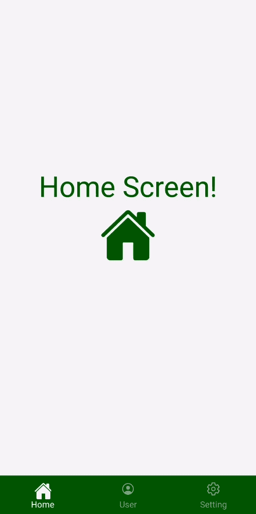

# 如何在 React Native 中创建物料底部标签导航器？

> 原文:[https://www . geesforgeks . org/how-create-material-bottom-tab-navigator-in-react-native/](https://www.geeksforgeeks.org/how-to-create-material-bottom-tab-navigator-in-react-native/)

要使用材质创建底部标签导航器，我们需要使用反应导航库中的创建材质底部标签导航器功能。它是用屏幕底部的材质主题标签栏设计的。它为您提供了令人愉悦的用户界面功能，并允许您通过动画在不同路线之间切换。“材质底部”选项卡导航器最重要的亮点是路线被“延迟初始化”，即与路线相对应的屏幕组件在被聚焦之前不会被安装。

**创建应用程序和安装模块:**

*   **步骤 1:** 打开终端，通过以下命令安装 expo-cli。

    ```jsx
    npm install -g expo-cli
    ```

*   **步骤 2:** 现在通过以下命令创建一个项目。

    ```jsx
    expo init demo-app
    ```

*   **第三步:**现在进入你的项目文件夹，即演示应用程序

    ```jsx
    cd demo-app
    ```

*   **步骤 4:** 使用以下命令安装所需的软件包:

    > npm 安装-保存反应-导航-材料-底部-选项卡反应-本地-纸张反应-本地-矢量-图标

**项目结构:**项目目录应该如下所示:


**项目结构**

**示例:**现在，让我们设置我们的材质底部选项卡导航器，以及一些基本的 CSS 样式。在我们的演示应用程序中将有 3 个屏幕:主屏幕、用户屏幕和设置屏幕。因此，我们将有 3 个选项卡在这 3 个屏幕之间导航。首先，我们将添加我们的 App.js 文件，它将保存材料底部标签导航器逻辑。除了关于屏幕和标签的基本信息，我们还将在设置时添加图标和基本样式。

## App。射流研究…

```jsx
import React from "react";
import { Ionicons } from "@expo/vector-icons";
import { createAppContainer } from "react-navigation";
import { createMaterialBottomTabNavigator } from
    "react-navigation-material-bottom-tabs";

import HomeScreen from "./screens/HomeScreen";
import UserScreen from "./screens/UserScreen";
import SettingScreen from "./screens/SettingScreen";

const TabNavigator = createMaterialBottomTabNavigator(
  {
    Home: {
      screen: HomeScreen,
      navigationOptions: {
        tabBarLabel: "Home",
        tabBarIcon: (tabInfo) => (
          <Ionicons
            name="md-home"
            size={tabInfo.focused ? 26 : 20}
            color={tabInfo.tintColor}
          />
        ),
      },
    },
    User: {
      screen: UserScreen,
      navigationOptions: {
        tabBarLabel: "User",
        tabBarIcon: (tabInfo) => (
          <Ionicons
            name="md-person-circle-outline"
            size={tabInfo.focused ? 26 : 20}
            color={tabInfo.tintColor}
          />
        ),
      },
    },
    Setting: {
      screen: SettingScreen,
      navigationOptions: {
        tabBarLabel: "Setting",
        tabBarIcon: (tabInfo) => (
          <Ionicons
            name="md-settings-outline"
            size={tabInfo.focused ? 26 : 20}
            color={tabInfo.tintColor}
          />
        ),
      },
    },
  },
  {
    initialRouteName: "Home",
    barStyle: { backgroundColor: "#006600" },
  }
);

const Navigator = createAppContainer(TabNavigator);

export default function App() {
  return (
    <Navigator>
      <HomeScreen />
    </Navigator>
  );
}
```

现在，我们需要导航到三个屏幕。

## HomeScreen.js

```jsx
import React from "react";
import { Text, View } from "react-native";
import { Ionicons } from "@expo/vector-icons";

const Home = () => {
  return (
    <View style={{ flex: 1, alignItems: "center", justifyContent: "center" }}>
      <Text style={{ color: "#006600", fontSize: 40 }}>Home Screen!</Text>
      <Ionicons name="md-home" size={80} color="#006600" />
    </View>
  );
};

export default Home;
```

## UserScreen.js

```jsx
import React from "react";
import { Text, View } from "react-native";
import { Ionicons } from "@expo/vector-icons";

const User = () => {
  return (
    <View style={{ flex: 1, alignItems: "center", justifyContent: "center" }}>
      <Text style={{ color: "#006600", fontSize: 40 }}>User Screen!</Text>
      <Ionicons name="md-person-circle-outline" size={80} color="#006600" />
    </View>
  );
};

export default User;
```

## SettingScreen.js

```jsx
import React from "react";
import { Text, View } from "react-native";
import { Ionicons } from "@expo/vector-icons";

const Settings = () => {
  return (
    <View style={{ flex: 1, alignItems: "center", justifyContent: "center" }}>
      <Text style={{ color: "#006600", fontSize: 40 }}>Settings Screen!</Text>
      <Ionicons name="md-settings-outline" size={80} color="#006600" />
    </View>
  );
};

export default Settings;
```

**运行文件:**使用以下命令启动服务器。

```jsx
expo start
```

**输出:**注意当你点击单个标签时，会有轻微的动画。这是由物料底部标签导航器自动提供的。



**输出**

**参考:**[https://react navigation . org/docs/material-bottom-tab-navigator/](https://reactnavigation.org/docs/material-bottom-tab-navigator/)