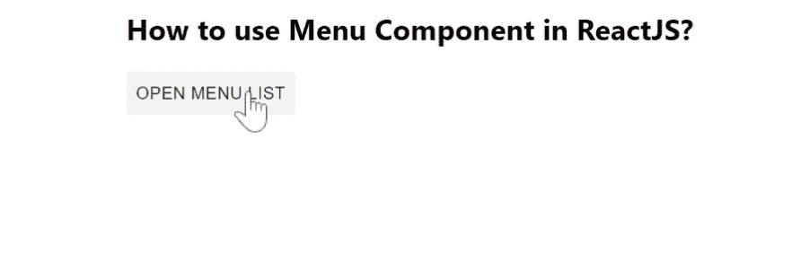

# 如何在 ReactJS 中创建菜单项组件？

> 原文:[https://www . geesforgeks . org/how-create-menu-item-in-component-reactjs/](https://www.geeksforgeeks.org/how-to-create-menu-item-component-in-reactjs/)

菜单在临时表面上显示选项列表。菜单  是  任何应用程序必不可少的一部分。【React 的 Material UI 有这个组件可供我们使用，非常容易集成。我们可以使用以下方法在 ReactJS 中使用菜单组件。

**创建反应应用程序并安装模块:**

**步骤 1:** 使用以下命令创建一个反应应用程序:

```
npx create-react-app foldername
```

**步骤 2:** 创建项目文件夹(即文件夹名**)后，使用以下命令移动到该文件夹中:**

```
cd foldername
```

**步骤 3:** 创建 ReactJS 应用程序后，使用以下命令安装 **material-ui** 模块:

```
npm install @material-ui/core
```

**项目结构:**如下图。


项目结构

**App.js:** 现在在 **App.js** 文件中写下以下代码。在这里，App 是我们编写代码的默认组件。

## java 描述语言

```
import React from "react";
import MenuItem from "@material-ui/core/MenuItem";
import Button from "@material-ui/core/Button";
import Menu from "@material-ui/core/Menu";

const App = () => {
  const [anchorEl, setAnchorEl] = React.useState(null);

  const handleClose = () => {
    setAnchorEl(null);
  };

  const handleClick = (event) => {
    setAnchorEl(event.currentTarget);
  };

  return (
    <div
      style={{
        marginLeft: "40%",
      }}
    >
      <h2>How to use Menu Component in ReactJS?</h2>
      <Button
        aria-controls="simple-menu"
        aria-haspopup="true"
        onClick={handleClick}
      >
        Open Menu List
      </Button>
      <Menu
        keepMounted
        anchorEl={anchorEl}
        onClose={handleClose}
        open={Boolean(anchorEl)}
      >
        <MenuItem onClick={handleClose}>My Account</MenuItem>
        <MenuItem onClick={handleClose}>Settings</MenuItem>
        <MenuItem onClick={handleClose}>Profile</MenuItem>
        <MenuItem onClick={handleClose}>Logout</MenuItem>
      </Menu>
    </div>
  );
};

export default App;
```

**运行应用程序的步骤:**从项目的根目录使用以下命令运行应用程序:

```
npm start
```

**输出:**现在打开浏览器，转到***http://localhost:3000/***，会看到如下输出:

