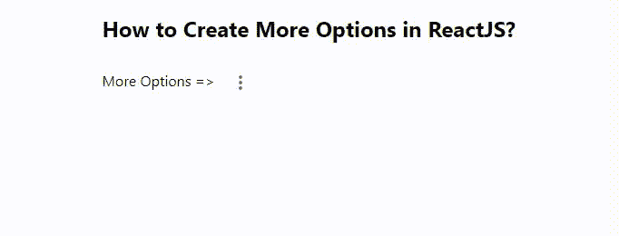

# 如何在 ReactJS 中创建更多选项？

> 原文:[https://www . geeksforgeeks . org/如何创建更多选项-in-reactjs/](https://www.geeksforgeeks.org/how-to-create-more-options-in-reactjs/)

更多选项是每个应用程序  都必须在点击按钮时向用户显示一些额外功能的常见特征。【React 的 Material UI 有这个组件可供我们使用，非常容易集成。我们可以使用以下方法在 ReactJS 中创建更多选项。

**创建反应应用程序并安装模块。**

**步骤 1:** 使用以下命令创建一个 React 应用程序。

```jsx
npx create-react-app foldername
```

**步骤 2:** 在创建项目文件夹(即文件夹名**)后，使用以下命令移动到该文件夹。**

```jsx
cd foldername
```

**步骤 3:** 创建 ReactJS 应用程序后，使用以下命令安装 **material-ui** 模块:

```jsx
npm install @material-ui/core
npm install @material-ui/icons
```

**App.js:** 现在在 **App.js** 文件中写下以下代码。在这里，App 是我们编写代码的默认组件。

## java 描述语言

```jsx
import React from "react";
import MoreVertIcon from "@material-ui/icons/MoreVert";
import IconButton from "@material-ui/core/IconButton";
import MenuItem from "@material-ui/core/MenuItem";
import Menu from "@material-ui/core/Menu";

const App = () => {
  const [anchorEl, setAnchorEl] = React.useState(null);

  const MyOptions = [
    "Share via Whatsapp",
    "Send Email",
    "Download",
    "Save as PDF",
  ];

  const handleClick = (event) => {
    setAnchorEl(event.currentTarget);
  };

  const open = Boolean(anchorEl);

  const handleClose = () => {
    setAnchorEl(null);
  };

  return (
    <div
      style={{
        marginLeft: "40%",
      }}
    >
      <h2>How to Create More Options in ReactJS?</h2>
      <span>More Options => </span>
      <IconButton
        aria-label="more"
        onClick={handleClick}
        aria-haspopup="true"
        aria-controls="long-menu"
      >
        <MoreVertIcon />
      </IconButton>
      <Menu 
        anchorEl={anchorEl} 
        keepMounted onClose={handleClose} 
        open={open}>
        {MyOptions.map((option) => (
          <MenuItem
            key={option} 
            onClick={handleClose}>
            {option}
          </MenuItem>
        ))}
      </Menu>
    </div>
  );
};

export default App;
```

**运行应用程序的步骤:**从项目的根目录使用以下命令运行应用程序:

```jsx
npm start
```

**输出:**现在打开浏览器，转到***http://localhost:3000/***，会看到如下输出。

