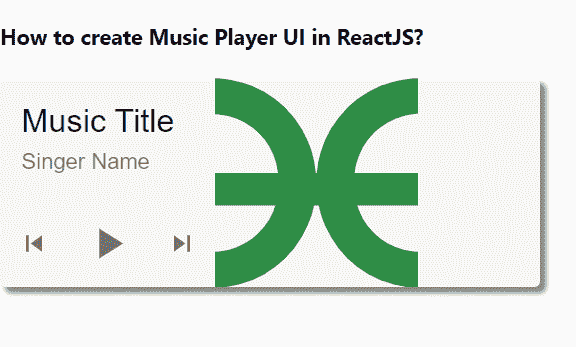

# 如何在 ReactJS 中创建音乐播放器 UI 控件组件？

> 原文:[https://www . geesforgeks . org/how-create-music-player-ui-controls-component-in-reactjs/](https://www.geeksforgeeks.org/how-to-create-music-player-ui-controls-component-in-reactjs/)

我们可以使用下面的逻辑在 ReactJS 中创建一个音乐播放器基本的用户界面，这个逻辑非常简单并且容易实现。【React 的 Material UI 有这个组件可供我们使用，非常容易集成。我们可以使用以下方法在 ReactJS 中创建它。

**创建反应应用程序并安装模块:**

**步骤 1:** 使用以下命令创建一个 React 应用程序。

```
npx create-react-app foldername
```

**步骤 2:** 在创建项目文件夹(即文件夹名**)后，使用以下命令移动到该文件夹。**

```
cd foldername
```

**步骤 3:** 创建 ReactJS 应用程序后，使用以下命令安装 **material-ui** 模块。

```
npm install @material-ui/core
npm install @material-ui/icons
```

**项目结构:**如下图。


项目结构

**示例:**现在在 **App.js** 文件中写下以下代码。在这里，App 是我们编写代码的默认组件。

## App.js

```
import React from "react";
import CardContent from "@material-ui/core/CardContent";
import SkipPreviousIcon from "@material-ui/icons/SkipPrevious";
import SkipNextIcon from "@material-ui/icons/SkipNext";
import { useTheme } from "@material-ui/core/styles";
import Typography from "@material-ui/core/Typography";
import IconButton from "@material-ui/core/IconButton";
import CardMedia from "@material-ui/core/CardMedia";
import PlayArrowIcon from "@material-ui/icons/PlayArrow";
import Card from "@material-ui/core/Card";

export default function App() {
  const playAudio = () => {
    const audioEl = document.getElementsByClassName("audio-element")[0];
    audioEl.play();
  };

  return (
    <div style={{}}>
      <h4>How to create Music Player UI in ReactJS?</h4>
      <Card
        style={{
          width: 400,
          display: "flex",
          backgroundColor: "whitesmoke",
          boxShadow: "4px 4px 4px gray",
        }}
      >
        <div
          style={{
            display: "flex",
            flexDirection: "column",
          }}
        >
          <CardContent
            style={{
              flex: "1 0 auto",
            }}
          >
            <Typography component="h5" variant="h5">
              Music Title
            </Typography>
            <Typography variant="subtitle1" color="textSecondary">
              Singer Name
            </Typography>
          </CardContent>
          <div
            style={{
              display: "flex",
              alignItems: "center",
              paddingLeft: 1,
              paddingBottom: 1,
            }}
          >
            <IconButton aria-label="previous">
              {useTheme().direction !== "rtl" ? (
                <SkipPreviousIcon />
              ) : (
                <SkipNextIcon />
              )}
            </IconButton>
            <IconButton aria-label="play/pause">
              <PlayArrowIcon
                style={{
                  height: 38,
                  width: 38,
                }}
                onClick={playAudio}
              />
            </IconButton>
            <IconButton aria-label="next">
              {useTheme().direction !== "rtl" ? (
                <SkipNextIcon />
              ) : (
                <SkipPreviousIcon />
              )}
            </IconButton>
          </div>
        </div>
        <CardMedia
          style={{
            width: 151,
          }}
          image=
"https://write.geeksforgeeks.org/static/media/Group%20210.08204759.svg"
        />
        <audio className="audio-element">
          <source src=
"https://assets.coderrocketfuel.com/pomodoro-times-up.mp3">
          </source>
        </audio>
      </Card>
    </div>
  );
}
```

**运行应用程序的步骤:**从项目的根目录使用以下命令运行应用程序。

```
npm start
```

**输出:**现在打开浏览器，转到***http://localhost:3000/***，会看到如下输出。



**参考:**T2】https://material-ui.com/components/cards/#ui-controls