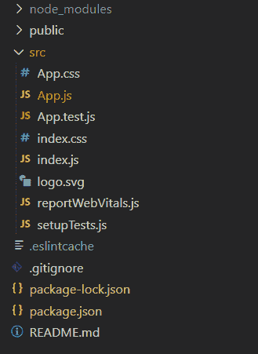
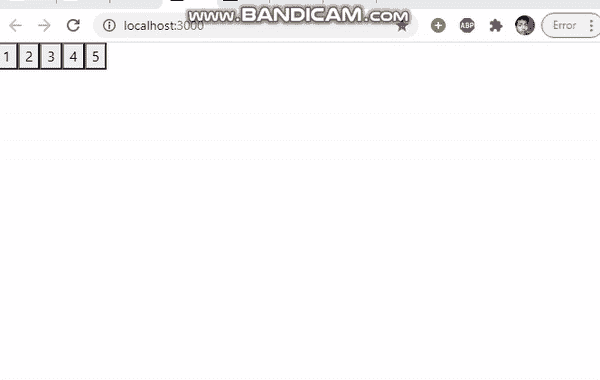

# 如何用 ReactJS 贴图道具创建新元素？

> 原文:[https://www . geeksforgeeks . org/how-create-new-elements-with-reactjs-mapping-props/](https://www.geeksforgeeks.org/how-to-create-new-elements-with-reactjs-mapping-props/)

如果我们想使用映射道具创建新的元素/组件，那么我们可以使用 map()函数。map()方法创建一个新数组，该数组填充了对调用数组中的每个元素调用所提供的函数的结果。

下面是映射方法的示例:

```jsx
// Sample array
const array1 = [1, 4, 9, 16];

// Pass a function to map
const map1 = array1.map(x => x * 2);

console.log(map1);
// Expected output: Array [2, 8, 18, 32]
```

我们以同样的方式将每个元素乘以 2，我们也可以使用 map 函数创建每个值的元素。

**创建反应应用程序:**

*   **步骤 1:** 使用以下命令创建一个反应应用程序:

    ```jsx
    npx create-react-app foldername
    ```

*   **步骤 2:** 创建项目文件夹(即文件夹名)后，使用以下命令移动到该文件夹:

    ```jsx
    cd foldername
    ```

**项目结构:**如下图。



**示例:**现在在 **App.js** 文件中写下以下代码。在这里，App 是我们编写代码的默认组件。

## App.js

```jsx
import React from 'react'

class App extends React.Component {

  getComponent = (arr) => {
    return arr.map(value => (
      <button key={value} onClick={() => {
        alert("button " + value + " is clicked")
      }}>{value} </button>
    ))
  }

  render() {
    const components = this.getComponent([1, 2, 3, 4, 5]);
    return (
      <div>
        {components}
      </div>
    )
  }
}

export default App;
```

**运行应用程序的步骤:**从项目的根目录使用以下命令运行应用程序:

```jsx
npm start
```

**输出:**现在打开浏览器，转到***http://localhost:3000/***，会看到如下输出:

