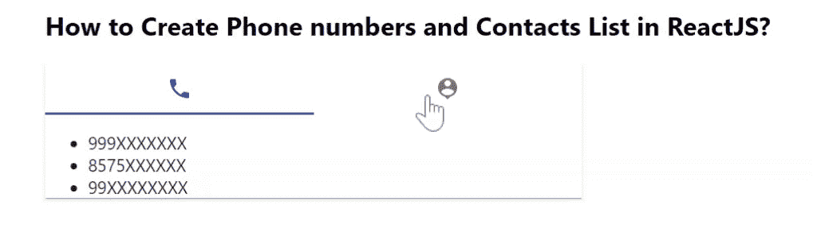

# 如何在 ReactJS 中创建电话号码和联系人列表？

> 原文:[https://www . geesforgeks . org/如何创建电话号码和联系人列表-in-reactjs/](https://www.geeksforgeeks.org/how-to-create-phone-numbers-and-contacts-list-in-reactjs/)

我们可以使用以下方法在 ReactJS 中创建电话号码列表以及联系人姓名。React 的 Material UI 有这个组件可供我们使用，非常容易集成。联系人列表/号码可以显示在列表中，并且可以切换选项卡来更改数据状态。

**创建反应应用程序并安装模块:**

**步骤 1:** 使用以下命令创建一个反应应用程序:

```jsx
npx create-react-app foldername
```

**步骤 2:** 在创建项目文件夹(即文件夹名**)后，使用以下命令将**移动到该文件夹:

```jsx
cd foldername
```

**步骤 3:** 创建 ReactJS 应用程序后，使用以下命令安装 **material-ui** 模块:

```jsx
npm install @material-ui/core
npm install @material-ui/icons
```

**App.js:** 现在在 **App.js** 文件中写下以下代码。在这里，App 是我们编写代码的默认组件。

## java 描述语言

```jsx
import React, { useState } from "react";
import Paper from "@material-ui/core/Paper";
import Tab from "@material-ui/core/Tab";
import Tabs from "@material-ui/core/Tabs";
import PhoneIcon from "@material-ui/icons/Phone";
import PersonPinIcon from "@material-ui/icons/PersonPin";

const App = () => {
  const [value, setValue] = React.useState(0);

  const [myList, setMyList] = useState([
    "999XXXXXXX",
    "8575XXXXXX",
    "99XXXXXXXX",
  ]);

  const handleChange = (event, newValue) => {
    if (newValue == 0) {
      setMyList(["999XXXXXXX", "8575XXXXXX", "99XXXXXXXX"]);
      setValue(0);
    } else {
      setMyList(["Contact One", "Contact Two", "Contact Three"]);
      setValue(1);
    }
  };

  return (
    <div
      style={{
        marginLeft: "40%",
      }}
    >
      <h2>
          How to Create Phone numbers and 
          Contacts List in ReactJS?
      </h2>
      <Paper
        square
        style={{
          flexGrow: 1,
          maxWidth: 500,
        }}
      >
        <Tabs
          value={value}
          onChange={handleChange}
          variant="fullWidth"
          indicatorColor="primary"
          textColor="primary"
          aria-label="icon tabs example"
        >
          <Tab icon={<PhoneIcon />} aria-label="phone" />
          <Tab icon={<PersonPinIcon />} aria-label="person" />
        </Tabs>
        <ul>
          <li>{myList[0]}</li>
          <li>{myList[1]}</li>
          <li>{myList[2]}</li>
        </ul>
      </Paper>
    </div>
  );
};

export default App;
```

**运行应用程序的步骤:**从项目的根目录使用以下命令运行应用程序。

```jsx
npm start
```

**输出:**现在打开浏览器，转到***http://localhost:3000/***，会看到如下输出。

