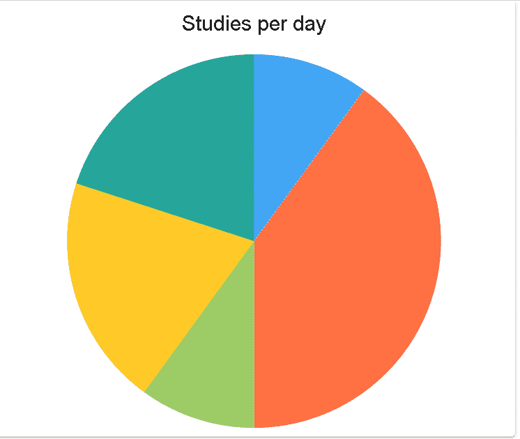

# 如何使用材质 UI 和 DevExpress 在 react 中创建饼图？

> 原文:[https://www . geeksforgeeks . org/如何使用材料创建反应饼图-ui-and-devexpress/](https://www.geeksforgeeks.org/how-to-create-pie-chart-in-react-using-material-ui-and-devexpress/)

**DevExpress:** DevExpress 是一个用于控制和构建 Window、Mobile 和其他应用程序的用户界面的包。

**饼状图:**饼状图是一种圆形的统计图形，将饼状图分成若干个切片来说明数字比例。它描绘了一个使用“饼图切片”的特殊图表，其中每个扇区显示数据的相对大小。

**创建 React 应用程序和安装模块的步骤:**

*   **步骤 1:** 使用以下命令创建一个 React 应用程序。

    ```jsx
    npx create-react-app foldername
    ```

*   **步骤 2:** 创建项目文件夹即文件夹名称后，使用以下命令移动到该文件夹。

    ```jsx
    cd foldername
    ```

*   **步骤 3:** 创建 ReactJS 应用程序后，使用以下命令安装所需的模块。

    ```jsx
    npm i --save @devexpress/dx-react-core @devexpress/dx-react-chart
    npm install @material-ui/core
    npm i --save @devexpress/dx-react-chart-material-ui
    ```

**项目结构:**如下图:


项目结构

**示例:**现在在 App.js 文件中写下以下代码。在这里，应用程序是我们编写代码的默认组件。

## App.js

```jsx
import React from "react";
import Paper from '@material-ui/core/Paper';
import {
  Chart,
  PieSeries,
  Title
} from '@devexpress/dx-react-chart-material-ui';

const App = () => {

// Sample data
const data = [
  { argument:'Monday', value:10 },
  { argument:'Tuesday', value:40 },
  { argument:'Wednesday', value:10 },
  { argument:'Thursday', value:20 },
  { argument:'Friday', value:20 },
];
return (
    <Paper>
    <Chart
      data={data}
    >
      <PieSeries valueField="value" argumentField="argument" />
      <Title text="Studies per day"/>
    </Chart>
  </Paper>
);
}

export default App;
```

**运行应用程序的步骤:**从项目的根目录使用以下命令运行应用程序:

```jsx
npm start
```

**输出:**现在打开浏览器，转到***http://localhost:3000/***，会看到如下输出:



输出