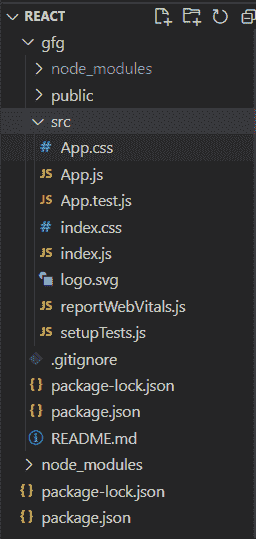
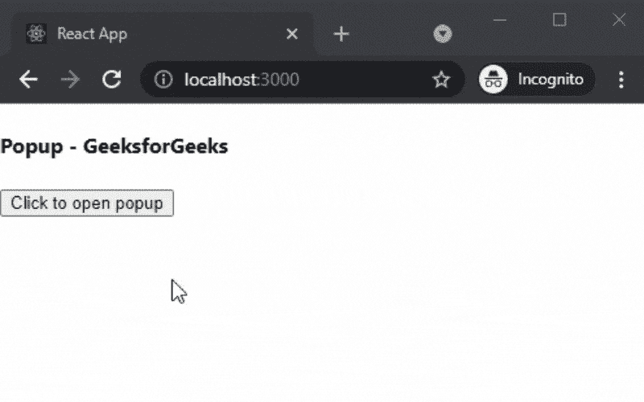

# 如何在 ReactJS 中创建弹出框？

> 原文:[https://www . geeksforgeeks . org/如何创建弹出框-in-reactjs/](https://www.geeksforgeeks.org/how-to-create-popup-box-in-reactjs/)

在本文中，我们将学习如何在 ReactJs 中创建弹出窗口。弹出式窗口是一种图形用户界面显示区域，通常是一个小窗口，突然出现在视觉界面的前景中。

React 是一个免费的开源前端 JavaScript 库，用于构建用户界面或 UI 组件。它由脸书和一个由个人开发者和公司组成的社区维护。

**方法:**为了创建我们的弹出窗口，我们将使用 reactjs-popup 包，因为它功能强大、重量轻且完全可定制。之后，我们将在主页上添加弹出窗口，并使用安装的软件包触发弹出窗口。

**创建 reatjs 应用程序:**您可以使用以下命令创建一个新的 reatjs 项目:

```
npx create-react-app gfg
```

**安装所需的软件包:**现在我们将使用以下命令安装 reactjs-popup 软件包:

```
npm i reactjs-popup
```

**项目结构:**会是这样的。



**添加弹出窗口:**在本例中，我们将使用我们安装的软件包在应用程序的主页上添加弹出窗口。为此，在 App.js 文件中添加以下内容。

## java 描述语言

```
import React from 'react';
import Popup from 'reactjs-popup';
import 'reactjs-popup/dist/index.css';

export default function PopupGfg(){
  return(
  <div>
    <h4>Popup - GeeksforGeeks</h4>
    <Popup trigger={<button> Click to open popup </button>} 
     position="right center">
      <div>GeeksforGeeks</div>
      <button>Click here</button>
    </Popup>
  </div>
  )
};
```

**解释:**首先在上面的例子中，我们从 react-popup 包中导入了 Popup 组件。之后，我们使用弹出组件添加一个带有按钮的弹出窗口来触发弹出窗口。

**运行应用的步骤:**在终端运行下面的命令运行应用。

```
npm start
```

**输出:**

