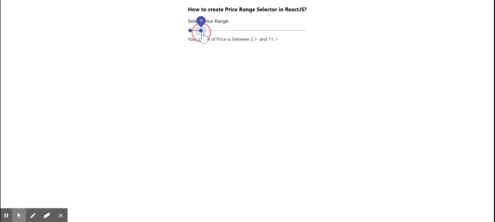

# 如何在 ReactJS 中创建价格区间选择器？

> 原文:[https://www . geeksforgeeks . org/如何创建价格范围选择器 in-reactjs/](https://www.geeksforgeeks.org/how-to-create-price-range-selector-in-reactjs/)

**价格范围选择器**意味着用户能够在给定值之间选择范围。React 的 Material UI 有这个组件可供我们使用，非常容易集成。价格范围选择器是非常流行的功能，用于根据用户选择的范围过滤结果。

**创建反应应用程序并安装模块:**

**步骤 1:** 使用以下命令创建一个反应应用程序:

```jsx
npx create-react-app foldername
```

**步骤 2:** 在创建项目文件夹(即文件夹名**)后，使用以下命令将**移动到该文件夹:

```jsx
cd foldername
```

**步骤 3:** 创建 ReactJS 应用程序后，使用以下命令安装 **material-ui** 模块:

```jsx
npm install @material-ui/core
```

**项目结构:**如下图。


项目结构

**App.js:** 现在在 **App.js** 文件中写下以下代码。在这里，**应用程序**是我们编写代码的默认组件。

## java 描述语言

```jsx
import React from 'react';
import Typography from '@material-ui/core/Typography';
import Slider from '@material-ui/core/Slider';

const App = () => {

  // Our States
  const [value, setValue] =  React.useState([2,10]);

  // Changing State when volume increases/decreases
  const rangeSelector = (event, newValue) => {
    setValue(newValue);
    console.log(newValue)
  };

  return (
    <div style={{
      margin: 'auto',
      display: 'block',
      width: 'fit-content'
    }}>
      <h3>How to create Price Range Selector in ReactJS?</h3>
      <Typography id="range-slider" gutterBottom>
        Select Price Range:
      </Typography>
      <Slider
        value={value}
        onChange={rangeSelector}
        valueLabelDisplay="auto"
      />
      Your range of Price is between {value[0]} /- and {value[1]} /-
    </div>
  );
}

export default App;
```

**运行应用程序的步骤:**从项目的根目录使用以下命令运行应用程序:

```jsx
npm start
```

**输出:**现在打开浏览器，转到***http://localhost:3000/***，会看到如下输出:



**支持的浏览器:**

*   铬
*   探险家
*   微软边缘