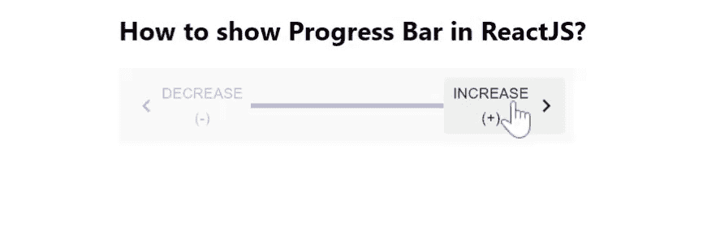

# 如何在 ReactJS 中创建进度条？

> 原文:[https://www . geeksforgeeks . org/如何创建进度条-in-reactjs/](https://www.geeksforgeeks.org/how-to-create-progress-bar-in-reactjs/)

进度条显示任何任务或活动的进度度量。它是进程的图形表示。【React 的 Material UI 有这个组件可供我们使用，非常容易集成。我们可以使用以下方法在 ReactJS 中创建进度条。

**创建反应应用程序并安装模块:**

**步骤 1:** 使用以下命令创建一个反应应用程序:

```
npx create-react-app foldername
```

**步骤 2:** 创建项目文件夹(即文件夹名**)后，使用以下命令移动到该文件夹中:**

```
cd foldername
```

**步骤 3:** 创建 ReactJS 应用程序后，使用以下命令安装 **material-ui** 模块:

```
npm install @material-ui/core
npm install @material-ui/icons
```

**App.js:** 现在在 **App.js** 文件中写下以下代码。在这里，App 是我们编写代码的默认组件。

## java 描述语言

```
import React from "react";
import { useTheme } from "@material-ui/core/styles";
import KeyboardArrowLeft from "@material-ui/icons/KeyboardArrowLeft";
import MobileStepper from "@material-ui/core/MobileStepper";
import KeyboardArrowRight from "@material-ui/icons/KeyboardArrowRight";
import Button from "@material-ui/core/Button";

const App = () => {
  const theme = useTheme();
  const [progressCount, setCurrentStepCount] = React.useState(0);

  const handleBack = () => {
    setCurrentStepCount((prevActiveStep) => prevActiveStep - 1);
  };

  const handleNext = () => {
    setCurrentStepCount((prevActiveStep) => prevActiveStep + 1);
  };

  return (
    <div
      style={{
        marginLeft: "40%",
      }}
    >
      <h2>How to show Progress Bar in ReactJS?</h2>
      <MobileStepper
        steps={6}
        activeStep={progressCount}
        position="static"
        variant="progress"
        style={{
          maxWidth: 400,
          flexGrow: 1,
        }}
        backButton={
          <Button
            size="small"
            onClick={handleBack}
            disabled={progressCount === 0}
          >
            {theme.direction !== "rtl" ? (
              <KeyboardArrowLeft />
            ) : (
              <KeyboardArrowRight />
            )}
            Decrease (-)
          </Button>
        }
        nextButton={
          <Button
            size="small"
            onClick={handleNext}
            disabled={progressCount === 5}
          >
            Increase (+)
            {theme.direction !== "rtl" ? (
              <KeyboardArrowRight />
            ) : (
              <KeyboardArrowLeft />
            )}
          </Button>
        }
      />
    </div>
  );
};

export default App;
```

**运行应用程序的步骤:**从项目的根目录使用以下命令运行应用程序。

```
npm start
```

**输出:**现在打开浏览器，转到***http://localhost:3000/***，会看到如下输出。

