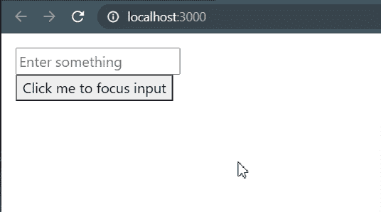

# 如何在 ReactJS 中创建 refs？

> 原文:[https://www . geeksforgeeks . org/how-create-refs-in-reactjs/](https://www.geeksforgeeks.org/how-to-create-refs-in-reactjs/)

在 ReactJS 中创建引用非常简单。参考文献通常用于以下目的:

*   管理焦点、文本选择或媒体播放。
*   触发命令式动画。
*   与第三方 DOM 库集成。

**注意:**对于任何可以声明性完成的事情，都应该避免使用 refs。

以下示例仅基于功能组件，但您也可以自由使用类组件。

**方法 1** :使用**[react . create ref()](https://www.geeksforgeeks.org/how-to-create-refs-in-reactjs/)**。在 **React 16.3 中介绍过。**

*   使用 React.createRef()创建一个引用变量
*   使用元素的**参考**属性来附加参考变量

**文件名:App.js**

## java 描述语言

```
// Importing everything as React
import * as React from "react";

const App = () => {
  // Creating textInputRef variable
  const textInputRef = React.createRef();

  // This method will be used to focus textInput
  const textInputFocusHandler = () => {
    // Focusing input element
    textInputRef.current.focus();
  };

  return (
    <div>

      {/** Attaching ref variable using element's ref attribute */}
      <input ref={textInputRef} type="text" 
             placeholder="Enter something" />

      {/** Attaching textInputFocusHandler method to button click */}
      <button onClick={textInputFocusHandler}>
             Click me to focus input
      </button>
    </div>
  );
};

export default App;
```

**方法二**:使用 **[useRef()](https://www.geeksforgeeks.org/react-js-useref-hook/)** 勾。

*   使用 React.useRef()创建一个引用变量
*   使用元素的引用属性来附加引用变量
*   与 createRef()相比，使用 useRef()的好处是可以方便地保留任何可变值，就像在类中使用实例字段一样。
*   useRef()也采用初始值。

**文件名:App.js**

## java 描述语言

```
// Importing everything as React
import * as React from "react";

const App = () => {
  // Creating textInputRef variable with initialValue "null"
  const textInputRef = React.useRef(null);

  // This method will be used to focus textInput
  const textInputFocusHandler = () => {
    // Focusing input element
    textInputRef.current.focus();
  };

  return (
    <div>

      {/** Attaching ref variable using element's ref attribute */}
      <input ref={textInputRef} type="text" 
             placeholder="Enter something" />

      {/** Attaching textInputFocusHandler method to button click */}
      <button onClick={textInputFocusHandler}>
              Click me to focus input
      </button>
    </div>
  );
};

export default App;
```

**方法 3** :使用回调引用。该方法在**反应 16.3** 之前使用。所以如果你正在使用反应< 16.3 使用这个方法。

使用此方法创建 ref 与其他两种方法有点不同。我们不传递使用 **createRef()** 或 **useRef()** 创建的 ref 属性，而是传递一个函数。函数接收 React 元素或 HTML DOM 元素作为参数，可以使用。

**文件名:App.js**

## java 描述语言

```
// Importing everything as React
import * as React from "react";

const App = () => {
  // Creating and initializing textInputRef variable as null 
  let textInputRef = null;

  // Callback function that will set ref for input field
  // Note: It can be used to set ref for any element
  const setTextInputRef = (element) => {
      textInputRef = element;
  };

  // This method will be used to focus textInput
  const textInputFocusHandler = () => {

    // If textInputRef is not null
    // otherwise it will throw an error
    if (textInputRef) {

      // Focusing input element
      textInputRef.focus();
    }
  };

  return (
    <div style={{ padding: 16 }}>
      {/** Using setTextInputRef function so that
       *   textInputRef can be set as ref for this input field
       * */}
      <input
        style={{ display: "block" }}
        ref={setTextInputRef}
        type="text"
        placeholder="Enter something"
      />

      {/** Attaching textInputFocusHandler 
           method to button click */}
      <button onClick={textInputFocusHandler}>
          Click me to focus input
      </button>
    </div>
  );
};

export default App;
```

**运行应用程序的步骤:**从项目的根目录使用以下命令运行应用程序:

```
npm start
```

**输出**:

