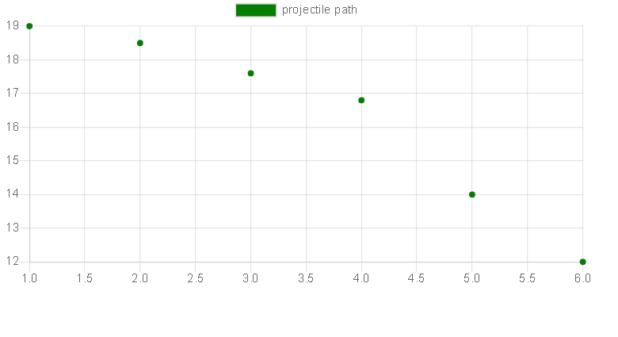

# 如何在 React Bootstrap 中创建散点图？

> 原文:[https://www . geesforgeks . org/如何创建反应中散点图-引导/](https://www.geeksforgeeks.org/how-to-create-scatter-chart-in-react-bootstrap/)

散点图用于观察变量之间的关系，并使用点来表示变量之间的关系。散点图广泛用于表示变量之间的关系以及一个变量的变化如何影响另一个变量。

**创建反应应用程序并安装模块:**

*   **步骤 1:** 使用以下命令创建一个反应应用程序。

    ```
    npx create-react-app foldername
    ```

*   **步骤 2:** 创建项目文件夹(即文件夹名)后，使用以下命令移动到该文件夹。

    ```
    cd foldername
    ```

*   **步骤 3:** 创建 ReactJS 应用程序后，使用以下命令安装所需的模块。

    ```
    npm install --save mdbreact react-chartjs-2
    ```

*   **第四步:**将 Bootstrap CSS 和 fontawesome CSS 添加到 index.js.

    ```
    import '@fortawesome/fontawesome-free/css/all.min.css';  
    import 'bootstrap-css-only/css/bootstrap.min.css';  
    import 'mdbreact/dist/css/mdb.css';
    ```

**项目结构:**如下图。


项目结构

**示例:**现在在 App.js 文件中写下以下代码。在这里，App 是我们编写代码的默认组件。

## App.js

```
import React from "react";
import { MDBContainer } from "mdbreact";
import { Scatter } from "react-chartjs-2";

const App = () => {

// Sample data
const data = {
      datasets: [
        {
          backgroundColor: 'green',
          label: 'projectile path',
          data: [
            {
              x: 1,
              y: 19
            },
            {
              x: 2,
              y: 18.5
            },
            {
              x: 3,
              y: 17.6
            },
            {
              x: 4,
              y: 16.8
            },
            {
              x: 5,
              y: 14
            },
            {
              x: 6,
              y: 12
            },
          ]
        }
      ]
    }

return (
    <MDBContainer>
    <Scatter data={data} />
    </MDBContainer>
);
}

export default App;
```

**运行应用程序的步骤:**从项目的根目录使用以下命令运行应用程序:

```
npm start
```

**输出:**现在打开浏览器，转到***http://localhost:3000/***，会看到如下输出:



输出