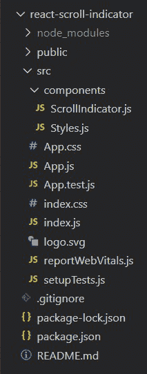
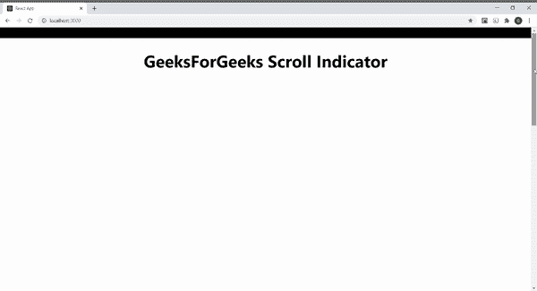

# 如何使用 ReactJS 创建滚动指示器？

> 原文:[https://www . geeksforgeeks . org/如何创建-滚动-指示器-使用-reactjs/](https://www.geeksforgeeks.org/how-to-create-scroll-indicator-using-reactjs/)

下面的方法介绍了如何使用 React JS 创建滚动指示器。这是一个简单的效果，你可以添加到任何 ReactJS 网站。

**先决条件:**

*   npm 和创建-反应-应用命令的基本知识。
*   样式组件的基本知识。
*   [**<u>基础知识使用</u>** 的](https://www.geeksforgeeks.org/what-is-usestate-in-react/)钩子。

**基本设置:**你将使用 [**<u>创建-反应-app</u>**](https://www.geeksforgeeks.org/reactjs-setting-development-environment/) 命令开始一个新项目。

```jsx
npx create-react-app react-scroll-indicator
```

现在，通过在终端中键入给定的命令，进入您的**反应-滚动-指示器**文件夹。

```jsx
cd react-scroll-indicator
```

**所需模块:**通过在终端中键入给定的命令，安装本项目所需的依赖项:

```jsx
npm install --save styled-components
```

现在在 src 中创建**组件**文件夹，然后转到组件文件夹，创建两个文件**scrollindinator . js**和**style . js**。

**项目结构:**项目中的文件结构如下图所示:



**示例:**在本例中，我们将设计一个滚动指示器组件，为此，我们需要操作 App.js 文件和其他创建的组件文件。

我们创建一个状态，其中第一个元素 scroll 作为初始状态，值为 0，第二个元素作为函数 **setScroll()** 来更新状态。然后创建了一个名为**的函数，在这个函数中我们声明了以下变量:**

*   **滚动:**它告诉我们到目前为止用户向下滚动了多少像素。
*   **MaxHeight:** 它告诉我们整个网页的高度和用户可以看到的浏览器最大部分的高度之差。
*   **滚动百分比:**它告诉我们滚动指示器元素宽度的百分比值。它等于 100 乘以用户向下滚动到目前为止(从顶部)的像素数与用户只能向下滚动才能看到的浏览器剩余部分的像素数之比。

当我们开始向下滚动页面时，函数**将通过[窗口触发。它将状态值设置为滚动百分比，因此当我们向下滚动页面时，指示条开始以绿色填充。当我们向上滚动页面时，颜色的数量会减少。](https://www.geeksforgeeks.org/javascript-addeventlistener-with-examples/)**

## ScrollIndicator.js(滚动指示器. js)

```jsx
import React, { useState, Fragment } from "react";
import { Container, ProgressBar, ScrollContent, Heading } from "./Styles";
const ScrollIndicator = () => {
  const [scroll, setScroll] = useState(0);

  const onScroll = () => {
    const Scrolled = document.documentElement.scrollTop;
    const MaxHeight =
      document.documentElement.scrollHeight -
      document.documentElement.clientHeight;
    const ScrollPercent = (Scrolled / MaxHeight) * 100;
    setScroll(ScrollPercent);
  };

  window.addEventListener("scroll", onScroll);

  return (
    <Fragment>
      <Container>
        <ProgressBar style={{ width: `${scroll}%` }}>
        </ProgressBar>
      </Container>
      <ScrollContent>
        <Heading>GeeksForGeeks Scroll Indicator</Heading>
      </ScrollContent>
    </Fragment>
  );
};

export default ScrollIndicator;
```

## Styles.js

```jsx
import styled from 'styled-components';

export const Container = styled.div`
   background-color: black;
   height: 30px;
   position: sticky;
   top: 0;
   left: 0;
   z-index: 1;
   width: 100%;
`

export const ProgressBar = styled.div`
   height: 30px;
   background-color: green;
`
export const ScrollContent = styled.div`
   overflowY: scroll;
   height:2000px;
`; 

export const Heading = styled.h1`
   text-align: center;
   font-size: 3rem;
`
```

## App.js

```jsx
import ScrollIndicator from
    './components/ScrollIndicator';

function App() {
  return (
     <ScrollIndicator />
  );
}

export default App;
```

**运行应用程序的步骤:**从项目的根目录使用以下命令运行应用程序:

```jsx
npm start
```

**输出:**现在打开浏览器，转到 **http://localhost:3000/** ，会看到如下输出:

