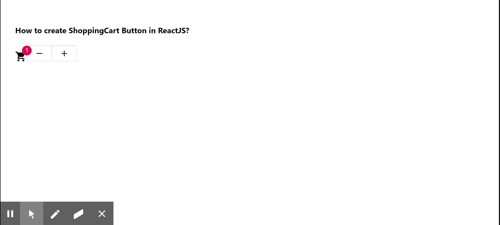

# 如何在 ReactJS 中创建购物车按钮？

> 原文:[https://www . geeksforgeeks . org/如何创建购物车-按钮-in-reactjs/](https://www.geeksforgeeks.org/how-to-create-shopping-cart-button-in-reactjs/)

我们可以通过功能创建一个购物类似购物车的按钮，在 ReactJS 中增加物品数量和减少物品数量的方法如下。【React 的 Material UI 有这个组件可供我们使用，非常容易集成。

**创建反应应用程序并安装模块:**

**步骤 1:** 使用以下命令创建一个 React 应用程序。

```jsx
npx create-react-app foldername
```

**步骤 2:** 在创建项目文件夹(即文件夹名**)后，使用以下命令移动到该文件夹。**

```jsx
cd foldername
```

**步骤 3:** 创建 ReactJS 应用程序后，使用以下命令安装 **material-ui** 模块。

```jsx
npm install @material-ui/core
npm install @material-ui/icons
```

**项目结构:**如下图。


项目结构

**示例:**现在在 **App.js** 文件中写下以下代码。在这里，App 是我们编写代码的默认组件。

## App.js

```jsx
import React from "react";
import ButtonGroup from "@material-ui/core/ButtonGroup";
import Badge from "@material-ui/core/Badge";
import ShoppingCartIcon from "@material-ui/icons/ShoppingCart";
import Button from "@material-ui/core/Button";
import AddIcon from "@material-ui/icons/Add";
import RemoveIcon from "@material-ui/icons/Remove";

export default function App() {
  const [itemCount, setItemCount] = React.useState(1);

  return (
    <div style={{ display: "block", padding: 30 }}>
      <h4>How to create ShoppingCart Button in ReactJS?</h4>
      <div>
        <Badge color="secondary" badgeContent={itemCount}>
          <ShoppingCartIcon />{" "}
        </Badge>
        <ButtonGroup>
          <Button
            onClick={() => {
              setItemCount(Math.max(itemCount - 1, 0));
            }}
          >
            {" "}
            <RemoveIcon fontSize="small" />
          </Button>
          <Button
            onClick={() => {
              setItemCount(itemCount + 1);
            }}
          >
            {" "}
            <AddIcon fontSize="small" />
          </Button>
        </ButtonGroup>
      </div>
    </div>
  );
}
```

**运行应用程序的步骤:**从项目的根目录使用以下命令运行应用程序。

```jsx
npm start
```

**输出:**现在打开浏览器，转到***http://localhost:3000/***，会看到如下输出。



**参考:**T2】https://material-ui.com/components/badges