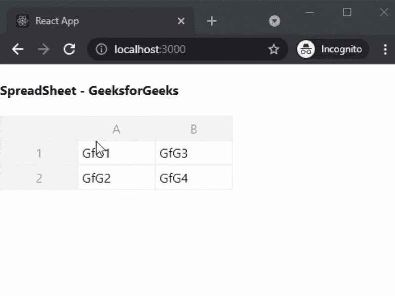

# 如何在 ReactJS 中创建电子表格？

> 原文:[https://www . geeksforgeeks . org/如何创建电子表格 in-reactjs/](https://www.geeksforgeeks.org/how-to-create-spreadsheet-in-reactjs/)

在本文中，我们将学习如何在 ReactJs 中创建电子表格。电子表格是由行和列中的单元格组成的文件，可以帮助排列、计算和排序数据。

React 是一个免费的开源前端 JavaScript 库，用于构建用户界面或 UI 组件。它由脸书和一个由个人开发者和公司组成的社区维护。

**方法:**为了创建我们的电子表格，我们将使用 react-电子表格包，因为它功能强大、重量轻且完全可定制。之后，我们将使用安装的软件包在主页上添加一个电子表格。

**创建 reatjs 应用程序:**您可以使用以下命令创建一个新的 reatjs 项目:

```jsx
npx create-react-app gfg
```

**安装所需的包:**现在我们将使用以下命令安装 react-电子表格包:

```jsx
npm install react-spreadsheet
```

**项目结构:**会是这样的。


**添加电子表格:**在本例中，我们将使用我们安装的软件包在应用程序的主页上添加电子表格。为此，在 **App.js** 文件中添加以下内容。

## java 描述语言

```jsx
import Spreadsheet from "react-spreadsheet";
import { useState } from "react";

export default function Sheet(){
  const [data, setData] = useState([
    [{ value: "GfG1" }, { value: "GfG3" }],
    [{ value: "GfG2" }, { value: "GfG4" }],
  ]);
  return(
  <div>
    <h4>SpreadSheet - GeeksforGeeks</h4>
    <Spreadsheet data={data} onChange={setData} />
  </div> 
  )

};
```

**解释:**在上面的例子中，首先，我们从 react-电子表格包中导入电子表格组件。之后，我们使用 useState 添加初始数据并更新数据。然后，我们使用电子表格组件添加电子表格。

**运行应用的步骤:**在终端运行下面的命令运行应用。

```jsx
npm start
```

### 输出:

