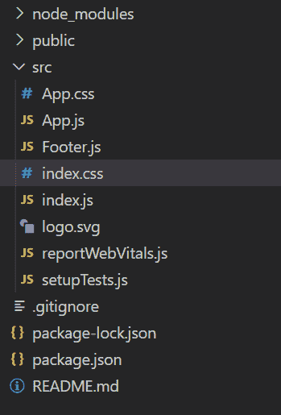
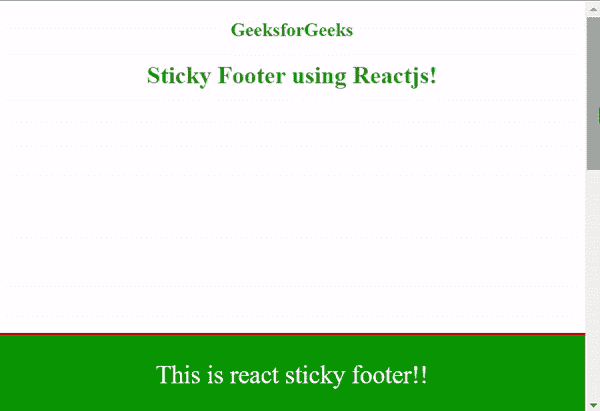

# 如何在 ReactJS 中创建粘性页脚？

> 原文:[https://www . geesforgeks . org/how-create-stick-footer-in-reactjs/](https://www.geeksforgeeks.org/how-to-create-sticky-footer-in-reactjs/)

在本文中，我们将看到如何在 ReactJS 中创建一个粘性页脚。页脚是网站设计的重要元素。一个粘性页脚粘在网站的底部，并向用户发出信号，表明他们已经到达网页的末尾。为了与 react 合作，我们必须先建立项目。

**创建反应应用程序:**

*   **步骤 1:** 使用以下命令创建一个反应应用程序:

    ```jsx
    npx create-react-app react-footer
    ```

*   **步骤 2:** 创建项目文件夹后，即反应-页脚，使用以下命令移动到该文件夹:

    ```jsx
    cd react-footer
    ```

**项目结构:**如下图。



**示例:**在本例中，我们将设计一个页脚，为此，我们需要操作 App.js 文件和 App.css 以及 Footer.js 文件。

## 页脚. js

```jsx
import React from 'react';

const Footer = () => (
  <footer className="footer">
    <p>This is react sticky footer!!</p>

  </footer>
);

export default Footer;
```

## App.css

```jsx
body {
 margin: 0;
 padding: 0;
 height:1000px;
}
.App{
 color: #228b22;
 text-align: center;
}
.footer {
 background-color: green;
 border-top:2px solid red;
 position: fixed;
 width: 100%;
 bottom: 0;
 color: white;
 font-size: 25px;
}
```

## App.js

```jsx
import React from "react";

// Importing the footer component
import Footer from "./Footer";

// Importing the styling of App component
import "./App.css";

const App = () => (
  <div className="App">
    <h3>GeeksforGeeks</h3>
    <h2>Sticky Footer using Reactjs!</h2>
    <Footer />
  </div>
);

export default App;
```

**运行应用程序的步骤:**从项目的根目录使用以下命令运行应用程序:

```jsx
npm start
```

**输出:**现在打开浏览器，转到***http://localhost:3000/***，会看到如下输出:

