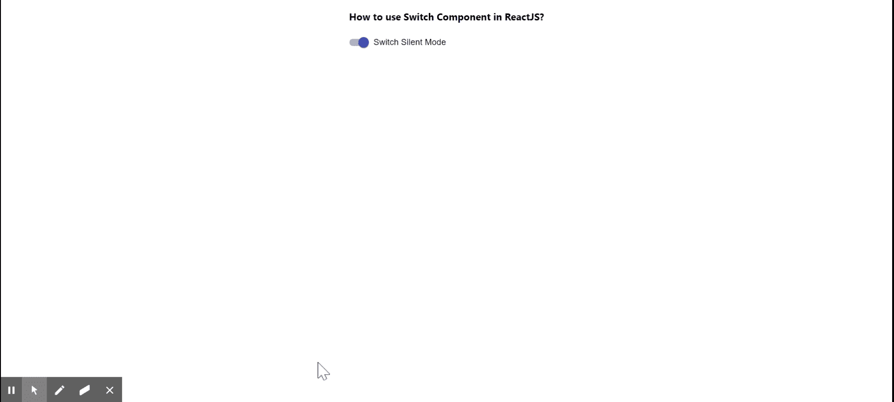

# 如何在 ReactJS 中创建 Switch？

> 原文:[https://www . geeksforgeeks . org/how-create-switch-in-reactjs/](https://www.geeksforgeeks.org/how-to-create-switch-in-reactjs/)

**开关**切换单个设置的开启或关闭状态。开关在我们希望用户在任意数值之间切换时很有用，比如 iPhone 静音按钮等。React 的 Material UI 有这个组件可供我们使用，非常容易集成。我们可以使用以下方法在 ReactJS 中使用开关组件。

**创建反应应用程序并安装模块:**

**步骤 1:** 使用以下命令创建一个反应应用程序:

```jsx
npx create-react-app foldername
```

**步骤 2:** 在创建项目文件夹(即文件夹名**)后，使用以下命令将**移动到该文件夹:

```jsx
cd foldername
```

**步骤 3:** 创建 ReactJS 应用程序后，使用以下命令安装 **material-ui** 模块:

```jsx
npm install @material-ui/core
```

**项目结构:**如下图。


项目结构

**App.js:** 现在在 **App.js** 文件中写下以下代码。在这里，App 是我们编写代码的默认组件。

## java 描述语言

```jsx
import React from 'react';
import FormControlLabel from '@material-ui/core/FormControlLabel';
import Switch from '@material-ui/core/Switch';

const App = () => {

  // Our States
  const [state, setState] = React.useState({status: true});

  // Change State Function
  const handleChange = (event) => {
    setState({ ...state, [event.target.name]: event.target.checked });
  };

  return (
    <div style={{
      margin: 'auto',
      display: 'block',
      width: 'fit-content'
    }}>
      <h3>How to use Switch Component in ReactJS?</h3>
      <FormControlLabel
        control={
          <Switch
            checked={state.status}
            onChange={handleChange}
            color="primary"
            name="status"
          />
        }
        label="Switch Silent Mode"
      />
    </div>
  );
}

export default App;
```

**运行应用程序的步骤:**从项目的根目录使用以下命令运行应用程序:

```jsx
npm start
```

**输出:**现在打开浏览器，转到***http://localhost:3000/***，会看到如下输出:

