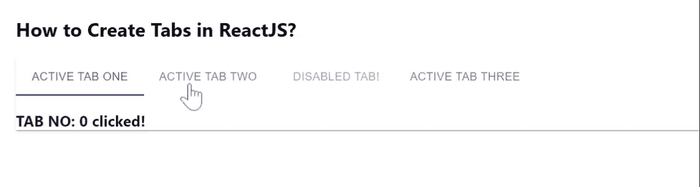

# 如何在 ReactJS 中创建标签？

> 原文:[https://www . geeksforgeeks . org/如何创建标签-in-reactjs/](https://www.geeksforgeeks.org/how-to-create-tabs-in-reactjs/)

选项卡使您可以轻松浏览和切换不同的视图。React 的 Material UI 有这个组件可供我们使用，非常容易集成。我们可以使用下面的方法在 ReactJS 中使用标签组件。

**创建反应应用程序并安装模块:**

**步骤 1:** 使用以下命令创建一个反应应用程序:

```jsx
npx create-react-app foldername
```

**步骤 2:** 创建项目文件夹(即文件夹名**)后，使用以下命令移动到该文件夹中:**

```jsx
cd foldername
```

**步骤 3:** 创建 ReactJS 应用程序后，使用以下命令安装 **material-ui** 模块:

```jsx
npm install @material-ui/core
```

**App.js:** 现在在 **App.js** 文件中写下以下代码。在这里，App 是我们编写代码的默认组件。

## java 描述语言

```jsx
import React from "react";
import Paper from "@material-ui/core/Paper";
import Tab from "@material-ui/core/Tab";
import Tabs from "@material-ui/core/Tabs";

const App = () => {
  const [value, setValue] = React.useState(2);

  return (
    <div
      style={{
        marginLeft: "40%",
      }}
    >
      <h2>How to Create Tabs in ReactJS?</h2>
      <Paper square>
        <Tabs
          value={value}
          textColor="primary"
          indicatorColor="primary"
          onChange={(event, newValue) => {
            setValue(newValue);
          }}
        >
          <Tab label="Active TAB One" />
          <Tab label="Active TAB Two" />
          <Tab label="Disabled TAB!" disabled />
          <Tab label="Active Tab Three" />
        </Tabs>
        <h3>TAB NO: {value} clicked!</h3>
      </Paper>
    </div>
  );
};

export default App;
```

**运行应用程序的步骤:**从项目的根目录使用以下命令运行应用程序。

```jsx
npm start
```

**输出:**现在打开浏览器，转到***http://localhost:3000/***，会看到如下输出。

