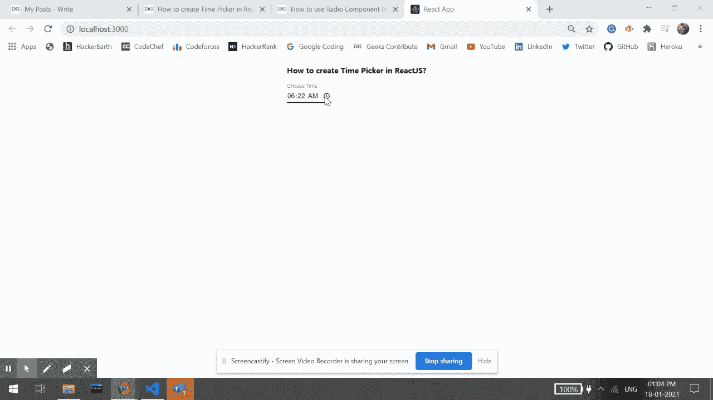

# 如何在 ReactJS 中创建时间选择器？

> 原文:[https://www . geeksforgeeks . org/如何创建时间选择器 in-reactjs/](https://www.geeksforgeeks.org/how-to-create-time-picker-in-reactjs/)

时间选择器提供了一种从预定集合中选择单个值的简单方法。React 的 Material UI 有这个组件可供我们使用，非常容易集成。我们可以使用以下方法在 ReactJS 中创建一个时间选择器:

**创建反应应用程序并安装模块:**

**步骤 1:** 使用以下命令创建一个反应应用程序:

```
npx create-react-app foldername
```

**步骤 2:** 创建项目文件夹(即文件夹名**)后，使用以下命令移动到该文件夹中:**

```
cd foldername
```

**步骤 3:** 创建 ReactJS 应用程序后，使用以下命令安装 **material-ui** 模块:

```
npm install @material-ui/core
```

**项目结构:**如下图。


项目结构

**App.js:** 现在在 **App.js** 文件中写下以下代码。在这里，App 是我们编写代码的默认组件。

## java 描述语言

```
import React from 'react';
import TextField from '@material-ui/core/TextField';

const App = () => {

  return (
    <div style={{
      margin: 'auto',
      display: 'block',
      width: 'fit-content'
    }}>
      <h3>How to create Time Picker in ReactJS?</h3>
      <TextField
        label="Choose Time"
        defaultValue="04:20"
        type="time"
        InputLabelProps={{
          shrink: true,
        }}
        // 5 minutes
        inputProps={{
          step: 300,
        }}
      />
    </div>
  );
}

export default App;
```

**运行应用程序的步骤:**从项目的根目录使用以下命令运行应用程序:

```
npm start
```

**输出:**现在打开浏览器，转到***http://localhost:3000/***，会看到如下输出:



**支持的浏览器:**以下浏览器支持该模块:

*   铬
*   微软边缘
*   探险家