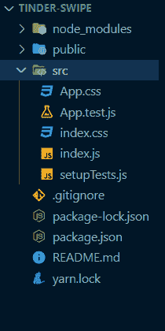
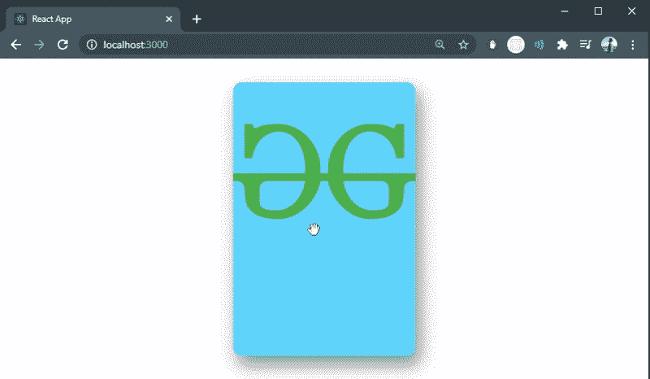
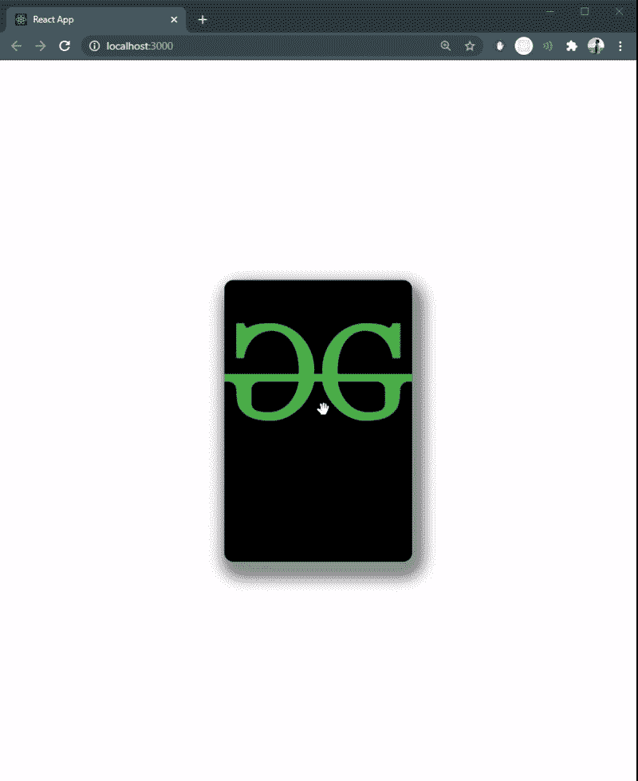

# 如何使用 React 和 framer-motion 创建 Tinder 刷卡手势？

> 原文:[https://www . geesforgeks . org/how-create-tinder-card-swipe-手势-使用-反应-成帧器-motion/](https://www.geeksforgeeks.org/how-to-create-tinder-card-swipe-gesture-using-react-and-framer-motion/)

我们可以使用 ReactJS 中的 **Framer** 模块，使用以下方法创建一个类似滑动手势的简单打火应用程序。

**先决条件:**

1.  JavaScript 知识(ES6)
2.  HTML/CSS 的知识。
3.  ReactJS 的基本知识。

**用于构建本应用程序的框架器挂钩有:**

1.  frame maker usemotion value
2.  成帧器使用转换
3.  成帧器使用动画

**创建反应应用程序并安装模块:**

**步骤 1:** 使用以下命令创建一个 React 应用程序。

```jsx
npx create-react-app tinder-swipe
```

**第 2 步:**创建项目文件夹后，即**打火刷，**使用以下命令移动到该文件夹。

```jsx
cd tinder-swipe
```

**步骤 3:** 创建 ReactJS 应用程序后，使用以下命令安装**成帧器**模块。

```jsx
npm install framer
```

**项目结构:**我们的项目结构树应该是这样的:



项目结构

**进场:**

*   我们将使用**使用运动值()**在用户拖动光标时移动卡片，因为所有运动组件内部都使用运动值来跟踪我们将通过这个钩子获得的动画值的状态和速度。
*   我们将使用**使用 Transform()** 钩子，通过链接卡片的运动值，在卡片拖动时旋转卡片。
*   此外，我们将使用 **useTransform()** 钩子，通过将卡片链接到运动值来改变卡片移动时的不透明度。
*   **usenimation()**是一个实用程序钩子，用于创建动画控件(animControls)，可以用来手动启动、停止和排列卡片上的动画。

**例 1:**

## index.js

```jsx
import React from "react";
import ReactDOM from "react-dom";
import "./index.css";
import { Frame, useMotionValue, useTransform, useAnimation } from "framer";

// Some styling for the card
const style = {
  backgroundImage: "URL(
https://img.icons8.com/color/452/GeeksforGeeks.png)",
  backgroundRepeat: "no-repeat",
  backgroundSize: "contain",
  backgroundColor: "#55ccff",
  boxShadow: "5px 10px 18px #888888",
  borderRadius: 10,
  height: 300,
};

const App = () => {
  // To move the card as the user drags the cursor
  const motionValue = useMotionValue(0);

  // To rotate the card as the card moves on drag
  const rotateValue = useTransform(motionValue, [-200, 200], [-50, 50]);

  // To decrease opacity of the card when swiped
  // on dragging card to left(-200) or right(200)
  // opacity gradually changes to 0
  // and when the card is in center opacity = 1
  const opacityValue = useTransform(
    motionValue,
    [-200, -150, 0, 150, 200],
    [0, 1, 1, 1, 0]
  );

  // Framer animation hook
  const animControls = useAnimation();

  return (
    <div className="App">
      <Frame
        center
        // Card can be drag only on x-axis
        drag="x"
        x={motionValue}
        rotate={rotateValue}
        opacity={opacityValue}
        dragConstraints={{ left: -1000, right: 1000 }}
        style={style}
        onDragEnd={(event, info) => {
          // If the card is dragged only upto 150 on x-axis
          // bring it back to initial position
          if (Math.abs(info.point.x) <= 150) {
            animControls.start({ x: 0 });
          } else {
            // If card is dragged beyond 150
            // make it disappear
            // making use of ternary operator
            animControls.start({ x: info.point.x < 0 ? -200 : 200 });
          }
        }}
      />
    </div>
  );
};

ReactDOM.render(<App />, document.getElementById("root"));
```

## index.css

```jsx
body {
  margin: 0;
  font-family: -apple-system, BlinkMacSystemFont, 
               'Segoe UI', 'Roboto', 'Oxygen',
               'Ubuntu', 'Cantarell', 'Fira Sans', 
               'Droid Sans', 'Helvetica Neue',
                sans-serif;
  -webkit-font-smoothing: antialiased;
  -moz-osx-font-smoothing: grayscale;
}

.App {
  text-align: center;
}

code {
  font-family: source-code-pro, Menlo, 
               Monaco, Consolas, 'Courier New',
    monospace;
}
```

**运行应用程序的步骤:**从项目的根目录使用以下命令运行应用程序。

```jsx
npm start
```

**输出:**现在打开浏览器，转到***http://localhost:3000/***，会看到如下输出:



像刷卡手势一样的火绒

**示例 2:** 创建一副牌

## index.js

```jsx
import React from 'react';
import ReactDOM from 'react-dom';
import './index.css';
import { Frame, useMotionValue, useTransform, useAnimation } from 'framer';

// Card component with destructured props
const Card = ({ image, color }) => {
  // To move the card as the user drags the cursor
  const motionValue = useMotionValue(0);

  // To rotate the card as the card moves on drag
  const rotateValue = useTransform(motionValue, [-200, 200], [-50, 50]);

  // To decrease opacity of the card when swiped
  // on dragging card to left(-200) or right(200)
  // opacity gradually changes to 0
  // and when the card is in center opacity = 1
  const opacityValue = useTransform(
    motionValue,
    [-200, -150, 0, 150, 200],
    [0, 1, 1, 1, 0]
  );

  // Framer animation hook
  const animControls = useAnimation();

  // Some styling for the card
  // it is placed inside the card component
  // to make backgroundImage and backgroundColor dynamic
  const style = {
    backgroundImage: `url(${image})`,
    backgroundRepeat: 'no-repeat',
    backgroundSize: 'contain',
    backgroundColor: color,
    boxShadow: '5px 10px 18px #888888',
    borderRadius: 10,
    height: 300
  };

  return (
    <div className='App'>
      <Frame
        center
        // Card can be drag only on x-axis
        drag='x'
        x={motionValue}
        rotate={rotateValue}
        opacity={opacityValue}
        dragConstraints={{ left: -1000, right: 1000 }}
        style={style}
        onDragEnd={(event, info) => {

          // If the card is dragged only upto 150 on x-axis
          // bring it back to initial position
          if (Math.abs(info.point.x) <= 150) {
            animControls.start({ x: 0 });
          } else {

            // If card is dragged beyond 150
            // make it disappear

            // Making use of ternary operator
            animControls.start({ x: info.point.x < 0 ? -200 : 200 });
          }
        }}
      />
    </div>
  );
};

const App = () => {
  const cards = [
    {
      image: 'https://img.icons8.com/color/452/GeeksforGeeks.png',
      color: '#55ccff'
    },
    {
      image: 'https://img.icons8.com/color/452/GeeksforGeeks.png',
      color: '#e8e8e8'
    },
    {
      image: 'https://img.icons8.com/color/452/GeeksforGeeks.png',
      color: '#0a043c'
    },
    {
      image: 'https://img.icons8.com/color/452/GeeksforGeeks.png',
      color: 'black'
    }
  ];

  return (
    <div className='App'>

      {/* Traversing through cards arrray using map function
      and populating card with different image and color */}

      {cards.map((card) => (
        <Card image={card.image} color={card.color} />
      ))}
    </div>
  );
};

ReactDOM.render(<App />, document.getElementById('root'));
```

**运行应用程序的步骤:**从项目的根目录使用以下命令运行应用程序:

```jsx
npm start
```

**输出:**现在打开浏览器，转到***http://localhost:3000/***，会看到如下输出:



可刷卡的一副牌