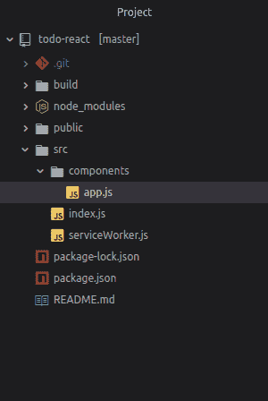
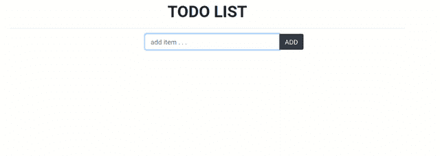

# 如何使用 ReactJS 创建 ToDo 应用？

> 原文:[https://www . geeksforgeeks . org/how-create-todo-app-using-reactjs/](https://www.geeksforgeeks.org/how-to-create-todo-app-using-reactjs/)

React 是一个用于开发交互式用户界面的 JavaScript 库。它由脸书和一个由个人开发者和公司组成的社区管理。React 主要专注于开发单页网页或移动应用。在这里，我们将创建一个 todo 应用程序来了解 **reactJS** 的基础知识。

**所需模块:**

*   [npm](https://www.geeksforgeeks.org/node-js-npm-node-package-manager/)
*   [反应](https://www.geeksforgeeks.org/react-js-introduction-working/)
*   反应自举

    ```jsx
    npm install react-bootstrap bootstrap
    ```

**基本设置:**通过以下命令启动项目:

*   **[NPX:](https://www.geeksforgeeks.org/what-are-the-differences-between-npm-and-npx/)** 它是一个自带 npm 5.2+的包 runner 工具，NPX 是好用的 CLI 工具。npx 用于执行节点包。它大大简化了许多事情，其中之一是快速检查/运行节点包，而无需在本地或全局安装它。

    ```jsx
    npx create-react-app todo-react
    ```

*   Now, goto the folder

    ```jsx
    cd todo-react
    ```

    

*   Start the server- Start the server by typing the following command in terminal:

    ```jsx
    npm start
    ```

    打开**http://localhost:3000/**
    

*   将目录更改为 src:

    ```jsx
    cd src
    ```

*   删除目录里面的所有东西

    ```jsx
    rm *
    ```

*   现在创建**索引. js** 文件

    ```jsx
    touch index.js 
    ```

*   该文件将把我们的应用程序渲染成位于**公共文件夹**中的 HTML 文件。还用文件名 **app.js**

    ```jsx
    mkdir components && cd components && touch app.js
    ```

    创建一个文件夹名组件
*   **app.js** 将包含我们的待办事项 app:
    
*   **在 src 中编辑 index.js 文件:**

    ```jsx
    import React from 'react';
    import ReactDOM from 'react-dom';
    import App from './components/app';
    import 'bootstrap/dist/css/bootstrap.min.css';

    ReactDOM.render(<App />, document.getElementById('root'));
    ```

*   **在组件中编辑 app . js:**

    ```jsx
    import React, {Component} from 'react';

    // Bootstrap for react
    import Container from 'react-bootstrap/Container';
    import Row from 'react-bootstrap/Row';
    import Col from 'react-bootstrap/Col';
    import Button from 'react-bootstrap/Button';
    import InputGroup from 'react-bootstrap/InputGroup';
    import FormControl from 'react-bootstrap/FormControl';
    import ListGroup from 'react-bootstrap/ListGroup';

    class App extends Component  {
      constructor(props) {
        super(props);

        // Setting up state
        this.state = {
          userInput : "",
          list:[]
        }
      }

      // Set a user input value
      updateInput(value){
        this.setState({
          userInput: value,
        });
      }

      // Add item if user input in not empty
      addItem(){
        if(this.state.userInput !== '' ){
          const userInput = {

            // Add a random id which is used to delete
            id :  Math.random(),

            // Add a user value to list
            value : this.state.userInput
          };

          // Update list
          const list = [...this.state.list];
          list.push(userInput);

          // reset state
          this.setState({
            list,
            userInput:""
          });
        }
      }

      // Function to delete item from list use id to delete
      deleteItem(key){
        const list = [...this.state.list];

        // Filter values and leave value which we need to delete
        const updateList = list.filter(item => item.id !== key);

        // Update list in state
        this.setState({
          list:updateList,
        });

      }

      render(){
        return(<Container>

              <Row style={{
                      display: "flex",
                      justifyContent: "center",
                      alignItems: "center",
                      fontSize: '3rem',
                      fontWeight: 'bolder',
                    }}
                    >TODO LIST
                </Row>

               <hr/>
              <Row>
              <Col md={{ span: 5, offset: 4 }}>

              <InputGroup className="mb-3">
              <FormControl
                placeholder="add item . . . "
                size="lg"
                value = {this.state.userInput}
                onChange = {item => this.updateInput(item.target.value)}
                aria-label="add something"
                aria-describedby="basic-addon2"
              />
              <InputGroup.Append>
                <Button
                  variant="dark"
                  size="lg"
                  onClick = {()=>this.addItem()}
                  >
                  ADD
                </Button>
              </InputGroup.Append>
            </InputGroup>

         </Col>
       </Row>
       <Row>
         <Col md={{ span: 5, offset: 4 }}>
            <ListGroup>
              {/* map over and print items */}
             {this.state.list.map(item => {return(

                <ListGroup.Item variant="dark" action 
                  onClick = { () => this.deleteItem(item.id) }>
                  {item.value}
                </ListGroup.Item>

             )})}
            </ListGroup>
         </Col>
       </Row>
         </Container>
        );
      }
    }

    export default App;
    ```

*   **保存所有文件并启动服务器:**

    ```jsx
    npm start
    ```

*   **输出:**在浏览器中打开**http://localhost:3000/**:
    