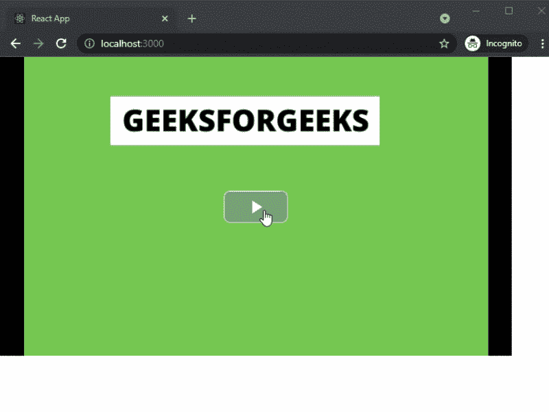

# 如何在 ReactJS 中创建视频播放器？

> 原文:[https://www . geesforgeks . org/how-create-video-player-in-reactjs/](https://www.geeksforgeeks.org/how-to-create-video-player-in-reactjs/)

在本文中，我们将学习如何在 ReactJS 中创建视频播放器。视频播放器是一种用于回放数字视频数据的媒体播放器。

React 是一个免费的开源前端 JavaScript 库，用于构建用户界面或 UI 组件。它由脸书和一个由个人开发者和公司组成的社区维护。

**方法:**为了创建我们的视频播放器，我们将使用 react-loading 包，因为它功能强大、重量轻且完全可定制。之后，我们将使用安装的软件包将视频播放器添加到我们的主页。

**创建 reatjs 应用程序:**您可以使用以下命令创建一个新的 reatjs 项目:

```jsx
npx create-react-app gfg
```

**安装所需的包:**现在我们将使用以下命令安装 react-video-js-player 包:

```jsx
npm i react-video-js-player
```

**项目结构:**会是这样的。


**添加视频播放器:**在这个例子中，我们将使用我们安装的包在我们的应用程序主页上添加反应加载。我们在示例中使用了下面的图像和视频。

 

现在在 **App.js** 文件中添加下面的代码，创建视频播放器。

## java 描述语言

```jsx
import React, { Component } from 'react';
import VideoPlayer from 'react-video-js-player';

class VideoApp extends Component {
    player = {}
    state = {
        video: {
            src: "/video.mp4",
            poster: "/1.png"
        }
    }

    onPlayerReady(player){
        this.player = player;
    }

    render() {
        return (
            <div>
                <VideoPlayer
                    controls={true}
                    src={this.state.video.src}
                    poster={this.state.video.poster}
                    width="720"
                    height="420"
                    onReady={this.onPlayerReady.bind(this)}
                />
            </div>
        );
    }
}
export default VideoApp;
```

**说明:**首先在上面的例子中，我们是从 react-video-js-player 包中导入 VideoPlayer 组件。之后，我们将创建 onPlayerReady 和 state 函数。然后，我们将使用已安装软件包的视频播放器组件添加我们的视频播放器。

**运行应用的步骤:**在终端运行下面的命令运行应用。

```jsx
npm start
```

### 输出:

