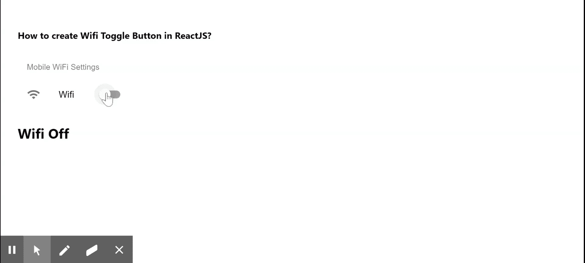

# 如何在 ReactJS 中创建 Wifi 切换按钮？

> 原文:[https://www . geeksforgeeks . org/how-create-wifi-toggle-button-in-reactjs/](https://www.geeksforgeeks.org/how-to-create-wifi-toggle-button-in-reactjs/)

Wifi 切换按钮表示打开和关闭 Wifi 的 Wi-Fi 按钮。【React 的 Material UI 有这个组件可供我们使用，非常容易集成。我们可以在 ReactJS 中使用以下方法来构建一个 Wifi 切换按钮。

**创建反应应用程序并安装模块:**

**步骤 1:** 使用以下命令创建一个 React 应用程序。

```
npx create-react-app foldername
```

**步骤 2:** 在创建项目文件夹(即文件夹名**)后，使用以下命令移动到该文件夹。**

```
cd foldername
```

**步骤 3:** 创建 ReactJS 应用程序后，使用以下命令安装 **material-ui** 模块。

```
npm install @material-ui/core
npm install @material-ui/icons
```

**项目结构:**如下图。


项目结构

**示例:**现在在 **App.js** 文件中写下以下代码。在这里，App 是我们编写代码的默认组件。

## App.js

```
import React from "react";
import ListItemSecondaryAction from 
    "@material-ui/core/ListItemSecondaryAction";
import WifiIcon from "@material-ui/icons/Wifi";
import ListItemText from "@material-ui/core/ListItemText";
import ListSubheader from "@material-ui/core/ListSubheader";
import Switch from "@material-ui/core/Switch";
import ListItemIcon from "@material-ui/core/ListItemIcon";
import ListItem from "@material-ui/core/ListItem";
import List from "@material-ui/core/List";

export default function App() {
  const [isChecked, setIsChecked] = React.useState(false);

  const handleToggleEvent = () => {
    setIsChecked(!isChecked);
  };

  return (
    <div style={{ display: "block", padding: 30 }}>
      <h4>How to create Wifi Toggle Button in ReactJS?</h4>
      <List subheader={<ListSubheader>
           Mobile WiFi Settings
      </ListSubheader>}
        style={{
          width: 200,
        }}
      >
        <ListItem>
          <ListItemIcon>
            <WifiIcon />
          </ListItemIcon>
          <ListItemText primary="Wifi" />
          <ListItemSecondaryAction>
            <Switch
              onChange={handleToggleEvent}
              edge="end"
              checked={isChecked}
            />
          </ListItemSecondaryAction>
        </ListItem>
      </List>
      <h2>{isChecked === true ? "Wifi On" : "Wifi Off"}</h2>
    </div>
  );
}
```

**运行应用程序的步骤:**从项目的根目录使用以下命令运行应用程序。

```
npm start
```

**输出:**现在打开浏览器，转到***http://localhost:3000/***，会看到如下输出。



**参考:**T2】https://material-ui.com/components/lists/#switch