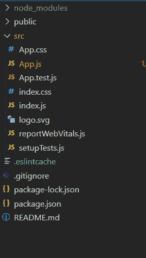
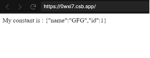
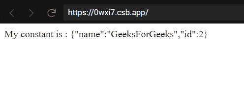

# 如何在 react 类中声明常量？

> 原文:[https://www . geeksforgeeks . org/如何声明常量 in-react-class/](https://www.geeksforgeeks.org/how-to-declare-constant-in-react-class/)

要声明一个可以在 React 类组件中访问的常量，有多种方法可以有效地实现，以便该常量可以在类范围内访问。常量可以通过以下两种方式声明:

1.  在类中创建一个 getter 方法，以便在需要时获取常量。
2.  在类声明之后分配类常数。

使用以下命令创建一个示例项目:

```
// constantDemo is the name of our folder
npx create-react-app constantDemo
```

现在使用以下命令移动到 ***constantDemo*** 文件夹:

```
cd constantDemo
```

***项目结构*** 如下图所示:



**文件名:App.js** 现在打开 ***App.js*** 文件，并在其中粘贴以下代码:

## java 描述语言

```
import React, { Component } from "react";

class App extends Component {

    static get myConstant() {
        return {
            name : "GFG",
            id : 1
        }
    }

    render() {
        return (
            <div>My constant is : 
{JSON.stringify(this.constructor.myConstant)}</div>
        );
    }
}

export default App
```

现在使用以下命令运行项目:

```
npm start
```

**输出:**



声明常量的另一种方式如下所示。将以下代码粘贴到 **App.js** 文件中。

**文件名:App.js**

## java 描述语言

```
import React, { Component } from "react";

class App extends Component {
  render() {
    return (
       <div>My constant is : 
{JSON.stringify(this.constructor.myConstant)}</div>
    );
  }
}

GFG.myConstant = {
    name : "GeeksForGeeks",
    id : 2
}

export default App
```

现在使用以下命令运行项目:

```
npm start
```

**输出:**

