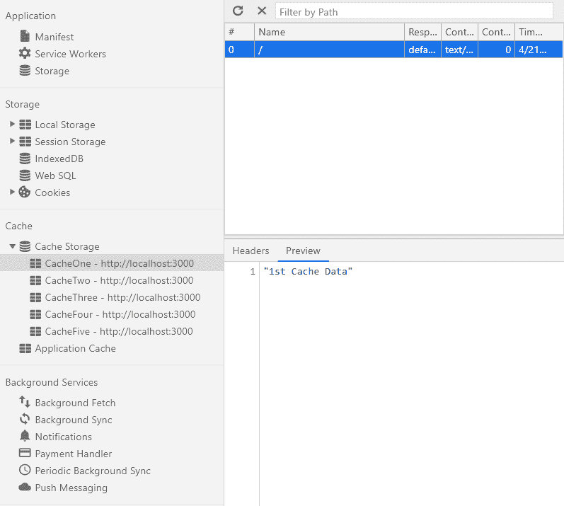
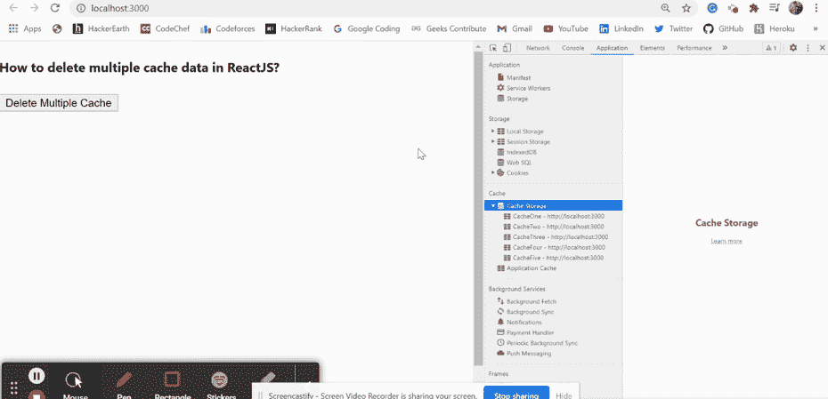

# 如何删除 ReactJS 中的多个缓存数据？

> 原文:[https://www . geeksforgeeks . org/如何删除多个缓存中的数据 reactjs/](https://www.geeksforgeeks.org/how-to-delete-multiple-cache-data-in-reactjs/)

我们可以在 reatjs 中使用以下方法删除 reatjs 中的多个缓存数据。我们可以根据用户需求从浏览器中删除多个缓存数据。缓存是一种技术帮助我们将给定资源的副本存储到我们的浏览器中，并在请求时提供给我们。

**方法:**按照这些简单的步骤以便到删除 ReactJS 中的特定缓存数据。我们已经创建了 *deleteMultipleCache* 函数，该函数将缓存名称作为一个数组，并将其从浏览器缓存中删除。当我们点击按钮时，该功能被触发，给定的缓存从浏览器中被删除，我们看到一个警告弹出窗口。

在下面的例子中，我们在浏览器中存储了 5 个缓存，命名为缓存一、缓存二、缓存三、缓存四和缓存五，如下所示，我们使用我们定义的函数删除了缓存一和缓存四。



**创建反应应用程序:**

*   **步骤 1:** 使用以下命令创建一个反应应用程序:

    ```jsx
    npx create-react-app foldername
    ```

*   **步骤 2:** 创建项目文件夹(即文件夹名**)后，使用以下命令移动到该文件夹中:**

    ```jsx
    cd foldername
    ```

**项目结构:**如下图。


项目结构

**示例:**现在在 **App.js** 文件中写下以下代码。在这里，App 是我们编写代码的默认组件。

## App.js

```jsx
import * as React from 'react';

export default function App() {

  // Function to delete our give caches
  const deleteMultipleCache = (cacheArray) => {
    for (var i = 0; i < cacheArray.length; i++) {
      if ("caches" in window) {
        caches.delete(cacheArray[i]).then(function (res) {
          return res;
        });
      }
    }
    alert('Multiple Caches Deleted!')
  };

  return (
    <div style={{ height: 500, width: '80%' }}>
      <h4>How to delete multiple cache data in ReactJS?</h4>
      <button onClick={() => deleteMultipleCache(['CacheOne', 'CacheFour'])} >
        Delete Multiple Cache</button>
    </div>
  );
}
```

**运行应用程序的步骤:**从项目的根目录使用以下命令运行应用程序:

```jsx
npm start
```

**输出:**现在打开浏览器，转到***http://localhost:3000/***，会看到如下输出:

