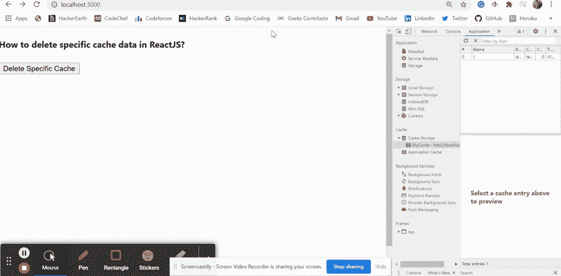

# 如何删除 ReactJS 中特定的缓存数据？

> 原文:[https://www . geeksforgeeks . org/如何删除特定于缓存的数据 in-reactjs/](https://www.geeksforgeeks.org/how-to-delete-specific-cache-data-in-reactjs/)

我们可以在 reatjs 中使用以下方法来删除 reatjs 中的特定缓存数据。我们可以根据用户需求从浏览器中删除特定的缓存数据。缓存是一种技术帮助我们将给定资源的副本存储到我们的浏览器中，并在请求时提供给我们。

**方法:**按照这些简单的步骤以便到删除 ReactJS 中的特定缓存数据。我们已经创建了 *deleteSpecificCache* 函数，该函数获取缓存名称并将其从浏览器缓存中删除。当我们点击按钮时，函数被触发，给定的缓存从浏览器中被删除，我们看到一个警告弹出窗口。

**创建反应应用程序:**

*   **步骤 1:** 使用以下命令创建一个反应应用程序:

    ```
    npx create-react-app foldername
    ```

*   **步骤 2:** 创建项目文件夹后，即文件夹名称**，**使用以下命令移动到项目文件夹:

    ```
    cd foldername
    ```

**项目结构:**如下图。


项目结构

**示例:**现在在 **App.js** 文件中写下以下代码。在这里，App 是我们编写代码的默认组件。

## App.js

```
import * as React from 'react';

export default function App() {

  // Function to delete our give cache
  const deleteSpecificCache = (cacheName) => {
    if ("caches" in window) {
        caches.delete(cacheName).then(function (res) {
            alert(cacheName)
            return res;
        });
    }
};

  return (
    <div style={{ height: 500, width: '80%' }}>
      <h4>How to delete specific cache data in ReactJS?</h4>
      <button onClick={()=>deleteSpecificCache('MyCache')} >
        Delete Specific Cache</button>
    </div>
  );
}
```

**运行应用程序的步骤:**从项目的根目录使用以下命令运行应用程序:

```
npm start
```

**输出:**现在打开浏览器，转到***http://localhost:3000/***，会看到如下输出:

