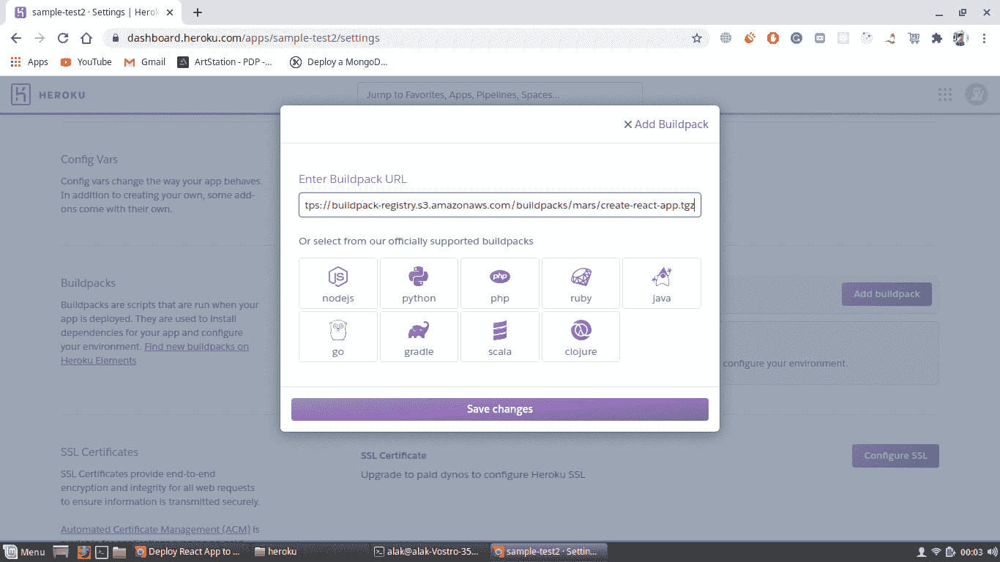
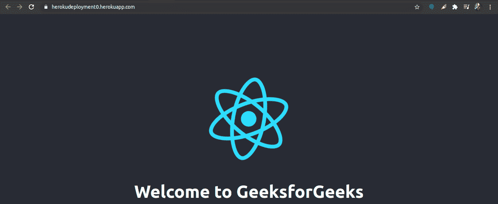

# 如何将 React app 部署到 Heroku？

> 原文:[https://www . geesforgeks . org/如何部署-反应-app-to-heroku/](https://www.geeksforgeeks.org/how-to-deploy-react-app-to-heroku/)

[**React**](https://www.geeksforgeeks.org/react-js-introduction-working/) 是一个非常流行且广泛使用的构建用户界面的库。所以如果你正在考虑将你的 React 应用部署到云平台，有各种各样的选择，比如 **AWS EC2** 或者 **Heroku** 。但是为了测试你的 React 应用，Heroku 将是最好的选择，因为它是免费的，并且非常容易上手。

**先决条件:**

1.  已安装 **Node.js** 和 **npm** 。
    *   [在 Windows 上安装 node . js](https://www.geeksforgeeks.org/installation-of-node-js-on-windows/)
    *   [在 Linux 上安装 node . js](https://www.geeksforgeeks.org/installation-of-node-js-on-linux/)
2.  关于 **GitHub** 的知识。
3.  关于 **Heroku** 的基础知识。
4.  [已经创建了一个 React 应用。](https://www.geeksforgeeks.org/reactjs-setting-development-environment/)

**注意:**确保下面显示的所有命令只能在项目文件夹中运行。

**步骤 1:** 通过运行以下命令，在系统中安装 **Heroku** CLI。它会将更新版本的**英雄库**命令行界面安装到您的系统中。

```
curl https://cli-assets.heroku.com/install-ubuntu.sh | sh
```

要检查版本，您可以运行命令。

```
heroku -v 
```

**第二步:**现在，前往[https://www.heroku.com/](https://www.heroku.com/)注册。完成注册后，转到仪表板，创建一个名为“**myherokupapp**或您选择的名称的新应用程序。

**第三步:**运行以下命令，它会提示你输入任意键继续，它会在你的浏览器中打开一个新的标签，要求你登录你的 **Heroku** 账户。在您输入所需的凭据并登录到站点后，它将在您的终端中显示“已登录”

```
heroku login
```

**步骤 4:** 通过运行以下命令初始化 Git 存储库。确保您位于项目目录的顶层。

```
git init
```

**第 5 步:**现在，只需运行命令即可添加 Heroku 遥控器，该命令可在您的 **Heroku 仪表板- > myherokuapp 或您的应用名称- >部署部分**中找到

或者

只需运行以下命令。部署方法应该选择 GitHub。

```
heroku git:remote -a myherokuapp
```

**第六步:**现在最重要的部分也就是 Heroku 为基于 Python、Node.js 的应用提供了 **buildpack** ，但是没有为 React 应用提供 **buildpack** 。所以我们必须在你的 Heroku 应用的设置部分增加一个额外的 **buildpack** 。

> https://build pack-registry . S3 . amazonaws . com/build packs/mars/create-react-app . tgz

[](https://media.geeksforgeeks.org/wp-content/uploads/20200719000910/buildpack.png)

**步骤 7:** 现在运行以下命令，将您的项目推送到存储库。

```
git add.
git commit -m "First Commit"
git push heroku master
```

**第八步:**成功将你的 React 应用推送到 Heroku 存储库。现在，要查看您部署的应用程序，请运行以下命令。



最后，网络应用将部署在[https://myherokuapp.herokuapp.com/](https://herokudeployment0.herokuapp.com/)上

**注意:**它会将你部署的应用打开到你的浏览器中。如果有任何问题，比如您的 React 应用程序没有显示，那么您可以运行以下命令来检查日志中出现了什么问题。考虑一件事，在部署之前，尝试从您的应用程序中删除所有警告，因为 heroku 认为所有警告都是错误。

```
heroku logs --tail
```