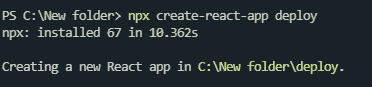
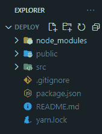
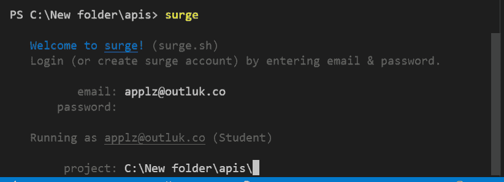
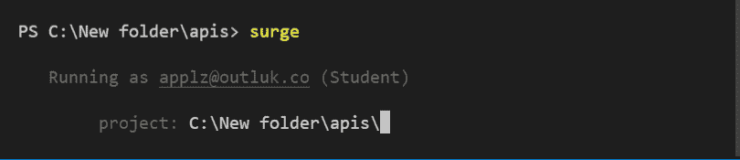
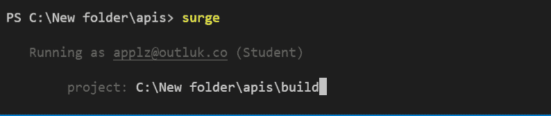
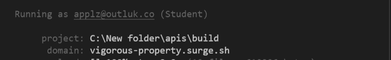
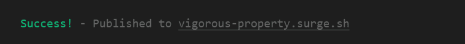

# 如何部署 React app 应对浪涌？

> 原文:[https://www . geesforgeks . org/如何部署-反应-app-to-surge/](https://www.geeksforgeeks.org/how-to-deploy-react-app-to-surge/)

[React](https://www.geeksforgeeks.org/reactjs-tutorials/) 是一个非常流行且广泛使用的构建用户界面的库。因此，如果您正在考虑部署您的静态反应应用程序，那么我们可以使用浪涌包，发布网络应用程序到一个 CDN，只需一个命令，不需要设置。

**先决条件:**已安装 Node.js 和 npm。

*   [在 Windows 上安装 node . js](https://www.geeksforgeeks.org/installation-of-node-js-on-windows/)
*   [在 Linux 上安装 node . js](https://www.geeksforgeeks.org/installation-of-node-js-on-linux/)

**浪涌:**有一些免费的工具可以托管我们的网站，比如 GitHub 和 Heroku，但是如果只发布前端的话，设置就有点复杂了。对于这样的场景，我们可以使用浪涌。这是一个流行的 npm 库，用于仅通过一个命令部署静态网页。首先，我们创建项目的构建，然后在构建文件夹内的终端上编写 surge 命令。我们甚至可以为我们的项目选择一个自定义名称。

**下面是分步实施:**

**步骤 1:** 使用以下命令创建一个反应应用程序:

```
npx create-react-app deploy
```

**注意:**如果您之前已经通过 npm 全局安装了 create-react-app，请直接使用下面的命令:



反应应用程序创建

您的开发环境已经准备好了。现在让我们在我们的应用程序中安装浪涌。

**步骤 2:** 创建项目文件夹(即样式)后，移动到相同的文件夹:

```
cd deploy
```

**步骤 3:** 浪涌可以通过 npm 安装在您的 React 应用程序中。按照下面给出的步骤在您的 React 应用程序中安装电涌:要安装电涌，请使用以下命令:

```
npm install --global surge
```

**项目结构**:如下图。



**第 4 步:**现在创建一个虚拟项目，并将以下代码放入您的 **App.js** 文件中。

## App.js

```
import React from 'react';

function App(){
    return (
       <div> Hello, World! </div>
    )
}

export default App;
```

**第五步:**现在你需要制作一个构建文件夹，这样你就可以部署你的 React App 了。Build 基本上捆绑和缩小了我们的代码，这个文件夹由编译过的 React 组成，可以归结为简单的 Html、CSS 和 JavaScript。

```
npm run build
```

**第 6 步:**现在我们可以托管和部署我们的 React App 了。现在，您的系统中已经在全球范围内安装了“surge ”,这样您将来就可以随心所欲地使用它。执行以下命令:

```
surge
```

**第 7 步:**现在它会询问你的电子邮件 ID 和密码(如果你是第一次使用)。在这里，你需要输入你的电子邮件 id 和你的浪涌帐户的新密码。



如果您已经登录，您将看到以下内容:



**第 8 步:**之后，你需要给你的静态文件一个位置(即构建文件夹)。如果您按照指示在同一文件夹中打开了终端，请按回车键。



**第九步:**现在它会用一个示例域名向你要一个域名。请在“. surge.sh”之前编辑该部分，如果该域可用，它将被分配给您。现在，您可以自定义网站的域名，它将托管在该网址上，您可以在浪涌之前更改该部分。



**第 10 步:**现在点击进入，你将获得通过网络发布的网站链接。



**输出:**现在如果你打开 URL 你可以看到下面的输出，或者你可以访问这个链接查看托管的 React App[dapper-food . surge . eh](https://dapper-food.surge.sh/)


正如我们所看到的，在激增的基础上托管一个静态网站的过程非常容易。我们可以只使用浪涌上的 2 个命令来托管我们的网站。