# 如何在 Firebase 上部署 React 项目？

> 原文:[https://www . geeksforgeeks . org/如何部署-反应-火上项目/](https://www.geeksforgeeks.org/how-to-deploy-react-project-on-firebase/)

当开发任何项目时，我们必须把它放在某个地方，这样全世界都能看到我们的努力。托管网站有时会很忙，但你不需要担心，因为我们现在可以在一两分钟内通过非常简单的设置在 **Firebase** 上托管我们的 React 项目。

**在 Firebase 上部署 React 项目的步骤:**

按照以下步骤或特别需要[为您的反应项目](https://www.geeksforgeeks.org/how-to-setup-a-firebase-for-your-react-project/)设置一个火基。

*   **第一步:**首先我们要建立我们的 Firebase 项目，去它的[官方](https://console.firebase.google.com/u/0/)网站，创建一个如下图所示的项目。

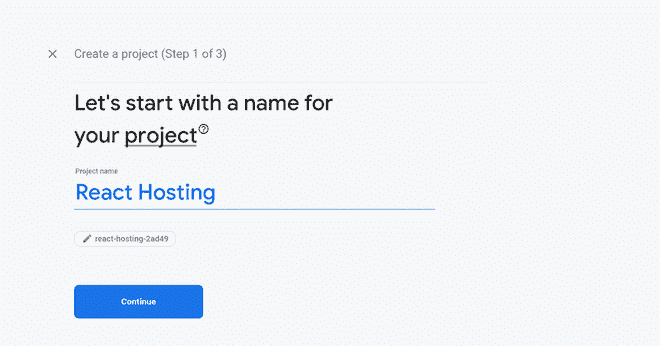

*   **Step 2: **Then we will enable **Firebase Hosting** by going into the hosting section under Build dropdown.

    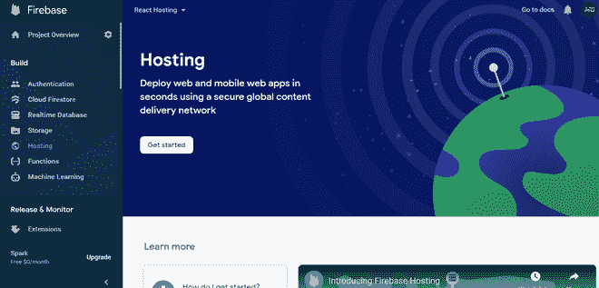

    *   **第三步:**然后我们将按照如下所述进行主机设置。

    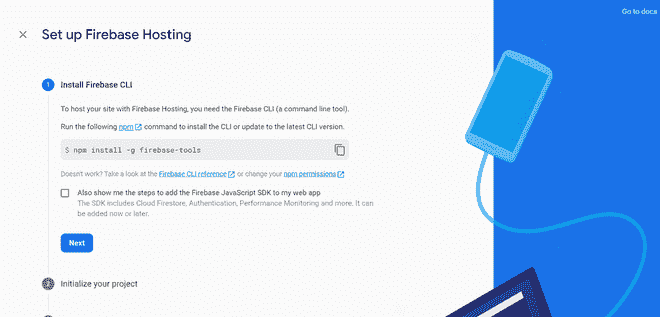  

    **创建反应应用程序:**

    *   **步骤 1** :使用以下命令创建一个反应应用程序:

        ```
        npx create-react-app react_hosting
        ```

        **第二步**:安装火基工具:

    *   ```
        npm install -g firebase-tools
        ```

        **项目结构:**

        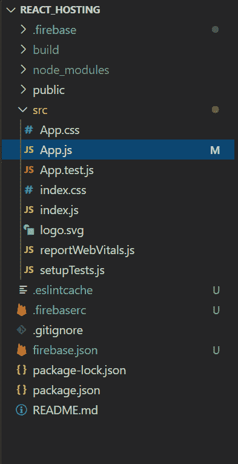

        项目结构

**托管网站:**

*   **步骤 1:** 首先，我们将通过在根目录的控制台中运行以下命令来初始化 React 应用程序中的 firebase 项目。

    ```
    firebase init
    ```

    现在输入 **y** ，我们准备继续。

    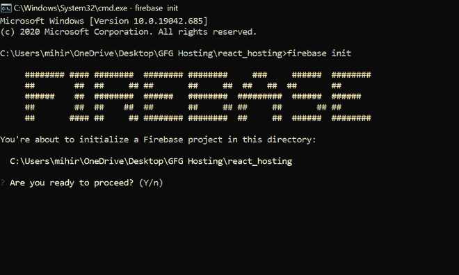

*   **Step 2:** Select **Hosting** from the options provided.

    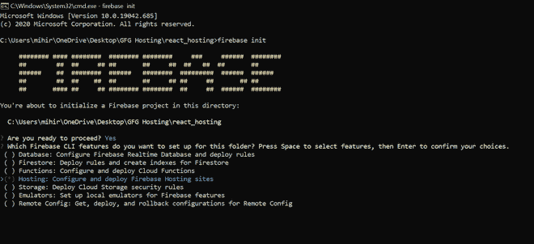

*   **Step 3: **Select the **Use an existing project** option.

    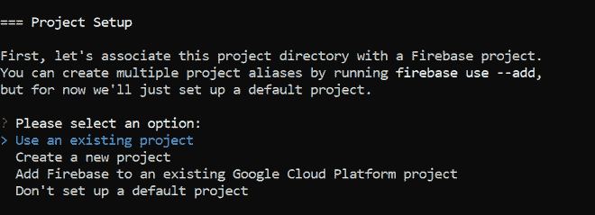

*   **Step 4: **As the build folder of react apps is generated in the build folder by default, we will use the same as our public directory.

    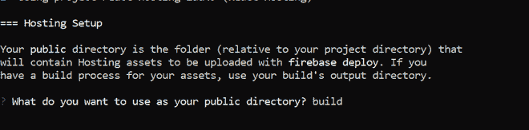

*   **第五步:**输入 **y** ，因为我们想要将我们的应用配置为单页应用。

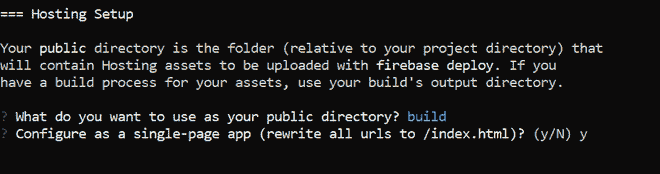

初始化已经完成，现在我们只需要运行一些命令，我们的应用程序就可以运行了。

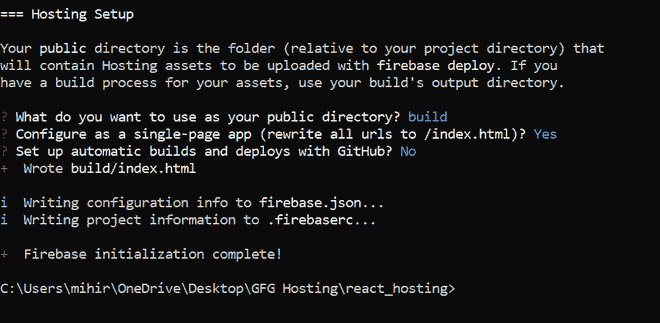

*   **Step 6: **Now we will run the following command to build our react app.

    ```
    npm run build
    ```

*   **Step 7: **Now we just need to run the last command and our application will be deployed.

    ```
    firebase deploy
    ```

    这将部署我们的项目，并为我们提供我们可以访问的**托管**链接。

    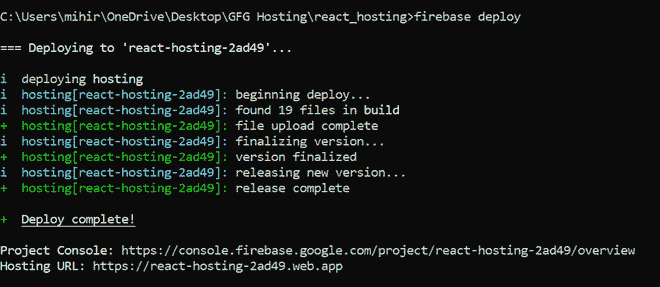

**输出:**我们可以通过访问控制台中 firebase 提供的托管链接来验证我们的网站部署成功，如下图所示:

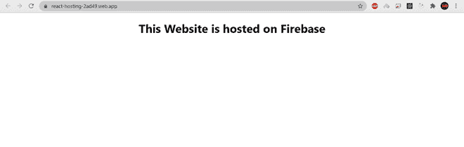