# 如何在 Netlify 上部署简单的无前端服务器(静态)React 应用

> 原文:[https://www . geeksforgeeks . org/如何部署-简单-前端-服务器-无静态-反应-应用-on-netlify/](https://www.geeksforgeeks.org/how-to-deploy-simple-frontend-server-less-static-react-applications-on-netlify/)

Netlify 是最受欢迎的托管服务之一，专门为 web 应用程序和静态网站托管无服务器服务。这是一个将生产力翻两番的网络开发项目。通过统一现代解耦网络的元素，从本地开发到高级边缘逻辑，Netlify 能够更快地实现性能更高、更安全、更可扩展的网站和应用。因此，可以毫不夸张地说，它是托管可能有也可能没有专用数据库或后端的前端 React 应用程序的最佳服务之一。

**该任务的先决条件:**

*   在你的电脑上安装了 [node.js](https://www.geeksforgeeks.org/installation-of-node-js-on-windows/) 。
*   在你的电脑上安装 [git](https://www.geeksforgeeks.org/introduction-and-installation-of-git/) 。
*   一个 Github 账号。(对于方法 2)
*   网络账户。
*   一个类似于 VS 代码的 IDE。

现在，我们将使用以下步骤创建一个虚拟的 React 应用程序。

**创建反应应用程序:**

**步骤 1:** 使用以下命令创建一个反应应用程序:

```
npx create-react-app foldername
```

**步骤 2:** 在创建项目文件夹(即文件夹名**)后，使用以下命令将**移动到该文件夹:

```
cd foldername
```

**项目结构:**如下图。

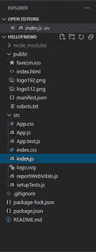

虚拟反应应用程序项目结构

这就是新创建的 React 应用程序的结构。正如您所看到的，React 是用户友好的，它创建了一个虚拟模板供我们使用，这样我们就可以轻松地进行更改并添加更多的 javascript 组件。您可以轻松地创建一个简单的计算器应用程序或石头剪刀布，而无需创建节点服务器，这就是无服务器(静态)应用程序或网站的含义。

在这里，我们只需要关注其中两个已经创建的文件，即 **App.js** 和 **index.js** 。 **App.js** 文件被称为我们的默认组件，它将在我们未来可能创建的所有其他组件中首先执行。

## App.js

```
import logo from './logo.svg';
import './App.css';

function App() {
  return (
    <div className="App">
      <header className="App-header">
        
        <p>
          Edit <code>src/App.js</code> and save to reload.
        </p>

        <a
          className="App-link"
          href="https://reactjs.org"
          target="_blank"
          rel="noopener noreferrer"
        >
          Learn React
        </a>
      </header>
    </div>
  );
}

export default App;
```

**index.js** 是部署时 **Netlify** 首先读取的文件。因此， **App.js** 组件已经被传递到 **index.js** 并在 **ReactDOM.render** 函数中呈现。

## index.js

```
import React from 'react';
import ReactDOM from 'react-dom';
import './index.css';
import App from './App';
import reportWebVitals from './reportWebVitals';

ReactDOM.render(
  <React.StrictMode>
    <App />
  </React.StrictMode>,
  document.getElementById('root')
);

// If you want to start measuring performance
// in your app, pass a function to log results
// (for example: reportWebVitals(console.log))
// or send to an analytics endpoint. 
reportWebVitals();
```

**运行应用程序的步骤:**从项目的根目录使用以下命令运行应用程序:

```
npm start
```

**输出:**现在打开浏览器，转到***http://localhost:3000/***，会看到如下输出:

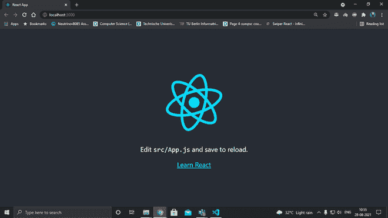

本地主机上运行的虚拟应用程序:3000

现在我们将看到如何在 netlify 上部署上面的 create react 应用程序。执行此任务主要有两种方法:

**方法 1:** 使用 netlify-cli(在某些情况下可能不起作用)。下面是逐步实现:

**第一步:**打开终端，运行该命令，

```
npm run build
```

**注意:**该命令将为我们的应用程序创建一个生产构建，然后可以通过 Netlify-cli 进行部署。

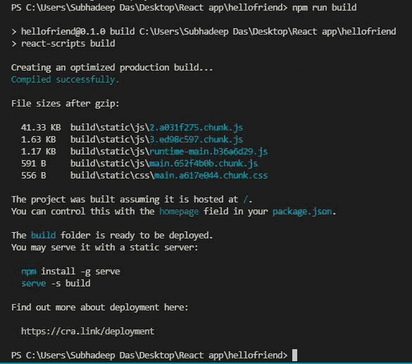

生产构建的创建

**第二步:**安装依赖项，

```
npm install --save-dev netlify-cli -g
```

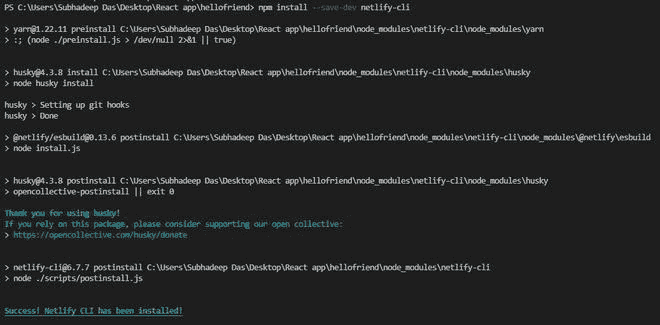

安装 netlify-cli 依赖项

**步骤 3:** 首先我们需要在 Netlify 中初始化一个项目，所以运行以下命令:

```
netlify init
```

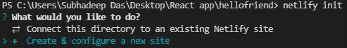

在这里，选择**创建并配置一个新的站点**。

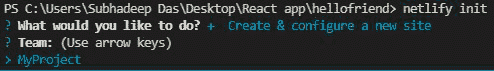

在这里，如果您没有项目，您需要创建一个，否则使用之前创建的项目。我正在使用我以前创建的项目“我的项目”。

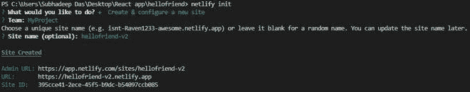

您将被要求给出一个网站名称。给定站点名称后，将创建站点 URL，但仍未部署。

**步骤 4:** 现在我们将使用以下命令部署应用程序。

```
netlify deploy
```

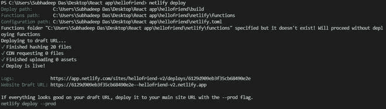

运行命令后部署站点

现在我们使用之前创建的网址，来打开我们部署的站点。

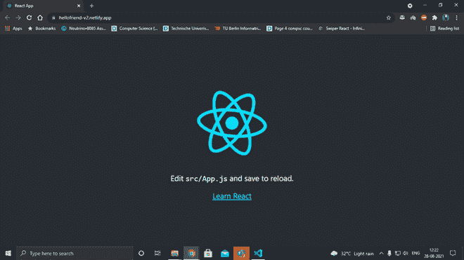

**使用方法 1 创建的网站的网址:**

**方法二:**使用 github 资源库部署 app(首选方法)。下面是逐步实现:

**第一步:**在默认浏览器上打开 github，登录账户。

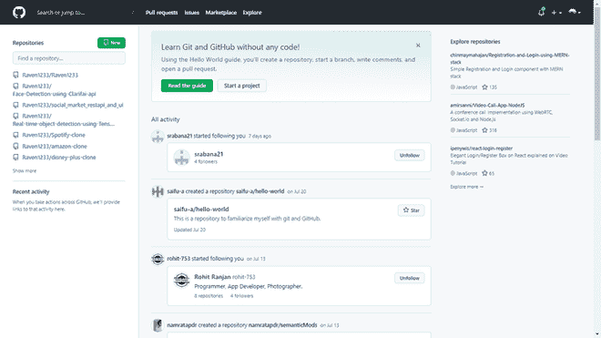

点击左上角的“新建”

**步骤 2:** 选择“新建存储库”。在存储库创建面板中，为存储库命名，并选择可见性为“私有”。

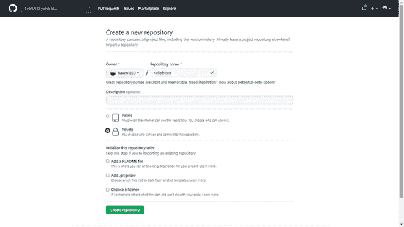

存储库创建面板

**步骤 3:** 创建存储库后，通过右键单击并选择“git bash Here”选项，导航到您的项目目录并打开 Git Bash。

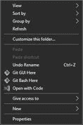

选择 Git Bash

**第 4 步:**在 git bash 中，按照正确的顺序键入以下命令。

```
git init
git add .
git commit -m "first commit"
git remote add origin <the SSH key for your newly created repo>
git push origin master

```

您的应用程序现在将被上传到 Github。

**注意:**SSH 密钥将出现在新创建的空存储库的页面上。

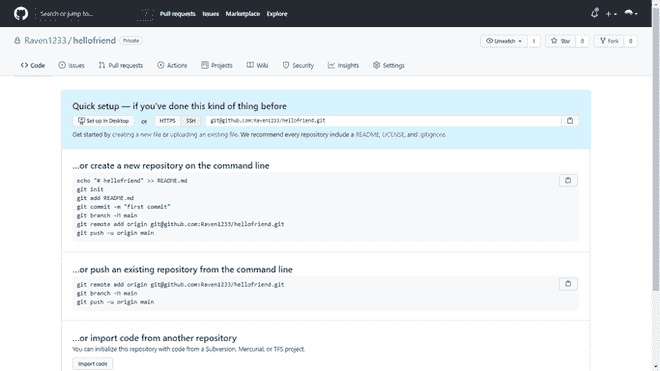

您的 SSH 密钥显示在“快速设置”面板下

**步骤 5:** 现在在默认浏览器上转到 Netlify.com。点击“Git 新网站”

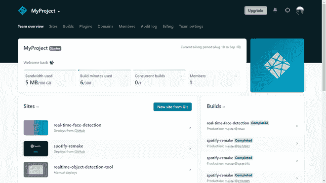

选择“从 Git 新建站点”

**第 6 步:**在下面的页面中，选择选项 Github。

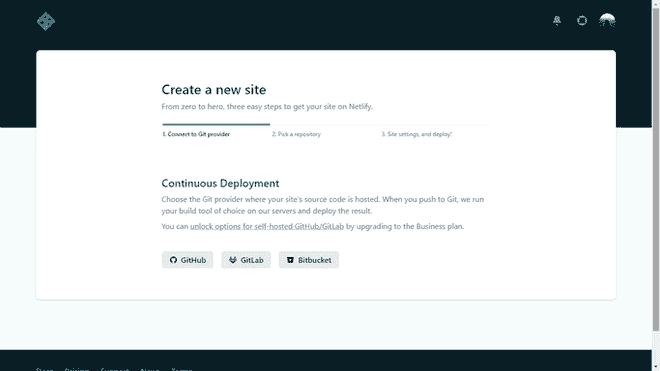

从下面选择 GitHub

**第 7 步:**选择上传应用的存储库。

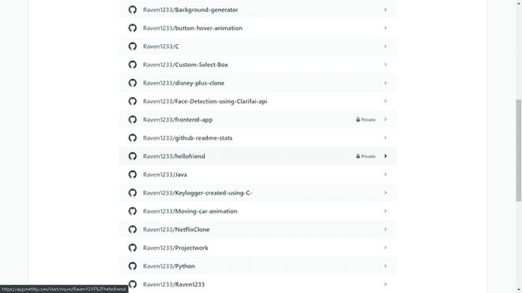

从列表中选择您的存储库

**注意:**我们选择的存储库是“hellofriend”。

**第 8 步:**之后，只需点击部署。Netlify 将开始部署您的应用程序，您需要等待几分钟。

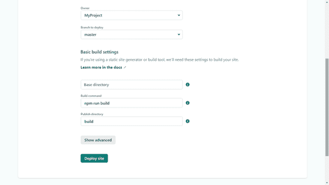

单击“部署站点”开始部署应用程序。

**第九步:**完成后，您可以使用它创建的网址查看应用程序。

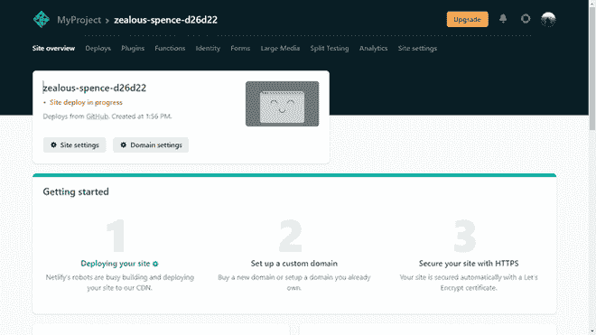

正在进行站点部署

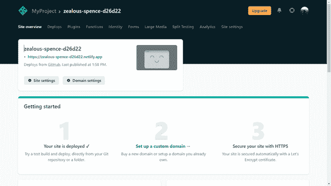

站点已部署。使用链接查看应用程序。

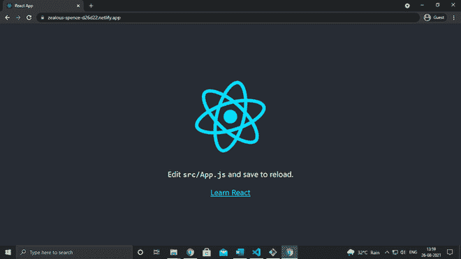

部署的应用程序

**注意:**我们已经把域名改成了“hello-f4iend”。您可以在**网信网站设置**中自行设置。

**查看此处部署的站点(使用方法 2):**https://hello-f4iend.netlify.app/

在我看来，这是一个非常有用的信息，每个人都应该拥有，这样他们才能轻松地部署他们的创作。