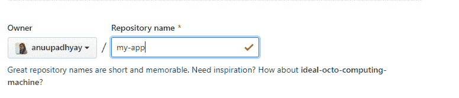
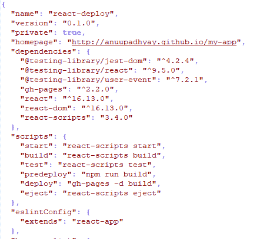
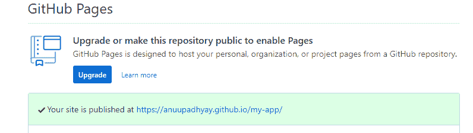
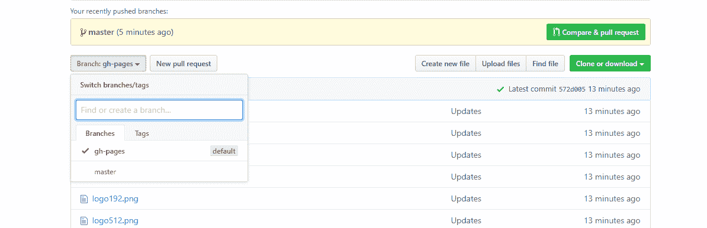

# 如何在 GitHub 上部署你的 React 网站？

> 原文:[https://www . geeksforgeeks . org/如何部署您的反应网站-on-github/](https://www.geeksforgeeks.org/how-to-deploy-your-react-websites-on-github/)

构建 web 应用程序对开发人员来说总是令人兴奋的，尤其是当你第一次踏入编程世界的时候。经过大量的努力，你建立了应用程序的前端，你想向世界展示你的技能，你的创造力，当然还有你的辛勤工作。有些人可能熟悉免费托管网站，他们可以在那里托管他们的应用程序。你们中的一些人可能也熟悉 [Github 页面](https://pages.github.com/)来部署静态网页。如果你不知道，那么这里有一个链接来检查……[使用 GitHub 来托管一个免费的静态网站](https://www.geeksforgeeks.org/using-github-to-host-a-free-static-website/)。嗯，这些资源非常受欢迎，可以让你的网络应用在服务器上运行，如果它非常有用并且免费可用**，为什么不呢？**

****

***你知道你可以用流行的 javascript 库 **React** 做一个* *酷酷的网站，也可以部署在 **GitHub 页面上吗？*** 你不信吗……？？在系统中安装 [React Developer Tool](https://chrome.google.com/webstore/detail/react-developer-tools/fmkadmapgofadopljbjfkapdkoienihi?hl=en) ，自行检查链接 [**Portfolio**](https://anuupadhyay.github.io/portfolio/) 。*用 React 学习和构建*一个 *web 应用不是很酷很神奇吗？在 GitHub 页面上免费部署你的 React web app，并向全世界展示，这不是很酷很神奇吗？***

**现在，如果你是一个对学习 ReactJS 感到兴奋的人，那么这里是你的链接[**geeks forgeeks ReactJS**](https://www.geeksforgeeks.org/reactjs/)但是要在 GitHub 页面上部署你漂亮的应用程序，我们只需要再学习一些东西。因此，在这个博客中，我们将讨论在 GitHub 页面上部署 React 应用程序的分步过程。**

### **基本术语**

****1。** [**React:**](https://www.geeksforgeeks.org/reactjs/) 由脸书开发的一个流行的 JavaScript 库，用于创建和处理用户界面的灵活组件。**

****2。Git:** 一个惊人的开源版本控制系统，可以处理大大小小的项目。它用于与其他开发人员协作，并在软件开发过程中跟踪源代码的变化。**

****3。GitHub:** 一个用于协作和版本控制的代码托管平台。它用于工作和存储 web 开发项目。**

****4。Github Pages:** 它允许你将你的 Github 存储库变成一个优雅的网站，展示你的投资组合、项目、文档或任何你想实时制作的东西，但请记住，没有要设置的数据库，也没有要配置的服务器。**

****5。** [**NodeJS**](https://www.geeksforgeeks.org/introduction-to-nodejs/) **和**[**npm**](https://www.geeksforgeeks.org/node-js-npm-node-package-manager/)**:**node . js 是一个在服务器上运行 JavaScript 的服务器运行时环境，NPM 是一个用于为 Javascript 项目下载和安装不同包的包管理器。**

### **先决条件**

****1。**下载 [Git](https://git-scm.com/) 并进行默认安装过程。**

****2。**应安装足够版本的[节点和](https://nodejs.org/en/)NPM。下面是检查安装和版本的命令。**

```
$ node --version
```

```
$ npm --version
```

****3。**安装了适当版本的[创建-反应-应用程序](https://github.com/facebook/create-react-app)。下面是检查安装和版本的命令。**

```
$ create-react-app --version
```

**如果没有安装，请使用下面的命令进行全局安装。**

```
$ npm install -g create-react-app
```

****4。**一个 GitHub 账号。**

### **现在真正的乐趣开始了(程序)**

****1。**首先使用下面给出的命令在系统中创建一个 React 应用程序。我们将这个应用程序命名为“react-deploy”。这是您将部署到 GitHub Pages 的应用程序。这个过程将在您的目录中创建一个名为“react-deploy”的新文件夹。**

```
$ create-react-app react-deploy
```

****2。**现在输入您的新应用程序，并运行以下命令来启动应用程序。您将看到您的应用程序正在本地开发服务器**上运行。****

```
#change directory
$ cd react-deploy
#run application in the development environment
$ npm start
```

****3。**在检查您的应用程序在本地服务器上没有任何错误地完美运行后，在 GitHub 上创建一个新的存储库。我们将此名称命名为“my-app”，它不同于您在上一步中创建的应用程序名称。但是，您也可以为您的 GitHub 存储库名称选择相同的名称，即“react-deploy”。这完全取决于你。**

****

****4。**安装 **gh-pages** 包作为应用的“开发依赖”。**

```
#install gh-pages package
$ npm install --save gh-pages
```

****5。**给 app 的 **package.json** 文件添加一些属性。在顶层，添加一个主页属性。将其值定义为字符串**http://{username} . github . io/{repo-name}**，其中{ username }是您的 GitHub 用户名，{ repo-name }是您在步骤 3 中创建的 GitHub 存储库(my-app)的名称。**

**看看下面给出的例子…**

```
"homepage": "http://anuupadhyay.github.io/my-app", 
```

**现在您需要再添加两个属性。在现有脚本属性中，添加一个**预部署**属性和一个**部署**属性，每个属性的值如下所示:**

```
"scripts": {
  //...
  "predeploy": "npm run build",
  "deploy": "gh-pages -d build",
  //...
  "build": "react-scripts build && cp build/index.html build/404.html", // this will prevent page reloads to give a  404 error
}
```

**一旦完成以上操作，您的文件**包. json** 将看起来像这样…**

****

**接下来，如果您从 react-router-dom 使用路由器，那么您需要将 Browser 路由器标签更改为**

```
//...
  BrowserRouter basename={process.env.PUBLIC_URL}
//... 
```

****6。**在这一步中，在应用程序的文件夹中创建一个 git 存储库，并将 GitHub 存储库作为“远程”添加到本地 git 存储库中。这将使 *gh-pages* 包知道您希望它在步骤 7 中部署您的应用程序的位置。它还会使 git 知道您希望它在第 8 步中把您的源代码推送到哪里(即在您的主分支上提交)。**

```
#create a new git repository
$ git init
#add remote repository
$ git remote add origin https://github.com/anuupadhyay/my-app.git
```

****7。**现在魔法来了。按照下面的命令，生成应用程序的生产版本，在 GitHub 页面上部署代码。**

```
#deploy application
$ npm run deploy
```

**就这样。您的 React 应用程序发布在 Github 页面上，如果您想验证它，只需转到 GitHub 存储库中应用程序的设置选项卡并向下滚动。你会看到下面这样的东西…**

****

**在我们的例子中，该应用可以在 https://anuupadhyay.github.io/my-app/的访问**

****8。**此时，如果您要浏览 GitHub 存储库，您会注意到主分支不存在，gh-pages 分支确实存在。这意味着后者包含构建的应用程序代码，而不是应用程序的源代码。因此，要创建一个默认的主分支并将您的源代码推送给它，请运行下面给出的命令…**

```
#add all changed file paths to staged changes
$ git add.
#commit all staged changes
$ git commit -m "Create a React app and publish it to GitHub Pages"
#pushed local repository to remote repository on GitHub
$ git push origin master
```

**在这最后一步之后，再次探索 GitHub 存储库。你会注意到一个主分支现在已经存在，它包含了应用程序的源代码。在您的 GitHub 存储库中，您将看到如下内容。**

****

**所以，主分支持有*源码*代码，gh-pages 分支持有*打造的* app 代码。**