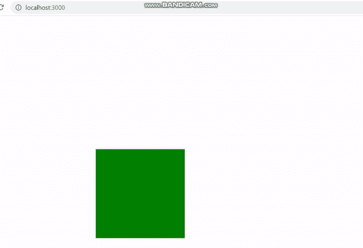

# 如何检测点击外部反应组件？

> 原文:[https://www . geesforgeks . org/如何检测-点击-外部-反应-组件/](https://www.geeksforgeeks.org/how-to-detect-click-outside-react-component/)

我们可以使用 **[createRef()方法](https://www.geeksforgeeks.org/how-to-create-refs-in-reactjs/)** 为基于类的组件中的任何元素创建引用。然后我们可以检查点击事件是发生在组件内还是组件外。

在功能组件中，我们可以使用 useRef()钩子为任何元素创建一个引用。

**创建反应应用程序并安装模块:**

**步骤 1:** 使用以下命令创建一个反应应用程序:

```jsx
npx create-react-app foldername
```

**步骤 2:** 在创建项目文件夹(即文件夹名**)后，使用以下命令将**移动到该文件夹:

```jsx
cd foldername
```

**项目结构:**如下图。


项目结构

**App.js:** 现在在 **App.js** 文件中写下以下代码。在这里，App 是我们编写代码的默认组件。

**文件名- App.js:** 使用基类组件

## java 描述语言

```jsx
import React from 'react';
class App extends React.Component {

  constructor(props) {
    super(props);

    // Creating a reference
    this.box = React.createRef();
  }

  componentDidMount() {

    // Adding a click event listener
    document.addEventListener('click', this.handleOutsideClick);
  }

  handleOutsideClick = (event) => {
    if (this.box && !this.box.current.contains(event.target)) {
      alert('you just clicked outside of box!');
    }
  }

  render() {
    return <div style={{
      margin: 300,
      width: 200, height: 200, backgroundColor: 'green'
    }}

      // Assigning the ref to div component
      ref={this.box}>{this.props.children}</div>;
  }
}

export default App;
```

**文件名- App.js:** <使用功能组件/p >

## java 描述语言

```jsx
import React, { useEffect, useRef } from 'react'

function App(props) {
  const box = useRef(null);
  useOutsideAlerter(box);
  return (<div style={{
    margin: 300,
    width: 200, height: 200, backgroundColor: 'green'
  }}
    ref={box}>{props.children}</div>
  )
}

export default App;

function useOutsideAlerter(ref) {
  useEffect(() => {

    // Function for click event
    function handleOutsideClick(event) {
      if (ref.current && !ref.current.contains(event.target)) {
        alert("you just clicked outside of box!");
      }
    }

    // Adding click event listener
    document.addEventListener("click", handleOutsideClick);

  }, [ref]);
}
```

**运行应用程序的步骤:**从项目的根目录使用以下命令运行应用程序:

```jsx
npm start
```

**输出:**现在打开浏览器，转到***http://localhost:3000/***，会看到如下输出:

