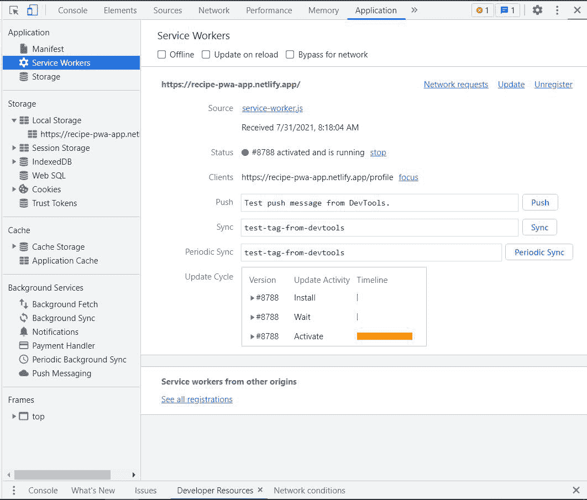

# 如何使用 ReactJS 开发一款渐进式网络应用？

> 原文:[https://www . geeksforgeeks . org/how-development-a-progressive-web-app-using-reactjs/](https://www.geeksforgeeks.org/how-to-develop-a-progressive-web-app-using-reactjs/)

渐进式反应应用程序对用户操作的响应非常快。它们加载速度快，就像移动应用程序一样引人入胜。他们可以访问移动设备功能，利用操作系统，并拥有非常高的影响力。它支持可安装性、后台同步、缓存和离线支持以及推送通知等其他功能。借助 React，我们可以非常轻松地逐步增强网络应用程序，使其看起来和感觉都像本地移动应用程序。

现在让我们看看如何使用 React 开发一个渐进式网络应用程序的分步实现****。****

******第一步:**有了 ReactJS，创建一个[进步网络应用程序](https://www.geeksforgeeks.org/progressive-web-apps-benefits-components-and-how-it-works/)甚至将一个现有的 React 项目转换成一个更容易。在文本编辑器的终端中，输入以下命令。CRA 为进步网络应用程序创建了一个样板，你可以根据自己的需要轻松修改。****

> ****npx 创建-反应-应用反应-pwa-模板 CRA-模板-pwa****
> 
> ****cd react-pwa****

****此命令创建一个名为 react-pwa 的新 React 应用程序，并导航到应用程序的目录。您可以进一步修改您的 manifest.json 文件和其他文件，如徽标，以自定义应用程序并使其成为您自己的应用程序。****

******步骤 2:** 让我们实现 PWA 的功能，并为我们的应用程序添加更多功能。在文本编辑器的终端中，输入以下命令来安装一些第三方和 npm 包。****

> ****npm 安装-保存网页-推送反应-路由器-dom 引导反应-引导****

******项目结构:**在您的**公共**文件夹中添加 **worker.js** 和 **feed.js** ，并在您的 **src** 文件夹中添加一个**组件**文件夹，使其看起来像这样。****

****

项目结构**** 

******第三步:注册服务人员–**服务人员是一种特殊的脚本文件，在浏览器和网络之间工作。它帮助我们执行独特的功能，并在加载页面时自动注册。要在您的 React App 中注册新的服务人员，请在您的公共文件夹( **public/worker.js** 中的 worker.js 文件中添加以下代码。****

## ****java 描述语言****

```jsx
**var STATIC_CACHE_NAME = "gfg-pwa";
var DYNAMIC_CACHE_NAME = "dynamic-gfg-pwa";

// Add Routes and pages using React Browser Router
var urlsToCache = ["/", "/search", "/aboutus", "/profile"];

// Install a service worker
self.addEventListener("install", (event) => {

  // Perform install steps
  event.waitUntil(
    caches.open(STATIC_CACHE_NAME).then(function (cache) {
      console.log("Opened cache");
      return cache.addAll(urlsToCache);
    })
  );
});

// Cache and return requests
self.addEventListener("fetch", (event) => {
  event.respondWith(
    caches.match(event.request).then((cacheRes) => {

      // If the file is not present in STATIC_CACHE,
      // it will be searched in DYNAMIC_CACHE
      return (
        cacheRes ||
        fetch(event.request).then((fetchRes) => {
          return caches.open(DYNAMIC_CACHE_NAME).then((cache) => {
            cache.put(event.request.url, fetchRes.clone());
            return fetchRes;
          });
        })
      );
    })
  );
});

// Update a service worker
self.addEventListener("activate", (event) => {
  var cacheWhitelist = ["gfg-pwa"];
  event.waitUntil(
    caches.keys().then((cacheNames) => {
      return Promise.all(
        cacheNames.map((cacheName) => {
          if (cacheWhitelist.indexOf(cacheName) === -1) {
            return caches.delete(cacheName);
          }
        })
      );
    })
  );
});**
```

******第四步:**有些老浏览器可能不支持服务人员。然而，像谷歌 Chrome 这样的大多数现代浏览器都内置了对服务人员的支持。在缺乏支持的情况下，该应用程序将像普通的网络应用程序一样运行。为了确保我们不会遇到错误或应用程序不会崩溃，我们需要在客户端的浏览器中检查服务人员的支持状态。为此，请使用以下代码更新公共文件夹( **public/index.html)** 中的 index.html 文件。****

## ****java 描述语言****

```jsx
**<script>
  if ("serviceWorker" in navigator) {

    window.addEventListener("load", function () {
      navigator.serviceWorker
        .register("/worker.js")
        .then(
          function (registration) {
            console.log(
              "Worker registration successful",
              registration.scope);
          },
          function (err) {
            console.log("Worker registration failed", err);
          }
        )
        .catch(function (err) {
          console.log(err);
        });
    });
  } else {
    console.log("Service Worker is not"
      + " supported by browser.");
  }
</script>**
```

******步骤 5:** 现在，我们有了服务人员基本功能的代码。我们需要注册它。为此，请将 src 文件夹中的 index.js 中的一行( **src/index.js** )从****

```jsx
**service-worker.unregister()**
```

****到****

```jsx
**serviceWorker.register()**
```

****我们的服务人员，即 worker.js 现在将成功注册。****

******运行应用程序的步骤:**现在，在文本编辑器的终端输入以下命令。****

```jsx
**npm start**
```

******输出:**这将在浏览器的 localhost://3000 中打开你的 React App。而且，在ṯhe 开发工具中，在应用程序选项卡下，您可以看到您的服务人员在控制台中注册了一条“工作人员注册成功”消息。****

****

注册服务人员**** 

******解释:**我们现在让基本服务人员按照我们希望的方式运行。为了实现其他类似本机设备的功能，让我们实现发送通知，以防用户在使用应用程序时离线。此外，要查看您的新功能，没有必要再次运行应用程序，只需点击重新加载按钮就可以了。****

******第 6 步:离线时发送推送通知–**推送通知是一项原生移动功能。浏览器会在默认设置中自动请求用户许可。**网络推送**是一个第三方包，它将帮助我们通过 VAPID 键推送通知。现在，我们需要一个 **VAPID API 密钥**来开始在我们的应用程序中实现推送通知。请注意，每个 VAPID API 密钥对于每个服务人员都是唯一的。****

****要生成应用编程接口密钥，请在终端中键入以下内容:****

```jsx
**./node_modules/.bin/web-push generate-vapid-keys**
```

****现在，在文本编辑器的终端，web-push 提供了两个你自己的索然无味的键。我们将使用公共 vapid 密钥来生成推送通知。****

****在 index.html 修改剧本。这将编码您的 base64 字符串 VAPID API KEY，并将其与服务工作人员连接，以便它能够发送通知。****

## ****java 描述语言****

```jsx
**<script>
  if ("serviceWorker" in navigator) {
    function urlBase64ToUint8Array(base64String) {
      const padding = "=".repeat((4 - 
          (base64String.length % 4)) % 4);
      const base64 = (base64String + padding)
        .replace(/\-/g, "+")
        .replace(/_/g, "/");

      const rawData = window.atob(base64);
      const outputArray = new Uint8Array(rawData.length);

      for (let i = 0; i < rawData.length; ++i) {
        outputArray[i] = rawData.charCodeAt(i);
      }
      return outputArray;
    }

    function determineAppServerKey() {
      var vapidPublicKey =
        "YOUR_PUBLIC_KEY";
      return urlBase64ToUint8Array(vapidPublicKey);
    }

    window.addEventListener("load", function () {
      navigator.serviceWorker
        .register("/worker.js")
        .then(
          function (registration) {
            console.log(
              "Worker registration successful",
              registration.scope
            );
            return registration.pushManager
              .getSubscription()
              .then(function (subscription) {
                registration.pushManager.subscribe({
                  userVisibleOnly: true,
                  applicationServerKey: determineAppServerKey(),
                });
              });
          },
          function (err) {
            console.log("Worker registration failed", err);
          }
        )
        .catch(function (err) {
          console.log(err);
        });
    });
  } else {
    console.log("Service Worker is not supported by browser.");
  }
</script>**
```

******第 7 步:**让我们使用这个新功能在我们离线时发送推送通知。在 **worker.js** 中修改 fetch 事件并添加以下代码。在显示通知功能中，您可以添加更多属性，并根据自己的意愿进行修改。****

## ****java 描述语言****

```jsx
**self.addEventListener("fetch", (event) => {
  event.respondWith(
    caches.match(event.request).then((cacheRes) => {
      return (
        cacheRes ||
        fetch(event.request).then((fetchRes) => {
          return caches.open(DYNAMIC_CACHE_NAME)
          .then((cache) => {
            cache.put(event.request.url, fetchRes.clone());
            return fetchRes;
          });
        })
      );
    })
  );
  if (!navigator.onLine) {
    if (event.request.url === 
        "http://localhost:3000/static/js/main.chunk.js") {
      event.waitUntil(
        self.registration.showNotification("Internet", {
          body: "internet not working",
          icon: "logo.png",
        })
      );
    }
  }
});**
```

****self . registration . show notification 函数显示所需的通知，甚至在显示之前请求许可。****

******步骤 8:** 要检查同步和缓存在离线时是否工作，您可以将开发工具中您的服务人员上方的状态更改为“离线”，或者在应用程序上方执行相同的操作。现在，每当您脱机时，您都会看到一个推送通知，指示您已脱机。****

****

推送通知:互联网不工作**** 

****请注意，尽管某些功能可能会丢失，但您仍然可以看到页面。这是因为这些默认页面和网址一旦被访问就会被存储在缓存中。因此，每次在开发过程中对文件进行更改时，一定要注销并在应用程序选项卡下再次注册它。****

******第 9 步:添加本机功能，如摄像头和地理定位–**PWA 支持使用本机功能，如访问网络摄像头，并在服务人员的帮助下计算位置。让我们首先为这个我们可以使用这些功能的地方创建用户界面，在“src/Profile.js”中创建一个 **Profile.js** 文件，我们可以使用[反应路线](https://www.geeksforgeeks.org/reactjs-router/)导航到该文件。****

## ****java 描述语言****

```jsx
**import React from "react";
import { InputGroup, Button, Container } 
        from "react-bootstrap";

const Profile = () => {
  return (
    <>
      <Container className={style.styling}>
        <br></br>
        <InputGroup className="mb-3">
          <InputGroup.Text>Latitude</InputGroup.Text>
          <InputGroup.Text id="latitude">00</InputGroup.Text>
        </InputGroup>
        <br></br>
        <InputGroup className="mb-3">
          <InputGroup.Text>Longitude</InputGroup.Text>
          <InputGroup.Text id="longitude">00</InputGroup.Text>
        </InputGroup>
        <br></br>
        <InputGroup className="mb-3">
          <InputGroup.Text>Location</InputGroup.Text>
        </InputGroup>
        <Button variant="outline-secondary" id="locationBtn">
          Get Location
        </Button>
        <br></br>
        <br></br>
        <Button variant="outline-secondary" id="photoBtn">
          Take a Picture Now!
        </Button>
        <video id="player" autoPlay width="320px" 
            height="240px"></video>
        <canvas
          id="canvas"
          width="320px"
          height="240px"
          style={{ display: "none" }}
        ></canvas>
        <Button variant="outline-secondary" id="capture">
          Capture
        </Button>
        <br></br>
        <div id="pick-image">
          <h6>Pick an Image instead</h6>
          <input type="file" accept="image/*"
            id="image-picker"></input>
        </div>
        <br></br>
        <br></br>
      </Container>
    </>
  );
};

export default Profile;**
```

******第十步:**现在我们在 **public/feed.js** 中添加一个 feed.js 文件，实现位置和摄像头的功能。****

## ****java 描述语言****

```jsx
**window.onload = function () {
  var photo = document.getElementById("photoBtn");
  var locationBtn = document.getElementById("locationBtn");
  locationBtn.addEventListener("click", handler);
  var capture = document.getElementById("capture");
  photo.addEventListener("click", initializeMedia);
  capture.addEventListener("click", takepic);
};

function initializeLocation() {
  if (!("geolocation" in navigator)) {
    locationBtn.style.display = "none";
  }
}

function handler(event) {
  if (!("geolocation" in navigator)) {
    return;
  }

  navigator.geolocation.getCurrentPosition(
  function (position) {
    console.log(position);
    var lat = position.coords.latitude;
    var lon = position.coords.longitude;
    console.log(lat);
    console.log(lon);
    latitude.innerHTML = lat;
    longitude.innerHTML = lon;
  });
}

function initializeMedia() {
  if (!("mediaDevices" in navigator)) {
    navigator.mediaDevices = {};
  }

  if (!("getUserMedia" in navigator.mediaDevices)) {
    navigator.mediaDevices.getUserMedia = 
    function (constraints) {
      var getUserMedia =
        navigator.webkitGetUserMedia 
        || navigator.mozGetUserMedia;

      if (!getUserMedia) {
        return Promise.reject(new Error(
            "getUserMedia is not implemented!"));
      }

      return new Promise(function (resolve, reject) {
        getUserMedia.call(navigator, 
            constraints, resolve, reject);
      });
    };
  }

  navigator.mediaDevices
    .getUserMedia({ video: true })
    .then(function (stream) {
      player.srcObject = stream;
      player.style.display = "block";
    })
    .catch(function (err) {
      console.log(err);
      imagePicker.style.display = "block";
    });
}

function takepic(event) {
  canvas.style.display = "block";
  player.style.display = "none";
  capture.style.display = "none";

  var context = canvas.getContext("2d");
  context.drawImage(
    player,
    0,
    0,
    canvas.width,
    player.videoHeight / (player.videoWidth / canvas.width)
  );
  player.srcObject.getVideoTracks().forEach(function (track) {
    track.stop();
  });
}**
```

******步骤 11:** 在( **/src/public** )文件夹中创建一个名为 feed.js 的新文件。在 feed.js 中，我们使用**地理定位**和**媒体设备**分别实现定位和摄像功能。您也可以使用谷歌地理编码器应用编程接口将这些纬度和经度转换为地名。****

******输出:**现在可以导航到 localhost:3000/profile 来拍照并获取位置。****

****

已启用本机功能**** 

******解释:**点击获取位置按钮将触发导航器。地理位置。获取当前位置在处理函数中，从而用适当的值填充纬度和经度字段。要获得城市的确切名称，请尝试使用上面提到的地理编码器应用编程接口。同样，点击“现在拍照”按钮将触发 initializeMedia 函数中的导航器。这两个函数都将首先添加权限，然后自己执行。****