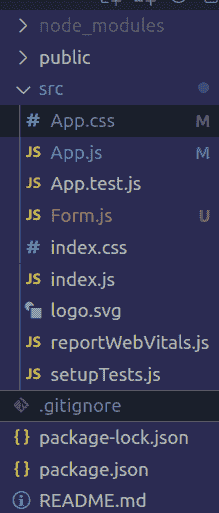

# 如何在 ReactJS 中开发用户登记表？

> 原文:[https://www . geesforgeks . org/how-development-user-registration-form-in-reactjs/](https://www.geeksforgeeks.org/how-to-develop-user-registration-form-in-reactjs/)

在传统的 HTML 代码和 ReactJS 中，表单通常在 [<表单>标签](https://www.geeksforgeeks.org/html-form-tag/)中定义。它可以有通常的表单提交行为，可以进入一个新的页面，但不会充分利用 react 的潜力，相反，我们都知道它是使用 react 组件完成的。

**方法:**众所周知，React 以组件和钩子及其可重用性而闻名，我们将使用组件创建一个表单。这个表单组件就像普通的 HTML 表单一样，可以有标签、输入字段、文本区域、单选按钮、复选框等。除此之外，它还可以有不同的属性，只需很少的修改，即“for”属性被“htmlfor”替换，“class”被“className”替换。它仍然可以有一些旧的做法，如“价值”属性仍然存在。

由于我们具有“反应”的能力，我们将通过为其创建不同的方法来处理表单，也就是说，要处理表单的任何字段中的更改，将会有一个方法当单击提交按钮时，也将会有一个方法。

我们不会将表单接收的值保存在普通的 JavaScript 变量中，而是使用高性能的完全反应挂钩。即 useState 钩子。为此，让我们首先看看如何将 useState 钩子用于表单。

**对表单数据使用 useState:**每个组件都可以有自己的状态，这些状态可以使用 hook useState 进行更新，效果会通过组件体现出来。

在这里，“名称”被指定为状态变量，其初始值为“GFG”。我们还给出了属性 **onChange** ，用于指定每当该输入字段的值发生变化时应该执行的方法，我们将其设置为 **handleChange** ，如下图所示，该参数尚未定义。

## java 描述语言

```
import React,{useState} from 'react'

export default function test() {

    const [name, setName] = useState("GFG");

    // HandleChange method to update the states
    const handleChange = () => (); 

    return (
        <div>
            <form>
                <input value={name} onChange={handleChange}/>
            </form>
        </div>
    )
}
```

**示例:**现在，让我们通过创建用户表单来扩展对 useState hook 的理解，该表单将以姓名、电子邮件和密码作为输入。它将有一个提交按钮来处理提交。我们还将验证这些字段，如果其中一个字段为空，我们将显示一条错误消息，否则我们将向用户显示一条成功消息。

**创建反应应用程序:**使用以下命令创建反应应用程序。

```
npx create-react-app yourappname
```

**项目目录:**然后在你的“src”文件夹中抹掉 App.css 和 App.js 文件的内容，还多创建了一个名为 Form.js 的文件，最后你的项目结构会是这样的。



项目结构

**Filename: App.css** 这个文件包含了我们这个例子需要的所有 css，这个例子不仅不言自明，而且也超出了本文的范围。虽然这里给你参考。

## 半铸钢ˌ钢性铸铁(Cast Semi-Steel)

```
.App {
  text-align: center;
  background-color:green;
}

.label{
  display: block;
  font-size: larger;
  color: white;
  padding: 5px;
}

.input{
  font-size: larger;
  padding: 5px;
  margin: 2px;

}
.btn{
  color: white;
  background-color: red;
  border-radius: 5px;
  font-size: larger;
  display: block;
  padding: 5px;
  margin: 10px auto;
}

.messages{
  display: flex;
  justify-content: center;
}

.error{
  display: block;
  background-color: red;
  color: white;
  width: fit-content;
  height: 50px;
  padding: 5px;
}

.success{
  display: block;
  background-color: lightblue;
  color: black;
  width: fit-content;
  height: 50px;
  padding: 5px;
}
```

**文件名:App.js** 这个 App.js 是文件，在 index.js 文件中默认是 React 正在渲染的，我们不会去碰那个 index.js 文件，相反我们制作的所有组件都会在这个 App.js 里面渲染，如下图所示。

## java 描述语言

```
import './App.css';
import Form from "./Form"

function App() {
  return (
    <div className="App">
      <Form />
    </div>

  );
}

export default App;
```

**文件名:Form.js** 这个文件包含了我们表单的所有必要组件和功能。首先，我们从 react 导入了 useState。然后，我们导出了包含所有状态和方法的表单组件。

我们已经为保存表单数据的姓名、电子邮件和密码定义了状态。对于表单的功能，我们还有一些其他的状态，比如提交和错误。然后，我们定义了用于更新状态的 handleName、handleEmail、handlePassword 方法。

之后，我们有了一个处理表单提交的方法。它正在检查是否有任何一个字段为空，它将错误设置为真，否则，它将成功设置为真。然后我们定义了一个成功消息，只有当成功设置为真时才会显示。然后，我们有一个错误消息，只有当错误设置为真时才会显示。

然后我们返回组件，首先，我们有一个 h1 来保存表单的标题。然后我们有一个部分来保存成功消息()和错误消息()。最后是保存表格的部门。它有常用的标签和输入字段。onChange 给出它们各自的方法和它们的值，以便将它们与状态相关联。

**注意:**状态只能使用方法中显示的设置方法更新。

## java 描述语言

```
import { useState } from 'react';

export default function Form() {

  // States for registration
  const [name, setName] = useState('');
  const [email, setEmail] = useState('');
  const [password, setPassword] = useState('');

  // States for checking the errors
  const [submitted, setSubmitted] = useState(false);
  const [error, setError] = useState(false);

  // Handling the name change
  const handleName = (e) => {
    setName(e.target.value);
    setSubmitted(false);
  };

  // Handling the email change
  const handleEmail = (e) => {
    setEmail(e.target.value);
    setSubmitted(false);
  };

  // Handling the password change
  const handlePassword = (e) => {
    setPassword(e.target.value);
    setSubmitted(false);
  };

  // Handling the form submission
  const handleSubmit = (e) => {
    e.preventDefault();
    if (name === '' || email === '' || password === '') {
      setError(true);
    } else {
      setSubmitted(true);
      setError(false);
    }
  };

  // Showing success message
  const successMessage = () => {
    return (
      <div
        className="success"
        style={{
          display: submitted ? '' : 'none',
        }}>
        <h1>User {name} successfully registered!!</h1>
      </div>
    );
  };

  // Showing error message if error is true
  const errorMessage = () => {
    return (
      <div
        className="error"
        style={{
          display: error ? '' : 'none',
        }}>
        <h1>Please enter all the fields</h1>
      </div>
    );
  };

  return (
    <div className="form">
      <div>
        <h1>User Registration</h1>
      </div>

      {/* Calling to the methods */}
      <div className="messages">
        {errorMessage()}
        {successMessage()}
      </div>

      <form>
        {/* Labels and inputs for form data */}
        <label className="label">Name</label>
        <input onChange={handleName} className="input" 
          value={name} type="text" />

        <label className="label">Email</label>
        <input onChange={handleEmail} className="input" 
          value={email} type="email" />

        <label className="label">Password</label>
        <input onChange={handlePassword} className="input" 
          value={password} type="password" />

        <button onClick={handleSubmit} className="btn" type="submit">
          Submit
        </button>
      </form>
    </div>
  );
}
```

使用以下命令运行应用程序:

```
npm start
```

**输出:**


输出

**参考文献:**T2】https://reactjs.org/docs/forms.html