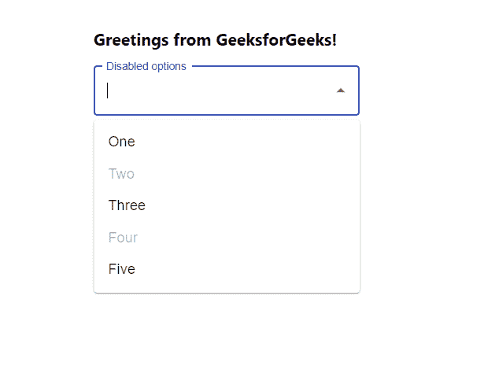

# 如何禁用 ReactJS 中的下拉选项？

> 原文:[https://www . geeksforgeeks . org/how-disable-drop down-options-in-reactjs/](https://www.geeksforgeeks.org/how-to-disable-dropdown-options-in-reactjs/)

禁用选项意味着下拉选项变为禁用，即不可点击。基本上禁用选项是不可用和不可点击。React 的 Material UI 有这个组件可供我们使用，非常容易集成。我们可以使用以下方法在下拉菜单中禁用选项。

**创建反应应用程序并安装模块:**

**步骤 1:** 使用以下命令创建一个反应应用程序:

```
npx create-react-app foldername
```

**步骤 2:** 创建项目文件夹(即文件夹名**)后，使用以下命令移动到该文件夹中:**

```
cd foldername
```

**步骤 3:** 创建 ReactJS 应用程序后，使用以下命令安装 **material-ui** 模块:

```
npm install @material-ui/core
npm install material-ui/lab
```

**项目结构:**如下图。


项目结构

**App.js:** 现在在 **App.js** 文件中写下以下代码。在这里，App 是我们编写代码的默认组件。

## java 描述语言

```
import React from 'react'
import TextField from '@material-ui/core/TextField';
import Autocomplete from '@material-ui/lab/Autocomplete';

const App = () => {

  // Sample options for dropdown
  const myOptions = ['One', 'Two', 'Three', 'Four', 'Five'];

  return (
    <div style={{ marginLeft: '40%', marginTop: '60px' }}>
      <h3>Greetings from GeeksforGeeks!</h3>
      <Autocomplete
        style={{ width: 400 }}
        options={myOptions}
        getOptionDisabled={(option) => {
          // Mention options which needs to be disable
          return option === myOptions[1] || option === myOptions[3]
        }}
        renderInput={(params) => (
          <TextField {...params} label="Disabled options" 
          variant="outlined" />
        )}
      />
    </div>
  );
}

export default App
```

**运行应用程序的步骤:**从项目的根目录使用以下命令运行应用程序:

```
npm start
```

**输出:**现在打开浏览器，转到***http://localhost:3000/***，会看到如下输出:

