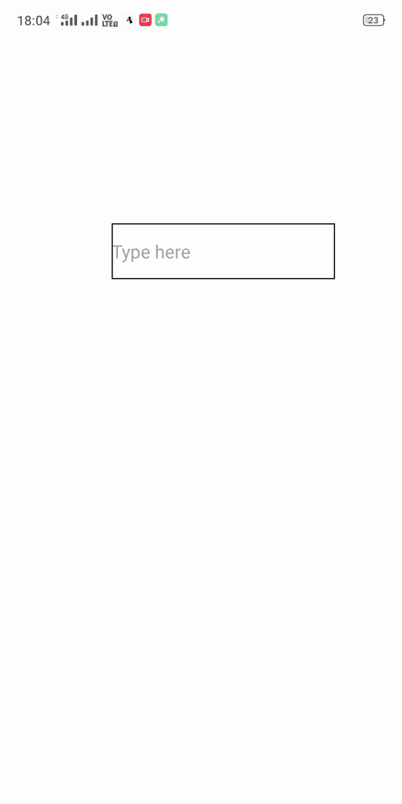
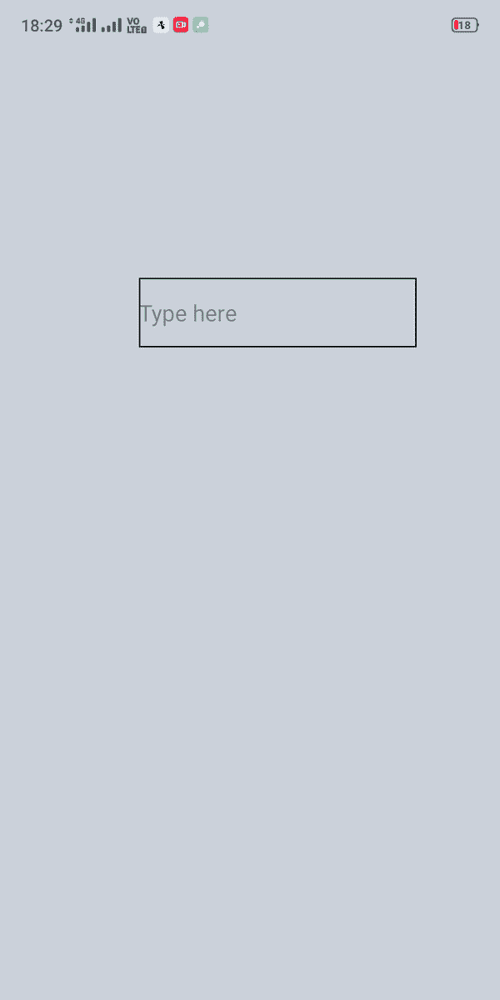

# 如何在 React native 中不点击返回按钮就关闭键盘？

> 原文:[https://www . geeksforgeeks . org/如何在不点击返回按钮的情况下解除键盘输入反应-原生/](https://www.geeksforgeeks.org/how-to-dismiss-the-keyboard-in-react-native-without-clicking-the-return-button/)

在本文中，我们将看到如何在不单击返回按钮的情况下关闭 React Native 中的键盘。为了消除键盘，我们将讨论两种方法。第一种方法使用*touchablewithetfeedback*组件来调用一个函数，该函数在屏幕被轻击时关闭键盘。第二种方法将使用 *ScrollView* 和*keyboardshoulpersisttaps = ' handled '*属性，这也将为我们提供相同的功能。

**方法 1:使用 TouchableWithoutFeedback 组件:**我们只需将应用程序最外层的*视图*组件封装在 *TouchableWithoutFeedback* 组件中，并将该组件的 *onPress* 值设置为 *Keyboard .辞退*。

**语法:**

```jsx
<TouchableWithoutFeedback onPress={Keyboard.dismiss} 
                          accessible={false}>
     <View style={{flex: 1}}>
         ...Rest of the Application Code...
     </View>
</TouchableWithoutFeedback>
```

**示例:**在 *App.js* 文件中写下以下代码。

## App.js

```jsx
import React from 'react';
import { View, 
         StyleSheet, 
         StatusBar, 
         TouchableWithoutFeedback, 
         TextInput,
         Keyboard } from 'react-native';

export default class App extends React.Component {
  render(){
    return (
      <TouchableWithoutFeedback onPress={Keyboard.dismiss} 
                                accessible={false}>
          <View style={styles.container}>
              <TextInput style={styles.input} keyboardType="numeric" 
              placeholder="Type here"/>
          </View>
      </TouchableWithoutFeedback>
    );
  }
}

const styles = StyleSheet.create({
  container:{
    flex: 1,
    justifyContent:'center',
    alignItems:'center',
    backgroundColor: '#ccd2db'
  },

  input:{
    width:200,
    height:50, 
    borderWidth:1,
    marginTop: 200,
    marginLeft: 100
  }
});
```

**输出:**



**方法 2:使用 ScrollView:** 我们将使用 *ScrollView* 组件以及*keyboardshoulpersisttaps = ' handled '*属性作为我们应用程序的最外层视图。这将使我们能够在除了按钮和文本输入区域之外的任何时候轻敲屏幕时都不使用键盘。如果我们使用 *ScrollView* 组件而不使用*键盘应该持续点击='handled'* 属性，那么在多个输入区域或按钮的情况下，点击这些也会关闭键盘。

**语法:**

```jsx
<ScrollView keyboardShouldPersistTaps='handled'>
     ... Rest of the Application Code ...
</ScrollView>
```

**示例:**在 *App.js* 文件中写下以下代码。

## App.js

```jsx
import React from 'react';
import { View, 
         StyleSheet, 
         StatusBar, 
         TouchableWithoutFeedback,
         TextInput,
         Keyboard, 
         ScrollView } from 'react-native';

export default class App extends React.Component {
  render(){
    return (

      <ScrollView keyboardShouldPersistTaps='handled' 
        style={styles.container}>
          <TextInput style={styles.input} keyboardType="numeric" 
          placeholder="Type here"/>
      </ScrollView>

    );
  }
}

const styles = StyleSheet.create({
  container:{
    flex: 1,
    backgroundColor: '#ccd2db'
  },

  input:{
    width:200,
    height:50, 
    borderWidth:1,
    marginTop: 200,
    marginLeft: 100
  }
});
```

**输出:**

