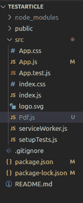
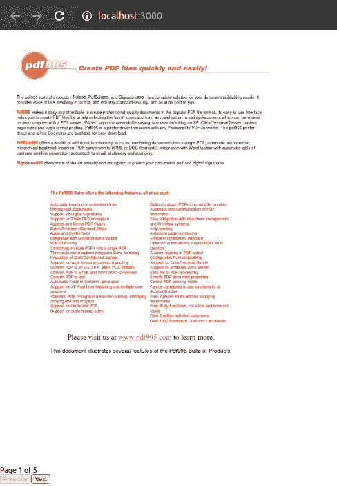

# 如何使用 URL 在 React app 中将 PDF 显示为图像？

> 原文:[https://www . geesforgeks . org/how-display-a-pdf-as-image-in-react-app-using-URL/](https://www.geeksforgeeks.org/how-to-display-a-pdf-as-an-image-in-react-app-using-url/)

如果我们使用提取方法，那么它将打开一个新的窗口来显示 PDF 文件，并让用户下载 PDF。但是如果你不想这样，那就有办法做到。你可以使用名为 **react-pdf 的包，**通过使用这个包，你可以使用 pdf 网址在你的 react 应用程序中渲染 PDF。

**先决条件:**

*   您的项目需要使用 React 16.3 或更高版本。
*   包装基础知识

**React-pdf:** 它可以让你在 React 应用中像显示图像一样轻松地显示 pdf。它有助于创建自定义组件，您可以使用这些组件来创建和组织您的 PDF 文档。

**第一步:**创建反应应用

> npx 创建-反应-应用 appname
> 
> 光盘应用名称
> 
> npm 启动

**第二步:**安装 [react-pdf](https://www.npmjs.com/package/react-pdf) 包。

> npm 安装反应-pdf

**第三步:**首先制作一个**独立组件** PDF(组件名称，可以是任何东西)并在 App.js 中渲染 PDF 组件

**App.js:**

## java 描述语言

```jsx
import React from 'react';
import Pdf from './Pdf'

const App = ()=> {

 return (
    <div className="App">
         //Rendering a pdf component
        <Pdf />
    </div>
  );
}

export default App;
```

创建 pdf 组件后，您的项目目录将如下所示。



**第四步:**在这一部分，我们加载 PDF 并在你的应用程序上渲染。

**文档:**加载使用文件道具传递的文档。

**文件道具:**它告诉应该显示什么 PDF，在上面的代码中，我们传递 URL 给它。

**URL:** 这里的 URL 由两部分组成。

*   第一部分是为了防止 cors 错误，你可以参考文档来阅读更多关于核心的内容。

```jsx
1st part: https://cors-anywhere.herokuapp.com/ 
```

*   第二部分是我们实际的 PDF 网址。

```jsx
2nd part: http://www.pdf995.com/samples/pdf.pdf
```

我们还需要做的一件事就是启用 **PDF。JS WORKER** ，你可以从外部 CDN 使用 pdf.worker.js。

**onDocumentLoadSuccess:** 当文档加载成功时，我们将页码状态设置为告知用户在 pdf 的哪个页码上。

**Pdf.js:** 现在打开 Pdf 组件。

## java 描述语言

```jsx
import React, { useState } from 'react';
import { Document, Page,pdfjs } from 'react-pdf';
import './pdf.css'

//PDFjs worker from an external cdn
const url = 
"https://cors-anywhere.herokuapp.com/http://www.pdf995.com/samples/pdf.pdf"

export default function Test() {

    pdfjs.GlobalWorkerOptions.workerSrc = 
    `//cdnjs.cloudflare.com/ajax/libs/pdf.js/${pdfjs.version}/pdf.worker.js`;
     const [numPages, setNumPages] = useState(null);
      const [pageNumber, setPageNumber] = useState(1);

    function onDocumentLoadSuccess({ numPages }) {
    setNumPages(numPages);
    setPageNumber(1);
  }
  return (
    <>
    <div className="main">
      <Document
        file={url}
        onLoadSuccess={onDocumentLoadSuccess}
        >
        <Page pageNumber={pageNumber} />
      </Document>
     </div>
    </>
  );
}
```

**第五步:**现在最后一件事就是给 PDF 文件添加 NEXT 和 PREVIOUS 按钮。

**Pdf.js:** 这里我们增加了两个按钮 **NEXT 和 PREVIOUS** 以及它们的功能名为 **previousPage()** 和 **nextPage()** ，改变当前页面的状态。

## java 描述语言

```jsx
import React, { useState } from 'react';
import { Document, Page,pdfjs } from 'react-pdf';

const url = 
"https://cors-anywhere.herokuapp.com/http://www.pdf995.com/samples/pdf.pdf"

export default function Test() {

  pdfjs.GlobalWorkerOptions.workerSrc = 
  `//cdnjs.cloudflare.com/ajax/libs/pdf.js/${pdfjs.version}/pdf.worker.js`;
  const [numPages, setNumPages] = useState(null);
  const [pageNumber, setPageNumber] = useState(1);

  /*To Prevent right click on screen*/
  document.addEventListener("contextmenu", (event) => {
    event.preventDefault();
  });

  /*When document gets loaded successfully*/
  function onDocumentLoadSuccess({ numPages }) {
    setNumPages(numPages);
    setPageNumber(1);
  }

  function changePage(offset) {
    setPageNumber(prevPageNumber => prevPageNumber + offset);
  }

  function previousPage() {
    changePage(-1);
  }

  function nextPage() {
    changePage(1);
  }

  return (
    <>
    <div className="main">
      <Document
        file={url}
        onLoadSuccess={onDocumentLoadSuccess}
      >
        <Page pageNumber={pageNumber} />
      </Document>
      <div>
        <div className="pagec">
          Page {pageNumber || (numPages ? 1 : '--')} of {numPages || '--'}
        </div>
        <div className="buttonc">
        <button
          type="button"
          disabled={pageNumber <= 1}
          onClick={previousPage}
          className="Pre"

        >
          Previous
        </button>
        <button
          type="button"
          disabled={pageNumber >= numPages}
          onClick={nextPage}

        >
          Next
        </button>
        </div>
      </div>
      </div>
    </>
  );
}
```

**输出:**

